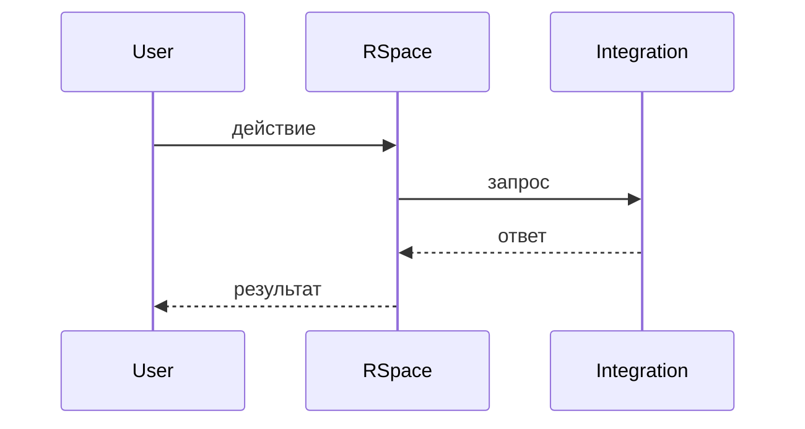

# Интеграция: [Название]

> **Тип:** [платежи / CRM / классифайд / AI / SMS / аналитика]
> **Направление:** [outbound / inbound / bidirectional]
> **Статус:** [production / WIP / настроена, не активна]
> **Ответственный:** [имя / TBD]

## Назначение

[Что делает эта интеграция в продукте. Какую боль закрывает.]

## Поставщик

- **Название:** [провайдер]
- **Сайт:** [https://...]
- **API docs:** [ссылка]
- **Контракт / аккаунт-менеджер:** [если есть, TBD]

## Конфигурация

**Env-переменные** (в `.env`, не коммитить!):
```
INTEGRATION_API_KEY=
INTEGRATION_API_URL=https://...
INTEGRATION_WEBHOOK_SECRET=
```

**config/services.php:**
```php
'integration' => [
    'key' => env('INTEGRATION_API_KEY'),
    'url' => env('INTEGRATION_API_URL'),
],
```

## Код

| Компонент | Путь |
|---|---|
| Клиент | `backend/app/<Path>/Services/IntegrationClient.php` |
| DTO | `backend/app/<Path>/Data/...` |
| Job | `backend/app/Jobs/IntegrationJob.php` |
| Webhook-controller | `backend/app/Http/Controllers/Webhooks/IntegrationWebhookController.php` |

## Сценарии (flow)

### Сценарий 1 — [имя]



**Шаги:**
1. [Что происходит в коде]
2. [Какие данные уходят / приходят]
3. [Какие ошибки возможны]

## Webhooks (если есть)

**Endpoint в нашем коде:**
```
POST /webhook/integration/:token
```

**Формат payload:**
```json
{
  "event": "...",
  "data": { ... }
}
```

**Верификация:** [сигнатура HMAC / IP-allowlist / токен в URL]

## Обработка ошибок

- Retry: [стратегия — N попыток с backoff X/Y/Z]
- Мёртвые запросы: [куда логируется, как восстанавливается]
- Алерты: [куда и при каких условиях]

## Лимиты и квоты

- Rate limit: [X запросов / секунду]
- Стоимость за запрос: [если важно]
- Дневной/месячный лимит: [если есть]

## Known issues

- [Что может сломаться]
- [Недокументированные особенности провайдера]

## Как тестировать локально

[Как поднять стенд / какой мок / какие тестовые креды]

## Изменения

- 2026-MM-DD — [что изменилось]
