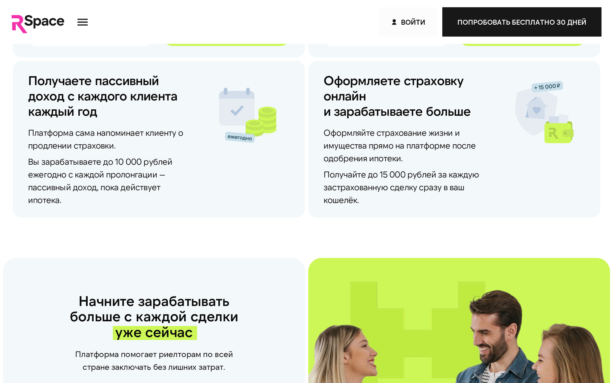
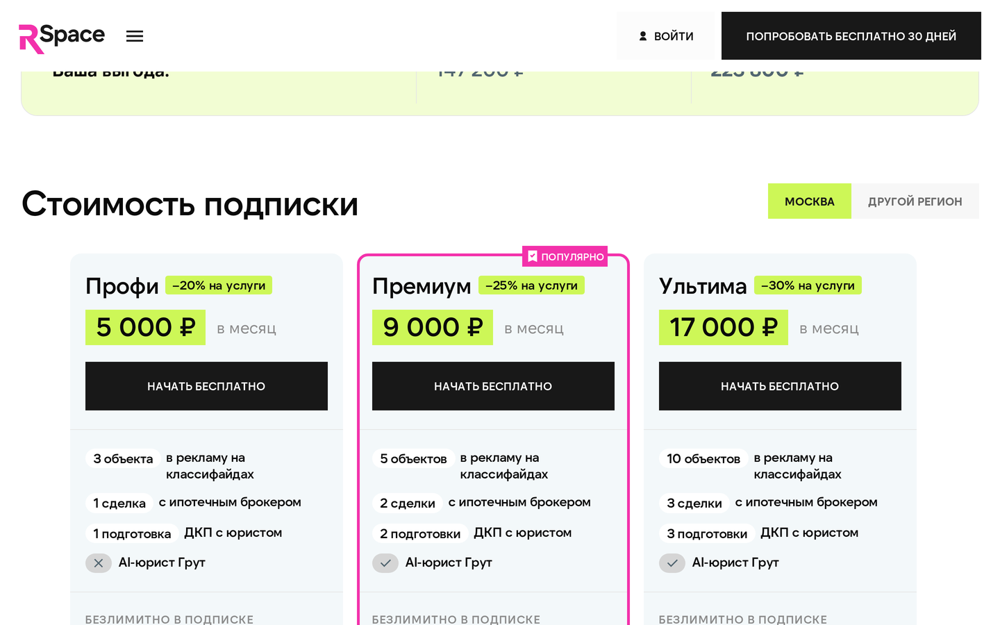
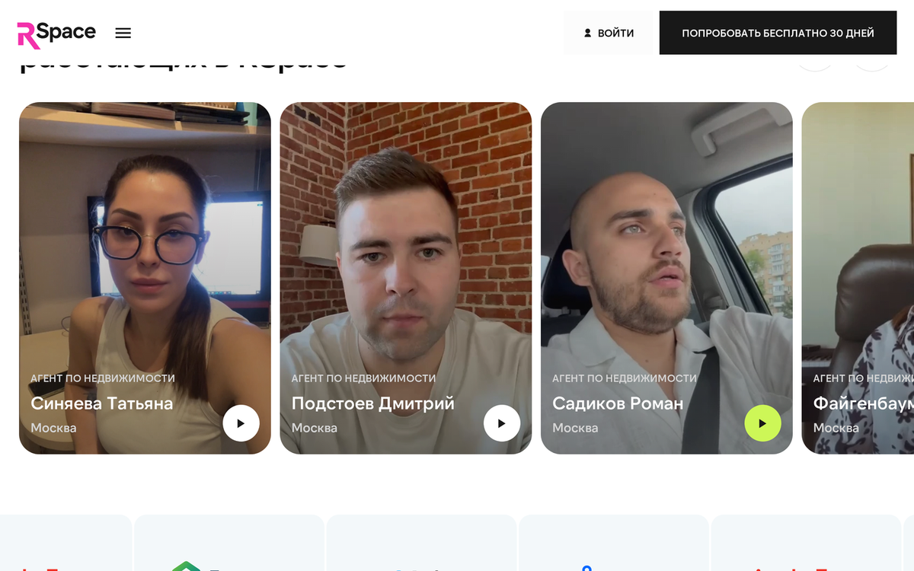

# Что такое RSpace

RSpace — это единая рабочая среда для независимого риелтора. Одна подписка закрывает публикацию объектов на двух площадках, приём лидов, юридические услуги, ипотечный брокер и управление сделкой. Вместо пяти разрозненных сервисов и подрядчиков — один кабинет.

## Для кого это

- **Частный агент вне агентства.** Ушли из сетевого агентства, устали отдавать 30-50% комиссии. Работаете на себя 2-10 лет, 4-10 активных объектов, 2-3 сделки в месяц.
- **Риелтор, который начинает самостоятельно.** Хотите подключить классифайды сразу и не разбираться в каждом по отдельности.
- **Опытный агент с портфелем ≥10 объектов.** Нужна экономия на публикации и инфраструктура для ипотечных сделок.

## Что входит в платформу

### Ядро — мультилистинг и кабинет
- **Публикация объектов на классифайдах:** сейчас в кабинете работают **Авито и ЦИАН** — одна форма, два размещения одним действием.
- **Статистика и звонки** с площадок: сколько просмотров, сколько контактов, что работает лучше.
- **Лиды** из площадок приходят сразу в кабинет, без ручного сбора по чатам.
- **Кабинет агента** (lk.rspace.pro) — объекты, сделки, услуги, подписка, выплаты.

### Коммерческие сервисы по скидке для подписчиков
- **Юрист на сделку** — проверенный юрист сопровождает от ДКП до регистрации. Скидка от тарифа.
- **Проверка объекта и собственника** — полная юридическая проверка с заключением. Скидка от тарифа.
- **Шаблоны ДКП** — актуальные договоры купли-продажи, хранятся в кабинете.
- **AI-юрист Грут** (начиная с Премиума) — быстрые консультации по юридическим вопросам 24/7.

### Ипотека и страховка
- **Заявки на ипотеку** через партнёров (банки). Безлимит на любом тарифе.
- **Ипотечный брокер** — человек ведёт заявку до одобрения. По лимиту тарифа.
- **Страховой брокер** — заявки на страховку. Безлимит на любом тарифе.

### Дополнительно
- **Телеграм-уведомления** о новых лидах и событиях.
- **Публичное предложение** — персональная страница объекта для клиентов (с вашим лого и цветами).
- **Кошелёк и вывод комиссий** — комиссии от партнёров (банки, страховщики) копятся на рублёвом счёте и выводятся на банковский счёт или конвертируются в баллы для новых услуг.

## Что это заменяет

Частный риелтор обычно платит и работает так:

| Раньше | С RSpace |
|---|---|
| Отдельная подписка на ЦИАН Pro — от 3 000 ₽/мес за объект | Входит в подписку |
| Авито — плата за каждое размещение | Входит в подписку |
| Юрист «по знакомству» — 8-15 000 ₽ за сделку | Юрист платформы со скидкой |
| Проверка объекта — ищет каждый раз нового, 5-8 000 ₽ | В кабинете, с заключением |
| Ипотека — свои контакты в одном банке | Один брокер, несколько банков |
| ДКП — гуглит шаблон или платит юристу | Шаблон готов, хранится в ЛК |
| Клиенты в заметках телефона | Карточки в кабинете |

Многие агенты отмечают: подписка окупается за первую ипотечную сделку.

## С чего начать (3 шага)

**Шаг 1. Зарегистрироваться.**
Нужен только номер телефона. Зайдите на [rspace.pro](https://rspace.pro), нажмите «Попробовать 30 дней бесплатно», введите телефон — придёт SMS с кодом.

**Шаг 2. Добавить первый объект.**

**Шаг 3. Выбрать тариф.**
Пробный период длится 30 дней — всё доступно бесплатно. За это время попробуйте публикации, статистику и хотя бы одну услугу (например, проверку объекта). Потом выберите тариф, который подходит по количеству объектов.

Подробнее о шагах — в разделе [«Начало работы»](./02-start.md).

## Партнёры

RSpace работает вместе с:

- **Банки по ипотеке:** Альфа-Банк, Ренессанс Банк, Дом.РФ (заявки идут через платформу).
- **Страховщики:** подбор страховых продуктов (поставщики уточняются).
- **Юристы:** собственная команда юристов RSpace и AI-юрист Грут.

## Тарифы

| Тариф | Москва | Регионы | Объектов | AI-юрист |
|---|---|---|---:|---|
| Триал | бесплатно 30 дней | бесплатно 30 дней | 3 | нет |
| **Профи** | **5 000 ₽/мес** | **4 000 ₽/мес** | 3 | нет |
| **Премиум** | **9 000 ₽/мес** | **7 000 ₽/мес** | 5 | **да** |
| **Ультима** | **17 000 ₽/мес** | **13 000 ₽/мес** | 10 | да |
| **Энтерпрайс** | **20 000 ₽/мес** | **20 000 ₽/мес** | **15** | да |

Подробный разбор (скидки на услуги, полный прайс-лист, агентская комиссия) — в [«Тарифах и подписках»](./01-tariffs.md).

## Что дальше

- [Тарифы и подписки](./01-tariffs.md) — сколько стоит, что включено, как выбрать.
- [Начало работы](./02-start.md) — регистрация, настройка профиля, первый объект.
- [Объекты](./03-listings.md) — создание, фото, документы, ДДУ, генерация описания.
- [Юридические услуги](./07-legal.md) — AI-юрист, проверки, сопровождение сделки.
- [FAQ](./13-faq.md) — ответы на частые вопросы.

## Известные ограничения

- Мобильного приложения нет — продукт работает в браузере с телефона или компьютера.
- Подключение к кабинету в процессе — технические интеграции готовы, UI-подключение в ЛК появится в ближайшем обновлении.
- AI-юрист Грут доступен начиная с Премиума (Премиум / Ультима / Энтерпрайс). На Триале и Профи — нет.

---

*Не нашли то, что искали? Напишите в поддержку — ответим в рабочее время.*
