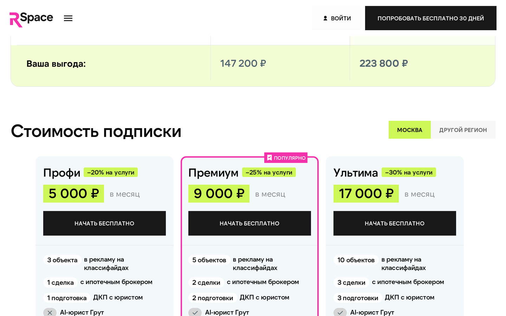
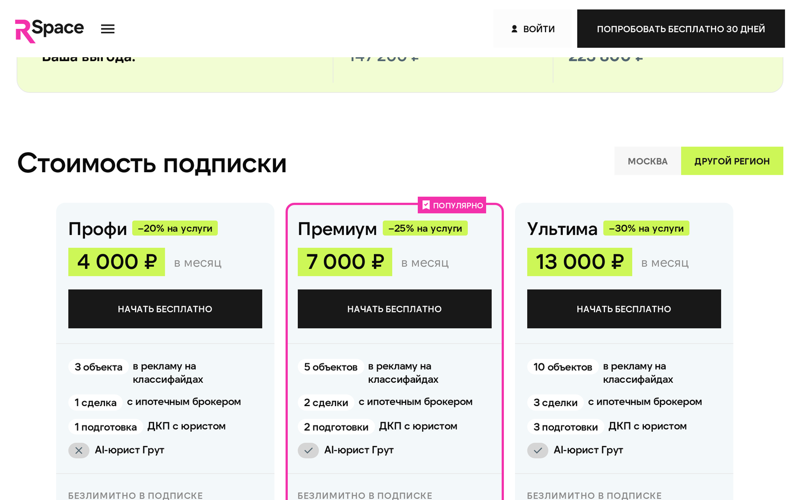

# Тарифы и подписки

У RSpace **пять уровней подписки**: Триал (пробный период), Профи, Премиум, Ультима и Энтерпрайс для крупных агентов. Чем выше тариф, тем больше лимиты, тем сильнее скидка на дополнительные юридические услуги и тем больший процент от агентской комиссии банков/страховых получает риелтор.

## Сравнение тарифов

### Абонентская плата

| Тариф | Москва | Регионы | Скидка на услуги |
| --------------- | ------------------- | ------------------- | ---------------- |
| Триал | бесплатно 30 дней | бесплатно 30 дней | базовая цена |
| **Профи** | **5 000 ₽/мес** | **4 000 ₽/мес** | **−20%** |
| **Премиум** | **9 000 ₽/мес** | **7 000 ₽/мес** | **−25%** |
| **Ультима** | **17 000 ₽/мес** | **13 000 ₽/мес** | **−30%** |
| **Энтерпрайс** | **по запросу** | **по запросу** | **−30%** |

Город определяется при регистрации по адресу объектов. Для Москвы и Санкт-Петербурга — «Столица», остальные — «Регионы».

### Как риелтор зарабатывает на платформе

Помимо экономии на услугах (−20% до −30% к базовой цене), риелтор получает **агентскую комиссию** при каждой ипотечной или страховой сделке клиента через партнёров RSpace. Размер зависит от тарифа: чем выше тариф, тем больший процент от агентской комиссии банка/страховой достаётся риелтору. Точные формулы см. в [«Ипотечный брокер»](./06-mortgage.md) и [«Страховка»](./08-insurance.md).

### Что входит в подписку

| Сервис | Триал | Профи | Премиум | Ультима | Энтерпрайс |
| -------------------------------- | ----- | ----- | ------- | ------- | ---------- |
| Объектов в рекламе | 3 | 3 | 5 | **10** | **15** |
| Ипотечный брокер (сопровождение) | 1 | 1 | 2 | 3 | 3 |
| **Подготовка ДКП (бесплатно)** | — | **1** | **2** | **3** | **3** |
| Заявки на ипотеку | ∞ | ∞ | ∞ | ∞ | ∞ |
| Страховой брокер | ∞ | ∞ | ∞ | ∞ | ∞ |
| Шаблоны договоров | да | да | да | да | да |
| **AI-юрист Грут** | нет | нет | **да** | да | да |
| Купить новостройку | да | да | да | да | да |

Объекты считаются как активные размещения на классифайдах. Если вы сняли объект с публикации (архивировали), он не занимает лимит.

Под «ипотечным брокером» имеется в виду сопровождение конкретной сделки брокером — сколько сделок вы ведёте через RSpace-брокера бесплатно. Заявки на ипотеку (заявка в банк от имени клиента) — без лимита на всех тарифах.

## Как считаются скидки на услуги

Скидка считается **от полной цены услуги** (как если бы подписки не было), а не от тарифа ниже. Это важно:

> Если бы скидка Премиум шла от уже сниженной цены Профи, итоговая скидка Премиум была бы ~40%, а не 25%. Поэтому все скидки — от «цены без подписки».

Пример для **Москвы**:

| Услуга | Без подписки | Профи | Премиум | Ультима / Энтерпрайс |
|---|---:|---:|---:|---:|
| Юрист на сделку | 26 250 ₽ | 21 000 ₽ | 19 688 ₽ | **18 375 ₽** |
| Проверка объекта | 8 750 ₽ | 7 000 ₽ | 6 563 ₽ | **6 125 ₽** |
| Проверка собственника | 3 750 ₽ | 3 000 ₽ | 2 813 ₽ | **2 615 ₽** |
| Сопровождение покупателя | 23 750 ₽ | 19 000 ₽ | 17 813 ₽ | **16 625 ₽** |
| Сопровождение продавца | 20 000 ₽ | 16 000 ₽ | 15 000 ₽ | **14 000 ₽** |
| Подготовка ДКП (сверх лимита) | 2 500 ₽ | 2 000 ₽ | 1 875 ₽ | **1 750 ₽** |
| 2D/3D планировка | 625 ₽ | 500 ₽ | 469 ₽ | **438 ₽** |

Цены для Регионов — примерно на 25-30% ниже (см. полную таблицу ниже).

## Полный прайс услуг

### Москва

| Услуга | Без подписки | Профи | Премиум | Ультима | Энтерпрайс |
|---|---:|---:|---:|---:|---:|
| Юрист на сделку | 26 250 | 21 000 | 19 688 | **18 375** | 18 375 |
| Юрист на сделку (срочный) | 52 500 | 42 000 | 39 375 | **36 750** | 36 750 |
| Сопровождение покупателя | 23 750 | 19 000 | 17 813 | **16 625** | 16 625 |
| Сопровождение покупателя (срочный) | 47 500 | 38 000 | 35 625 | **33 250** | 33 250 |
| Сопровождение продавца | 20 000 | 16 000 | 15 000 | **14 000** | 14 000 |
| Сопровождение продавца (срочный) | 40 000 | 32 000 | 30 000 | **28 000** | 28 000 |
| Подготовка ДКП | 2 500 | 2 000 | 1 875 | **1 750** | 1 750 |
| Подготовка ДКП (срочный) | 5 000 | 4 000 | 3 750 | **3 500** | 3 500 |
| Проверка задатка | 2 000 | 2 000 | 1 875 | **1 750** | 1 750 |
| Проверка задатка (срочный) | 4 000 | 4 000 | 3 750 | **3 500** | 3 500 |
| Проверка аванса | 2 000 | 2 000 | 1 875 | **1 750** | 1 750 |
| Проверка аванса (срочный) | 4 000 | 4 000 | 3 750 | **3 500** | 3 500 |
| Проверка объекта | 8 750 | 7 000 | 6 563 | **6 125** | 6 125 |
| Проверка объекта (срочный) | 17 500 | 14 000 | 13 125 | **12 250** | 12 250 |
| Проверка собственника | 3 750 | 3 000 | 2 813 | **2 615** | 2 615 |
| Проверка собственника (срочный) | 7 500 | 6 000 | 5 625 | **5 250** | 5 250 |
| 2D/3D планировка | 625 | 500 | 469 | **438** | 438 |

### Регионы

| Услуга | Без подписки | Профи | Премиум | Ультима | Энтерпрайс |
|---|---:|---:|---:|---:|---:|
| Юрист на сделку | 18 750 | 15 000 | 14 063 | **13 125** | 13 125 |
| Юрист на сделку (срочный) | 37 500 | 30 000 | 28 125 | **26 250** | 26 250 |
| Сопровождение покупателя | 16 250 | 13 000 | 12 188 | **11 375** | 11 375 |
| Сопровождение покупателя (срочный) | 32 500 | 26 000 | 24 375 | **22 750** | 22 750 |
| Сопровождение продавца | 12 500 | 10 000 | 9 375 | **8 750** | 8 750 |
| Сопровождение продавца (срочный) | 25 000 | 20 000 | 18 750 | **17 500** | 17 500 |
| Подготовка ДКП | 1 875 | 1 500 | 1 406 | **1 313** | 1 313 |
| Подготовка ДКП (срочный) | 3 750 | 3 000 | 2 813 | **2 625** | 2 625 |
| Проверка задатка | 1 875 | 1 500 | 1 406 | **1 313** | 1 313 |
| Проверка аванса | 1 875 | 1 500 | 1 406 | **1 313** | 1 313 |
| Проверка объекта | 6 875 | 5 500 | 5 156 | **4 812** | 4 812 |
| Проверка объекта (срочный) | 13 750 | 11 000 | 10 313 | **9 625** | 9 625 |
| Проверка собственника | 3 125 | 2 500 | 2 344 | **2 188** | 2 188 |
| Проверка собственника (срочный) | 6 250 | 5 000 | 4 688 | **4 375** | 4 375 |
| 2D/3D планировка | 625 | 500 | 469 | **438** | 438 |

«Срочная» версия услуги — выполнение в ускоренном режиме за двойную цену. Применяется, когда клиент торопится, а стандартный срок (обычно 1-3 рабочих дня) не подходит.

### Продвижение на Авито и ЦИАН

Платное продвижение объявлений на классифайдах — через RSpace со скидкой по тарифу:

| Тариф | Скидка на продвижение |
|---|---|
| Триал / без подписки | базовая цена площадки |
| Профи | −20% |
| Премиум | −25% |
| Ультима / Энтерпрайс | −30% |

Конкретные тарифы продвижения (x2, x5, x10 по просмотрам, 1-30 дней) зависят от площадки — актуальные цены показываются в карточке объекта при заказе.

## Как выбрать тариф

### Вы начинающий агент, 1-3 объекта, 0-1 сделка в месяц
**Профи.** 5 000 ₽ (или 4 000 ₽ для регионов) за публикацию на классифайдах, шаблоны договоров и одну бесплатную подготовку ДКП — уже окупает ручные размещения. Юрист по сделкам — отдельно со скидкой 20%.

### Средний риелтор, 3-5 объектов, 1-2 сделки, иногда нужна ипотека
**Премиум.** 9 000 ₽ (7 000 ₽ для регионов) — ключевая добавка: **AI-юрист Грут** (которого нет на Профи), 2 бесплатных подготовки ДКП, 2 ипотечных брокера в месяц. Это базовая точка для опытного агента.

### Активный риелтор, 5-10 объектов, регулярные ипотечные сделки
**Ультима.** 17 000 ₽ (13 000 ₽ для регионов) — 10 объектов, 3 брокера, 3 подготовки ДКП, максимальная скидка −30%, максимальный процент агентской комиссии с ипотечных и страховых сделок. Для риелтора с 2 ипотечными сделками в месяц и средним чеком 6 млн ₽ агентская комиссия по ипотеке (1,5% от банка) перекрывает абонплату.

### Агентство или крупный риелтор, 10+ объектов
**Энтерпрайс.** Цена — **индивидуально по запросу**, формируется под задачи конкретной компании. Включает 15 объектов в рекламе, 3 брокера, 3 подготовки ДКП, AI-юрист, максимальную скидку на услуги (−30%). Условия по агентской комиссии с банков/страховых и дополнительным интеграциям согласовываются лично. Пишите в поддержку, если у вас стабильно более 10 объектов или отдельные требования к аналитике / отчётам.

## Пример расчёта экономии

**Риелтор на Ультима (Москва), делает в месяц:**
- 1 проверку объекта: 6 125 ₽ вместо 8 750 ₽ — экономия **2 625 ₽**
- 1 юриста на сделку: 18 375 ₽ вместо 26 250 ₽ — экономия **7 875 ₽**
- 1 проверку собственника: 2 615 ₽ вместо 3 750 ₽ — экономия **1 135 ₽**
- Публикация на 10 объектах — включена в подписку (иначе на Авито + ЦИАН пакетом: ~12 000 ₽)

**Итого экономии на услугах и публикациях:** ~23 600 ₽/мес. **Подписка:** 17 000 ₽. Чистый «плюс» — экономия около **6 600 ₽/мес** за всю инфраструктуру, плюс агентская комиссия до 1,5% от банков по ипотечным сделкам.

Для сравнения: один юрист со стороны («по знакомству») — 8-15 000 ₽ за сделку без учёта проверок и публикаций, и без агентской комиссии от банков.

## Пробный период (Триал)

- Доступен при регистрации — нажимаете «Попробовать 30 дней бесплатно».
- **При активации триала привязывается банковская карта** (через CloudPayments, проходит 3-D Secure и холд 1 ₽ для авторизации). В течение 30 дней списаний нет.
- После активации карту можно **отвязать** в настройках — подписка продолжит работать за счёт внутреннего баланса (баллов), если на нём достаточно средств. Это удобно, если накопили бонусы или получили начисления от банковских партнёров.
- По окончании 30 дней с привязанной карты автоматически списывается первый платёж выбранного тарифа.
- Все фичи Профи доступны: 3 объекта, публикация, шаблоны, заявки на ипотеку и страховку, ипотечный брокер (1), 1 подготовка ДКП бесплатно.
- **AI-юрист на Триале и Профи не включён** — появится только на Премиуме и выше.
- По истечении 30 дней, если не выбрали платный тариф, кабинет переходит в режим «только чтение»: объекты сохраняются, публикация останавливается до оплаты.

## Как оформить подписку

1. В кабинете откройте раздел «Подписка».
2. Выберите тариф (Профи / Премиум / Ультима / Энтерпрайс).
3. Подтвердите оплату.

Способ оплаты — **автосписание с внутреннего баланса (баллов)** каждый расчётный период (30 дней). Баллы пополняются через привязанную карту в CloudPayments (привязка при регистрации / активации триала, может быть отвязана позже).

Если на внутреннем балансе к моменту списания недостаточно баллов — система попросит пополнить (через карту или, если карта отвязана, потребует привязать заново). Без напоминания никогда не спишем: за 3 дня до конца периода придёт уведомление в Telegram (если привязали бот) и email.

## Как сменить тариф

- **Повышение** (например, Профи → Премиум) — применяется сразу, пересчёт пропорционально остатку месяца.
- **Понижение** (Премиум → Профи) — применяется **со следующего расчётного периода**, текущий месяц работает на старом тарифе.
- **Отмена** — отключает автосписание. Подписка работает до конца оплаченного периода, потом переходит в режим «только чтение».

Смена тарифа не влияет на уже созданные объекты и лиды — они сохраняются.

## Возвраты

Стандартная политика:
- Если вы оформили подписку по ошибке и не начали пользоваться — возврат в течение **3 дней**, напишите в поддержку.
- Если пользовались — возврата нет (это подписка, не разовая покупка).
- Услуги, оплаченные отдельно (юрист, проверка), возвращаются, если мы не начали работу — для конкретной услуги правила есть в её карточке.

## Промокоды

- Промокод вводится на странице подписки до оплаты.
- Скидка по промокоду применяется **к подписке** (пока не к услугам).
- Срок действия и условия зависят от конкретного кода — все правила показываются при вводе.
- Один промокод = один пользователь. Повторно активировать нельзя.

Пример действующего промокода: **SUPERSTAR** — даёт 30% скидку на подписку (действует для ранних пользователей, ограниченное количество активаций).

## Частые вопросы

**В: У меня свой юрист, дешевле. Есть смысл брать Премиум?**
О: Если сделок мало — Профи достаточно. Премиум добавляет **AI-юриста** (консультации 24/7, удобно вечером) и увеличенное бесплатное наполнение (+1 подготовка ДКП, +1 ипотечный брокер). Если ваш юрист стоит меньше и работает быстро — можно оставаться на нём и брать RSpace только ради публикаций на Профи.

**В: Можно ли иметь подписку на несколько регионов?**
О: Город определяется по месту основных объектов. Если работаете и в Москве, и в регионе — напишите в поддержку, обсудим.

**В: Что будет, если превысить лимит объектов?**
О: Новый объект не опубликуется, пока не снимете один из текущих или не повысите тариф. Существующие объекты остаются активными.

**В: AI-юрист заменяет живого юриста?**
О: Нет. AI-юрист отвечает на юридические вопросы, объясняет нюансы, помогает формулировать документы, проверяет договор в ограниченном режиме. Для сопровождения сделки и подписи ДКП нужен живой юрист — заказывайте услугу «Юрист на сделку» (со скидкой по тарифу).

**В: Чем Ультима отличается от Энтерпрайса?**
О: Скидка на услуги одинаковая (−30%). Отличия: Энтерпрайс даёт больше объектов в рекламе (15 вместо 10) и индивидуальные условия по агентской комиссии с ипотеки и страховки. Если у вас стабильно 10+ объектов или нужны особые отчёты/интеграции — обсуждаем Энтерпрайс. Если до 10 объектов хватает — Ультимы достаточно.

**В: Что такое агентская комиссия и откуда она берётся?**
О: Если клиент через вас оформляет ипотеку в банке-партнёре или страховку у страхового партнёра, банк/страховая платят RSpace агентскую комиссию за привлечение. Платформа переводит её часть вам на рублёвый баланс. Чем выше тариф — тем больший % вам. Это отдельно от скидки на юридические услуги.

## Что дальше

- [Как начать](./02-start.md) — регистрация и первые шаги.
- [Юридические услуги](./07-legal.md) — как заказать юриста, проверку, ДКП; как работает AI-юрист.
- [Баланс и выплаты](./09-balance.md) — как пополнять, как выводить комиссии от банков.
- [FAQ](./13-faq.md) — общие вопросы.

## Известные ограничения

- Промокоды пока действуют только на подписку, не на разовые услуги.
- Триал нельзя продлить — если 30 дней не хватило, нужно оформить платный тариф или начать с новой регистрации на другой номер.
- Цены на продвижение классифайдов (Авито, ЦИАН) зависят от площадки и могут меняться — актуальная цена отображается при заказе.

---

*Если сомневаетесь в выборе тарифа — напишите в поддержку с количеством ваших объектов и типом сделок, мы подскажем.*
