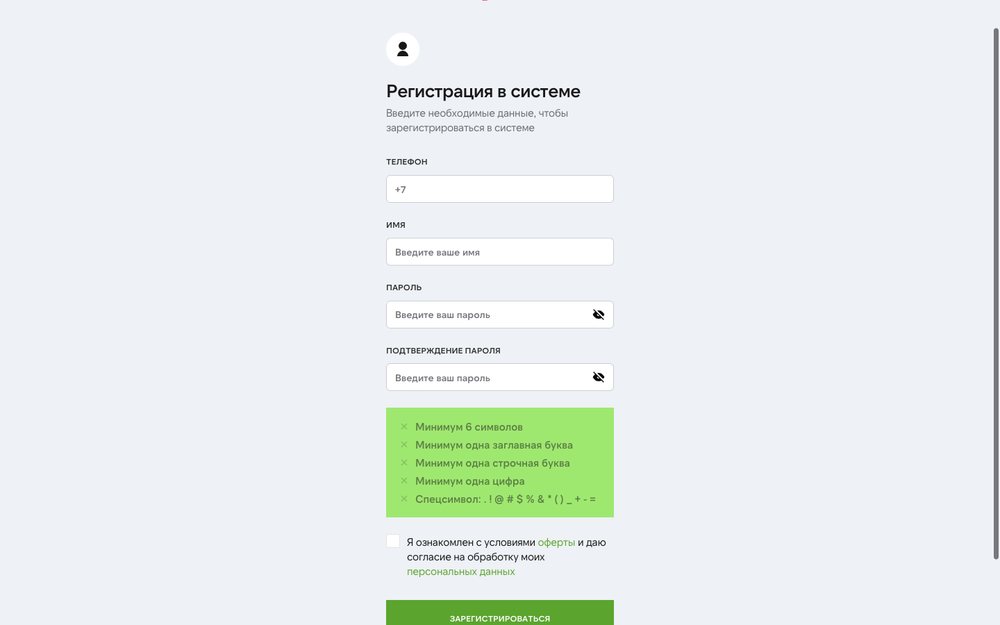
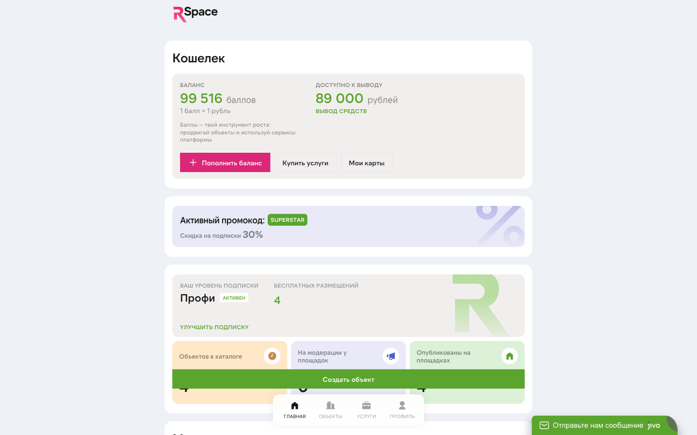
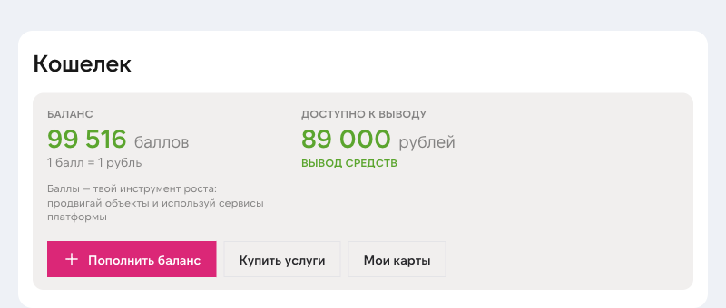
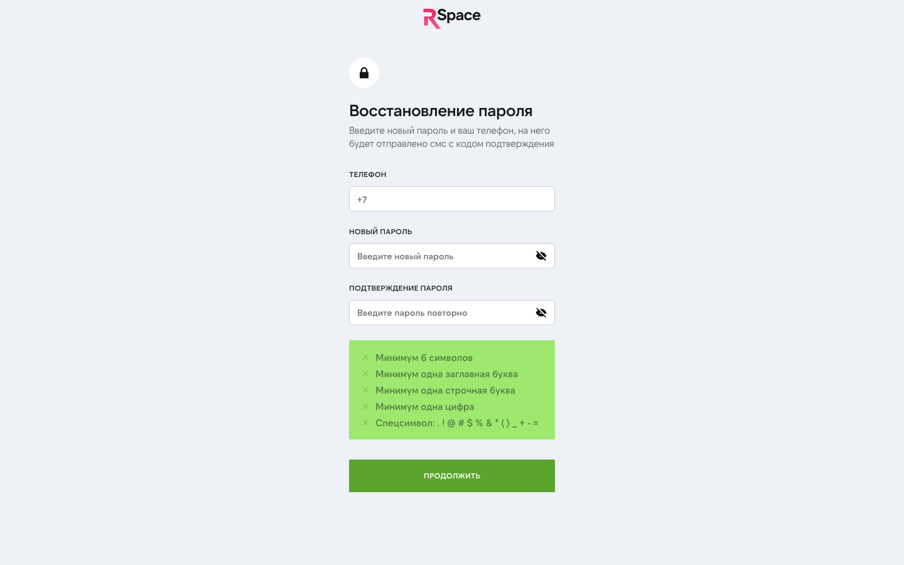

# Начало работы

> **Для кого:** новый пользователь — только зарегистрировались или собираетесь; сотрудник поддержки, объясняющий первые шаги.
> **Сложность:** базовая
> **Последнее обновление:** 2026-04-23

На всё про всё — от регистрации до первого опубликованного объекта на трёх площадках — уходит 15-20 минут. Основные шаги ниже.

## Что понадобится

- Телефон с российским номером (на него придёт SMS).
- Адрес объекта и базовые параметры (площадь, цена, этаж). Можно добавить позже.
- Фото объекта (3-5 штук достаточно для старта; правила площадок — не меньше 3).
- Документы собственника — для подключения ипотечного брокера и юридических услуг. Опционально на этапе первой публикации.
- Логины Авито / ЦИАН, если хотите публиковать от своего имени. Без них публикация идёт через RSpace-аккаунт (ДомКлик и Яндекс.Недвижимость в кабинете пока не подключены — появятся в ближайшем обновлении).

## Шаг 1. Регистрация

1. Откройте [rspace.pro](https://rspace.pro) и нажмите **«Попробовать 30 дней бесплатно»**. Либо сразу [lk.rspace.pro/registration](https://lk.rspace.pro/registration).
2. На форме регистрации заполните **сразу четыре поля** (это один экран):
    - **Телефон** (начинается с `+7`).
    - **Имя**.
    - **Пароль** — требования: минимум 6 символов, одна заглавная и одна строчная буква, одна цифра, один из спецсимволов `. ! @ # $ % & * ( ) _ + - =`.
    - **Подтверждение пароля**.
3. Поставьте галочку согласия с [офертой](https://rspace.pro/docs/oferta) и [согласием на обработку персональных данных](https://rspace.pro/docs/consent). Без этого регистрация не пройдёт.

4. Нажмите **«ЗАРЕГИСТРИРОВАТЬСЯ»**. На указанный телефон придёт SMS с 4-значным кодом — код действует 5 минут. Если SMS не пришла — проверьте, нет ли блокировки коротких номеров. Повторный запрос — через 90 секунд.
5. Введите код подтверждения и подтвердите.

После регистрации вы автоматически попадаете в кабинет [lk.rspace.pro](https://lk.rspace.pro). Для активации 30-дневного пробного периода **потребуется привязать банковскую карту** (через CloudPayments, 3-D Secure + холд 1 ₽ для подтверждения). В течение триала списаний нет.

После активации триала карту можно **отвязать** — подписка после этого продолжает работать за счёт накопленных баллов на внутреннем балансе (например, если админ начислил бонус или вы конвертировали рубли, заработанные как агентская комиссия с банков/страховых). Но если баллов не хватит на следующее списание подписки, потребуется снова привязать карту для пополнения баланса через CloudPayments.

По окончании 30 дней с привязанной карты автоматически списывается первый платёж выбранного тарифа (подробнее про баллы и рубли — в разделе «Баланс и выплаты»).

### Забыли пароль

Нажмите «Забыл пароль» на форме входа → откроется страница восстановления, где нужно указать телефон + задать новый пароль (на телефон придёт код подтверждения).

**Что активно на пробном периоде:**
- Публикация до 3 объектов на классифайдах (сейчас — Авито и ЦИАН; ДомКлик и Яндекс.Недвижимость подключим в ближайшем обновлении).
- Заявки на ипотеку и страхование (безлимит).
- Шаблоны договоров.
- 1 бесплатная подготовка ДКП.
- 1 сопровождение ипотечной сделки.

**Что не активно на триале:**
- AI-юрист Грут (доступен начиная с Премиума — Премиум / Ультима / Энтерпрайс).

## Шаг 2. Настройка профиля

В кабинете откройте **Профиль** (иконка в правом верхнем углу → «Настройки профиля»).

Заполните:
- **Имя, фамилия, отчество** — как должны видеть клиенты.
- **Email** — для уведомлений о лидах, счетах, новостях продукта.
- **Город** — по нему определяется регион (Столица / Регионы), от этого зависят цены на услуги.
- **Fake-номер** (опционально) — публичный номер для объявлений. Если заполнен, клиенты видят его, а не ваш основной. Полезно, если не хотите палить личный телефон.
- **Аватар** — JPG/PNG, не больше 5 МБ.

Сохраните.

## Шаг 3. Привязать Telegram (рекомендуется)

Без Telegram вы будете получать лиды только по email, а это медленнее.

1. В профиле найдите блок **Telegram**.
2. Нажмите **«Привязать»** — откроется ссылка на бота `@rspace_bot`.
3. В Telegram нажмите `Start` в боте.
4. Бот подтвердит привязку. В кабинете обновите страницу — появится ник Telegram.

Теперь новые лиды и события подписки будут приходить вам в чат с ботом.

Отвязать — в том же блоке, кнопка «Отвязать».

## Шаг 4. Первый объект

1. В боковом меню кабинета выберите **«Объекты»**.
2. Нажмите **«Добавить объект»**.
3. Выберите тип: **квартира**, **дом** или **участок**.
4. Заполните шаги мастера:
    - **Локация** — адрес (работает подсказка), город, координаты ставятся автоматически. Опционально — кадастровый номер.
    - **Параметры** — для квартиры: количество комнат, площадь, этаж, тип здания, ремонт. Для дома — материал стен, площадь, этажность. Для участка — площадь и тип использования.
    - **Фото** — перетащите файлы или выберите через диалог. Для каждого фото указывается категория (фасад, гостиная, спальня, кухня, санузел, вид, план). Минимум 3 фото — правило площадок.
    - **Собственник** — ФИО, паспорт, ИНН. Можно пропустить и заполнить позже.
    - **Условия сделки** — цена, комиссия (процент или фикс), кто платит (продавец / покупатель / оба), тип продажи (прямая / альтернативная / новостройка).
    - **Описание** — напишите сами или нажмите **«Сгенерировать через AI»**. AI доступен, если вы заполнили основные поля.

Подробнее про каждый раздел — в [Объекты](./03-listings.md).

## Шаг 5. Публикация на площадках

Когда объект заполнен, в правом верхнем углу карточки появится кнопка **«Опубликовать»**.

1. Нажмите её.
2. Выберите площадки: **Авито** и **ЦИАН** (по умолчанию — обе). ДомКлик и Яндекс.Недвижимость появятся в списке после ближайшего обновления.
3. Подтвердите.

Объект уходит на площадки:
- **Авито, ЦИАН** — публикуются через API. Модерация площадки обычно проходит за 2-4 часа.

Статус публикации отображается в карточке:
- **«На модерации»** — ушло на площадку, ждём одобрения.
- **«Опубликовано»** — видно клиентам.
- **«Отклонено»** — модерация не пропустила. В карточке будет причина (обычно: плохие фото, мало информации).
- **«В архиве»** — вы сняли объект вручную.

## Шаг 6. Лиды

Когда клиент позвонит или напишет на площадке, лид приходит:
- **В кабинет** — раздел «Лиды», новая запись с источником (Авито/ЦИАН/и т.д.), временем и контактом.
- **В Telegram** (если привязан) — мгновенное push-сообщение.
- **В AmoCRM** (если настроена интеграция) — сделка создаётся автоматически.

Отвечайте быстро — CusDev показал, что конверсия в сделку заметно падает после часа задержки.

## Что делать дальше

- **Выбрать тариф** — до конца триала (30 дней). Смотри [«Тарифы и подписки»](./01-tariffs.md).
- **Заказать проверку объекта** — перед сделкой, через виджет в карточке объекта или раздел «Услуги».
- **Подключить ипотечный брокер** — если клиенту нужна ипотека, закажите сопровождение.
- **Настроить public offer** — персональная страница объекта с вашим лого и цветами. Смотри [«Настройки»](./12-settings.md).

## Частые вопросы

**В: Могу ли я публиковать под своим аккаунтом Авито, а не RSpace?**
О: Да. В настройках публикации можно привязать ваш логин Авито или ЦИАН — объекты будут публиковаться от вашего имени. Это **опционально** — можно работать и через общий аккаунт RSpace. Возможность привязки личного аккаунта ДомКлик и Яндекс.Недвижимости откроем одновременно с релизом этих площадок в ЛК.

**В: Можно ли заливать объект, не подтверждая собственника?**
О: Да, на этапе draft собственник не обязателен. Но **опубликовать** объект без собственника нельзя — этого требуют правила площадок.

**В: Что если SMS-код не пришёл?**
О: Проверьте, что номер указан правильно. Запросите повторно через 90 секунд. Если не помогло — напишите в поддержку.

**В: Когда закончится триал, что будет с моими объектами?**
О: Объекты сохраняются. Публикация на площадках приостанавливается до оформления подписки. Лиды продолжают приходить по уже размещённым объявлениям, но новые публикации недоступны.

**В: Как заменить фото?**
О: В карточке объекта удалите старое (иконка корзины на фото) и загрузите новое. Площадки обновят карточку автоматически при следующей синхронизации.

## Что дальше

- [Объекты](./03-listings.md) — детально про создание и редактирование.
- [Публикация на порталах](./04-publishing.md) — тонкости Авито/ЦИАН (+ план по ДомКлик и Яндекс.Недвижимости).
- [Лиды](./05-leads.md) — работа со входящими обращениями (Волна 3).
- [Тарифы и подписки](./01-tariffs.md) — выбор тарифа.

## Известные ограничения

- Мобильного приложения нет — работаем в браузере.
- Telegram-привязка — одна на аккаунт (нельзя привязать два Telegram).
- Привязка Avito-аккаунта агента — требует API-доступа от Авито; сейчас для большинства юзеров публикации идут через аккаунт RSpace.

---

*Застряли на шаге? Напишите в поддержку, поможем пройти первую публикацию.*
