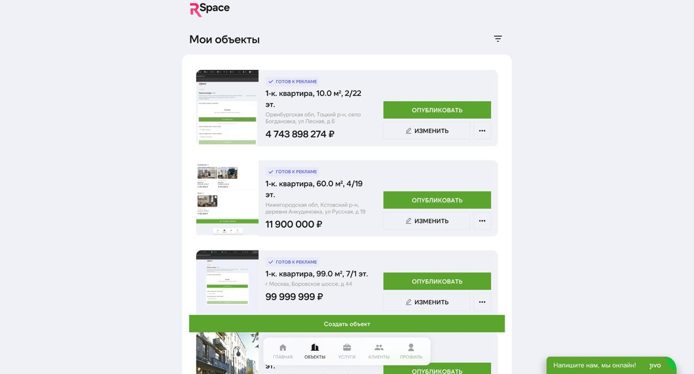

# Объекты недвижимости

«Объект» в RSpace — это квартира, дом или участок, с которым вы работаете. Одна карточка объекта — один листинг на всех площадках.

## Типы объектов

RSpace поддерживает три типа. От выбора зависит, какие поля надо заполнять.

| Тип | Что включает |
|---|---|
| **Квартира** | Комнаты, площадь (общая, жилая, кухня), этаж, тип здания, ремонт, вид, балкон, санузлы. Отдельно — данные здания (год постройки, лифт, парковка). |
| **Дом** | Материал стен, этажность, жилая/общая площадь, отопление, канализация, водоснабжение, газ, тип санузла. |
| **Участок** | Площадь, тип использования (ИЖС, СНТ, сельхоз, промышленный). |

Для новостроек (квартира первичка) включается блок «Новостройка»: застройщик, ЖК, тип отделки, год сдачи, ДДУ.

## Создание объекта

1. В меню кабинета — **Объекты** → **Добавить**.
2. Выберите тип (квартира / дом / участок).
3. Объект создаётся в статусе **Черновик** — не виден на площадках, вы его редактируете.

### Шаги заполнения (мастер)

Мастер ведёт по шагам. Между шагами можно свободно перемещаться, сохраняются отдельно.

1. **Локация.** Начните вводить адрес — работает подсказка от Dadata. Выбирайте из вариантов, тогда координаты ставятся автоматически. При необходимости укажите кадастровый номер (формат `XX:XX:XXXXXXX:XXXX`).

2. **Параметры объекта.** Конкретные поля зависят от типа — для квартиры, например: количество комнат, общая/жилая/кухонная площади, этаж, этажей в доме, тип санузлов, вид из окна, тип ремонта, наличие и **количество балконов и лоджий** (раздельно — клиент видит, есть ли пристройка, и сколько именно).

3. **Здание** (только для квартир). Год постройки, материал (кирпич/панель/монолит), количество этажей, лифты (пассажирский/грузовой), консьерж, парковка (наземная/подземная), отопление, газ, водоснабжение.

4. **Фото.** Перетащите файлы или выберите через диалог. Для каждого фото задайте категорию:
 - **Фасад** — вид здания снаружи.
 - **Гостиная, спальня, кухня, санузел** — комнаты.
 - **Вид** — то, что видно из окна.
 - **План** — поэтажный план / планировка.
 - **Другое** — прочее.
 
 Фото автоматически сжимаются и готовятся для площадок. Рекомендуем **минимум 5 фото** — правила площадок (некоторые требуют от 3).
 
 Порядок фото — первое становится обложкой. Перетащите фото в нужный порядок.

5. **Комнаты** (только для квартир). Опционально — детально разбить по комнатам. Для каждой: тип (спальня/гостиная/кухня/кабинет), площадь.

6. **Собственник.** Тип (физ/юр лицо), ФИО, паспортные данные, ИНН. Для новостройки — тип лица от застройщика (физ/юр). Можно загрузить сканы документов — они нужны для услуг юриста и ипотеки, но не для площадок.

7. **Условия сделки.** Цена (в рублях), комиссия (процент от сделки или фикс), кто платит комиссию (продавец/покупатель/оба), тип продажи:
 - **Прямая** — обычная купля-продажа.
 - **Альтернативная** — продавец сразу покупает другой объект («цепочка»).
 - **Новостройка** — продажа от застройщика.
 
 Опции: «Возможен торг», «Публикует собственник» (если вы агент, но публикация от лица собственника).

8. **Описание.** Напишите сами или нажмите **«Сгенерировать через AI»**. Про AI — ниже.

9. **Видео** (опционально). Вставьте ссылку на YouTube, RuTube или VK Video с обзором объекта.

Все шаги сохраняются. Вы можете вернуться и доделать позже — объект останется в «Черновиках».

### Когда все разделы заполнены — публикация в один клик

Как только напротив каждого раздела появляется зелёная галочка ✓ (Расположение, О доме, О квартире, Описание, Цена и условия сделки, Как выглядит недвижимость), внизу страницы редактирования появляется крупная зелёная кнопка **«Опубликовать объявление →»**. Один клик — и вы попадаете на страницу выбора площадок, без возврата в список объектов и поиска через меню «⋮».

Если хотя бы один раздел не заполнен, кнопка не показывается — это сделано специально, чтобы не отправлять на модерацию неполный объект.

## AI-генерация описания

Если описание писать вручную не хочется, RSpace сгенерирует через OpenAI (GPT) на основе заполненных полей объекта.

**Когда доступно:**
- Заполнены базовые параметры (адрес, цена, площадь, тип).
- У вас активная подписка (включая триал).

**Как использовать:**
1. В разделе «Описание» нажмите **«Сгенерировать через AI»**.
2. Подождите ~10-20 секунд.
3. Отредактируйте результат, если нужно.
4. Сохраните.

Генерация не увеличивает счёт — она входит во все тарифы, включая триал. Отдельных лимитов на AI-описания сейчас нет.

## Фото: рекомендации

- **Разрешение:** от 1024×768 пикселей. Ниже — площадки могут отклонить.
- **Формат:** JPEG (PNG принимается, но тяжелее по объёму).
- **Размер файла:** до ~15 МБ за фото.
- **Освещение:** дневной свет, без вспышки, горизонтально.
- **Порядок:** первое фото — обложка. Лучше выбрать самое привлекательное (обычно гостиная или фасад). Далее — по типу помещения, с улицей в конце.
- **Без водяных знаков, скриншотов с Яндекс.Карт, фото чужих планировок с интернета.** Площадки блокируют.

## ДДУ для новостроек

Если объект — новостройка:

1. В мастере появится блок **«Новостройка»**.
2. Укажите застройщика (название из Dadata или вручную), ЖК, тип отделки (чистовая / без отделки / с мебелью), планируемую дату сдачи.
3. Загрузите скан ДДУ (договор долевого участия) — PDF или JPG. Хранится в кабинете, используется юристами при сопровождении сделки.

ДДУ не видна клиентам — это внутренний документ.

## Public offer (публичная страница объекта)

У каждого объекта есть публичная страница — её вы можете давать клиентам ссылкой.

**Что там показано:**
- Фото, описание, цена.
- Параметры объекта.
- Адрес (без точного дома, если не хотите раскрывать — настройка в публикации).
- Контакты агента (с fake-номером, если настроен).
- Ваш логотип и брендовые цвета (если настроили в разделе «Настройки» → «Public offer»).

**Что НЕ показано:**
- Данные собственника.
- Документы (ДДУ, паспорт).
- Внутренние комментарии.

Страница работает без подписки — клиент открывает её, не логинится в RSpace. Ссылку можно отправить в WhatsApp, Telegram, email.

## Комиссия и цена

В RSpace цена и комиссия настраиваются гибко:

- **Цена объекта** — то, что увидит клиент.
- **Комиссия** — процент (обычно 2-4%) или фикс (например, 150 000 ₽).
- **Кто платит** — продавец, покупатель или оба. Если «оба» — будет указана доля каждого.

Формат, в котором это попадёт на площадку, зависит от площадки (Авито и ЦИАН принимают эти поля по-разному; RSpace подстраивает).

## Статусы объекта

| Статус | Что означает |
|---|---|
| **Черновик** | Заполняете, не опубликован |
| **На модерации** | Отправлен на площадку(и), ждём проверки |
| **Опубликован** | Видим клиентам хотя бы на одной площадке |
| **Отклонён** | Все площадки не пропустили модерацию (читайте причину в карточке) |
| **В архиве** | Сняли с публикации вручную (лимит тарифа освобождается) |

Архивировать объект — кнопка в карточке. Восстановить — в разделе «Архив».

## Редактирование опубликованного

Изменения в опубликованном объекте синхронизируются с площадками:
- **Авито, ЦИАН** — обновление через API, обычно в течение часа.

Некоторые поля (адрес, основной тип) нельзя менять после публикации — только через удаление и создание заново.

## Удаление vs архивирование

- **Архивирование** — мягкое снятие. Объект исчезает с площадок, остаётся в кабинете. Можно восстановить. Слот в тарифе освобождается.
- **Удаление** — жёсткое. Удаляются фото, история, связанные лиды (если есть). Необратимо. Используйте только для тестовых/ошибочных карточек.

## Лимиты объектов

| Тариф | Активных объектов |
|---|---|
| Триал / Профи | 3 |
| Премиум | 5 |
| Ультима | 10 |
| Энтерпрайс | индивидуально |

Если превысили — новый объект не опубликуется. Либо архивируйте старый, либо повышайте тариф.

## Частые вопросы

**В: Можно ли загрузить видео?**
О: Ссылкой на YouTube/RuTube/VK — да. Прямая загрузка видеофайла в RSpace не поддерживается (тяжело и не всегда принимается площадками). Лучше ссылка.

**В: Если объект «отклонён» модерацией, как узнать, почему?**
О: В карточке объекта под статусом будет текст отклонения от площадки. Чаще всего это «недостаточно фото», «неразборчивое фото», «неполное описание». Исправьте и нажмите «Опубликовать повторно».

**В: Что, если хочу опубликовать только на Авито, без ЦИАН?**
О: При публикации выбирайте только Авито — галочку ЦИАН отключите. В любой момент можете добавить площадку: кнопка «Добавить площадку» в карточке.

**В: Как удалить фото из объекта?**
О: Наведите на фото, нажмите иконку корзины. Подтвердите. Площадки обновят карточку при следующей синхронизации.

**В: Можно ли сделать одну публикацию на несколько объектов (похожие квартиры в одном доме)?**
О: Нет. Каждый объект — отдельная карточка. Это требование площадок.

**В: Если собственника нет — можно ли публиковать?**
О: Нет. Данные собственника (хотя бы ФИО) — обязательны для публикации. Можно не загружать документы, но указать ФИО нужно.

**В: Что такое кадастровый номер и зачем он?**
О: Уникальный идентификатор объекта в Росреестре. Нужен для юридической проверки объекта и для некоторых площадок. Если не знаете — можно не указывать, площадки обычно принимают и без него.

## Что дальше

- [Публикация на порталах](./04-publishing.md) — детали Авито/ЦИАН, платные услуги площадок.
- [Лиды](./05-leads.md) — что делать с входящими.
- [Юридические услуги](./07-legal.md) — проверка объекта, юрист на сделку.
- [Настройки](./12-settings.md) — настройка public offer, брендинг.

## Известные ограничения

- **Видеоролики внутри карточки** — только через внешние ссылки.
- **Массовое редактирование** (сменить цену на нескольких объектах сразу) — пока не реализовано.
- **Копирование объекта** (для похожих квартир в одном доме) — в планах, сейчас — вручную.

---

*Если что-то непонятно в карточке — сделайте скриншот и напишите в поддержку. Помогаем разобраться в реальном времени.*

