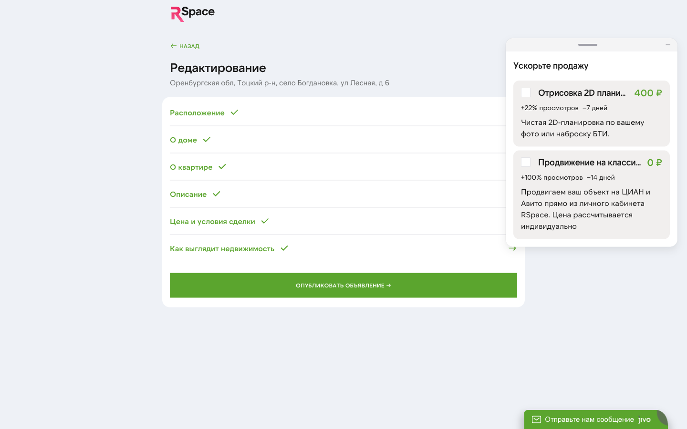

# Публикация на порталах

RSpace публикует ваши объекты на **Авито** и **ЦИАН** одним действием. Одна карточка объекта — два размещения на классифайдах, единая статистика, единый счётчик лидов.

## С чего начать

Публикация — это финальный шаг создания объекта. Предварительно:

1. [Создайте объект](./03-listings.md) — адрес, параметры, фото, цена.
2. Убедитесь, что данные заполнены полностью. Объект в статусе «Черновик» не опубликуется: система покажет, что не хватает.
3. Если нужно — подтвердите собственника (ФИО минимум). Без этого площадки отклоняют.

## Запуск публикации

1. В карточке объекта нажмите **«Опубликовать»** (кнопка в правом верхнем углу или в нижней части формы).
2. В модальном окне выберите площадки. По умолчанию отмечены обе доступные — **Авито** и **ЦИАН**.
3. Подтвердите.

## Как работает каждая площадка

### Авито

- **Через API**, напрямую от нашего аккаунта (или вашего, если вы привязали — см. «Персональный аккаунт»).
- **Модерация:** обычно 2-4 часа, иногда до суток.
- **Статистика:** просмотры, контакты, сохранения — обновляются автоматически, отображаются в карточке.
- **Звонки:** все звонки с Avito записываются (Авито предоставляет запись) и попадают в раздел «Звонки» объекта в кабинете.
- **Платные услуги:** VIP, Premium, XL, Выделение, Закрепление — можно заказать прямо из кабинета, оплата через RSpace.

### ЦИАН

- **Через API**, от аккаунта RSpace.
- **Модерация:** строже, чем Авито. Типичные причины отклонения: меньше 3 фото, размытые фото, не указан юридический статус объекта, отсутствует ДДУ для новостроек.
- **Статистика и звонки:** доступны, как на Авито.
- **Звонки без записей:** по умолчанию ЦИАН не даёт аудиозаписи. Если нужны — у RSpace есть платная опция «Звонки с записью» (уточните в поддержке).
- **Платные услуги:** нельзя заказать онлайн. Подайте **«Заявку»** — администратор обработает вручную в течение 1-2 рабочих дней.

## Статусы публикации

В карточке объекта рядом с каждой площадкой отображается:

| Статус | Что значит |
|---|---|
| **На модерации** | Объект принят площадкой, ждём проверки. |
| **Опубликовано** | Виден клиентам. Активный. |
| **Отклонено** | Модерация не прошла. **Причина отображается**. Исправьте и опубликуйте повторно. |
| **Удалено** | Вы сняли объект с этой площадки (другие могут оставаться активными). |
| **Заархивировано** | Весь объект в архиве. |

Агрегированный статус (комбинация всех площадок) показывается в общем списке объектов.

## Частые причины отклонения

### Авито
- **Мало фото.** Минимум 3, рекомендуем 5-7.
- **Плохое качество фото.** Размыто, через окно, с плохим освещением.
- **Водяные знаки, логотипы на фото.** Авито запрещает.
- **Неверная категория** (например, коттедж в категории «квартиры»). Проверяется автоматически.
- **Дублирование.** Если тот же объект уже размещён другим агентом — может быть блокировка.

### ЦИАН
- **Нет ДДУ** для новостроек.
- **Нет документов собственника** (хотя бы ФИО).
- **Неадекватная цена** (сильно ниже рынка — подозревают мошенничество).
- **Неверные параметры** (этаж больше этажности, площадь = 0).

## Что делать, если объект отклонён

1. Откройте карточку объекта.
2. В блоке «Публикации» увидите статус **«Отклонено»** с причиной.
3. Исправьте (обычно фото или описание).
4. Нажмите **«Опубликовать повторно»** — объект снова уходит на модерацию.

Если причина непонятна или повторное отклонение — напишите в поддержку. Приложите скриншот.

## Платные услуги продвижения

### Авито — онлайн-оплата

1. В карточке объекта — блок «Продвижение Avito».
2. Выберите услугу:
 - **Выделение** — объект выделен цветом в списке. Умеренный эффект, недорого.
 - **XL** — увеличенная карточка. Заметнее в ленте.
 - **Premium** — прикреплён в топ категории. Мощный эффект.
 - **VIP** — топ + выделение + показ в других разделах. Максимум.
3. Нажмите «Заказать» — откроется страница оплаты CloudPayments. Оплатите картой.
4. После успешной оплаты услуга применяется в течение нескольких минут.

Цены зависят от тарифа Avito (они время от времени меняются) — актуальные видно на шаге заказа.

### ЦИАН — через заявку

1. В карточке — «Продвижение ЦИАН» → «Заявка».
2. Опишите, какое продвижение нужно (Топ, Премиум и т.д.).
3. Нажмите «Отправить» — админ обработает.
4. Через 1-2 дня получите подтверждение в Telegram или email.

Через RSpace публикация и промо **пока недоступны** — площадки появятся в ближайшем обновлении. До этого работайте через собственные кабинеты .

## Продление срока размещения

Объекты на Авито и ЦИАН имеют срок активности (30-60 дней, зависит от тарифа площадки). По истечении:

- Объект уйдёт в «Архив» автоматически.
- Статистика и звонки сохранятся, но новых не будет.
- За 3 дня до окончания придёт уведомление (Telegram/email).

Чтобы продлить — нажмите **«Продлить»** в карточке. Объявление снова становится активным на следующий период.

## Снятие с публикации

### Снять только с одной площадки
- В карточке — кнопка «Снять с Avito» (или ЦИАН).
- Другая площадка продолжает работать.
- Слот в тарифе RSpace **не освобождается** (объект всё ещё опубликован где-то).

### Снять полностью (архивировать)
- Кнопка «Архивировать» в карточке объекта.
- Объявление снимается со всех площадок.
- Слот в тарифе **освобождается** — можно опубликовать другой объект.
- Объект можно восстановить в любой момент (кнопка «Восстановить» в архиве).

## Статистика

Для каждой публикации в карточке доступны:

- **Показы** — сколько раз объявление видели в ленте.
- **Просмотры** — сколько раз открыли карточку.
- **Контакты** — сколько раз нажимали «Позвонить» или «Написать».
- **Сохранения** — сколько клиентов добавили в избранное.
- **CTR** — отношение просмотров к показам.

Обновляется:
- **Авито, ЦИАН:** несколько раз в день.

## Звонки

Все звонки с объявлений попадают в:

- **Карточка объекта → «Звонки»** — полный список с датой и длительностью.
- **Раздел «Лиды»** — отдельно каждый новый контакт.
- **Telegram** — push-уведомление мгновенно.

Записи звонков — **по Avito есть всегда**, **по ЦИАН — опционально** (платная услуга площадки).

## Персональный аккаунт Авито/ЦИАН

По умолчанию объявления публикуются от имени **аккаунта RSpace**. Это быстро и проще.

Если хотите публиковать **от своего имени** (чтобы клиенты видели ваш бренд, а не RSpace):

- Для Авито: нужен ваш бизнес-аккаунт с API-доступом. Пишите в поддержку — настроим привязку.
- Для ЦИАН: аналогично, но чаще сложнее. Уточните.

## Частые вопросы

**В: Я опубликовал, прошло 5 часов — нет статуса на ЦИАН. Что делать?**
О: Модерация ЦИАН иногда занимает до суток. Проверьте причину через 24 часа. Если «На модерации» — ждите ещё. Если пропал — напишите в поддержку.

**В: Клиент звонит, а номер не мой (RSpace). Это нормально?**
О: Да. Если у вас не настроен свой аккаунт на площадке, объявления идут от RSpace. Звонки через систему переадресации — попадают вам в кабинет и в Telegram. Настройка своего номера — в разделе «Профиль» (`fake_phone`).

**В: Можно ли отключить звонки на время (уехал в отпуск)?**
О: Архивируйте объекты на время — и звонки не пойдут. После возвращения — восстановите.

**В: Заказал Premium на Авито, а объявление не в топе. Почему?**
О: Premium — это функция Avito, а не RSpace. Продвижение применяется в течение нескольких минут после оплаты, но эффект зависит от конкуренции в категории. Проверьте через 15-30 минут. Если не помогло — напишите в поддержку, свяжемся с Avito.

**В: Могу ли я сменить цену после публикации?**
О: Да. Изменения в карточке объекта автоматически синхронизируются с активными площадками (Avito, ЦИАН — в течение часа).

**В: Сколько фото помещается на одном объявлении?**
О: Лимит определяет площадка:
- Авито — до 20 фото.
- ЦИАН — до 20.

В RSpace вы можете загрузить хоть 50 — они все пойдут на те площадки, которые принимают.

**В: Что если я превышу лимит объектов по тарифу?**
О: Новый объект не опубликуется, пока не:
- Снимете один из текущих с публикации (архивирование освобождает слот).
- Повысите тариф (Профи → Премиум добавит 2 слота; Премиум → Ультима — 5 слотов).

## Что дальше

- [Лиды](./05-leads.md) — что делать с звонками и сообщениями.
- [Объекты](./03-listings.md) — редактирование карточки.
- [Баланс и выплаты](./09-balance.md) — как оплачивать промо (Волна 4).
- [Уведомления](./11-notifications.md) — настройки Telegram-уведомлений (Волна 6).

## Известные ограничения

- **Публикация от персонального аккаунта** для большинства агентов пока не настроена — все идут через аккаунт RSpace.
- **Онлайн-промо ЦИАН** — через заявку, не автоматически.
- **Звонки по ЦИАН** — без записей на базовом тарифе.

---

*Вопросы по модерации или продвижению — в поддержку. Мы видим, что с вашим объявлением происходит на каждой площадке.*
