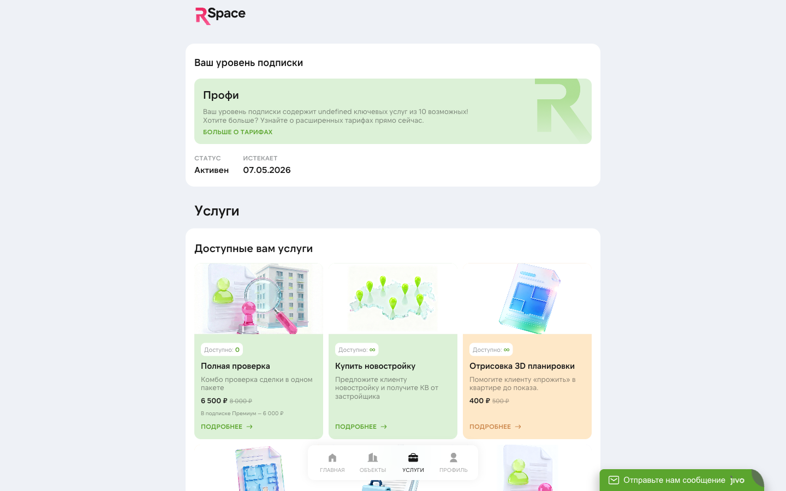

# Юридические услуги

RSpace закрывает юридическую часть сделки: проверки, договоры, сопровождение сделки юристом, AI-помощник по быстрым вопросам. Весь набор — со скидкой по тарифу.

## Что входит

### Бесплатно (в подписке)
- **Шаблоны ДКП** — актуальные договоры купли-продажи.
- **AI-юрист Грут** — начиная с Премиума (Триал и Профи — без AI-юриста).
- **Подготовка ДКП** — 1/2/3/3 бесплатных подготовок в месяц в зависимости от тарифа (Профи / Премиум / Ультима / Энтерпрайс). Сверх этого лимита — платно со скидкой тарифа.

### Платно (по заявке, со скидкой)
- **Юрист на сделку** — сопровождение от подготовки ДКП до регистрации.
- **Сопровождение покупателя / продавца** — как юрист, но с конкретной стороны.
- **Подготовка ДКП** — когда нужен кастомный договор.
- **Проверка задатка / аванса** — юрист проверяет формулировки.
- **Проверка собственника** — 8 проверок (банкротство, ФССП, паспорта, доверенности, иноагенты, розыск, Росфинмониторинг, коммерч. деятельность).
- **Проверка объекта** — 3 проверки (ЕГРН, аварийность дома, история владения).
- **Комплексная проверка объекта + собственника** — объединённый пакет (11 пунктов).
- **2D/3D планировка** — визуализация для объявления.

## Цены (Столица, по вашему тарифу)

| Услуга | Без подписки | Профи −20% | Премиум −25% | Ультима / Энтерпрайс −30% |
|---|---:|---:|---:|---:|
| Юрист на сделку | 26 250 ₽ | 21 000 ₽ | 19 688 ₽ | **18 375 ₽** |
| Юрист (срочный) | 52 500 ₽ | 42 000 ₽ | 39 375 ₽ | 36 750 ₽ |
| Сопровождение покупателя | 23 750 ₽ | 19 000 ₽ | 17 813 ₽ | **16 625 ₽** |
| Сопровождение продавца | 20 000 ₽ | 16 000 ₽ | 15 000 ₽ | **14 000 ₽** |
| Подготовка ДКП (сверх лимита тарифа) | 2 500 ₽ | 2 000 ₽ | 1 875 ₽ | **1 750 ₽** |
| Проверка объекта | 8 750 ₽ | 7 000 ₽ | 6 563 ₽ | **6 125 ₽** |
| Проверка собственника | 3 750 ₽ | 3 000 ₽ | 2 813 ₽ | **2 615 ₽** |
| Проверка задатка / аванса | 2 000 ₽ | 2 000 ₽ | 1 875 ₽ | 1 750 ₽ |
| 2D/3D планировка | 625 ₽ | 500 ₽ | 469 ₽ | **438 ₽** |

**Регионы** — цены ниже. Полный прайс (обе географии, обычные и срочные версии всех услуг) — в [«Тарифы»](./01-tariffs.md#полный-прайс-услуг).

**Срочный вариант** (×2 цена) — выполнение в течение 24 часов вместо стандартного 1-3 рабочих дней.

**ДКП в подписке** — у Профи 1, у Премиума 2, у Ультимы и Энтерпрайса 3 бесплатные подготовки ДКП каждый месяц в рамках тарифа. Сверх этого лимита — по указанной цене со скидкой.

## AI-юрист Грут

### Что это

Чат-бот на основе GPT, обученный на типовых юридических кейсах российской недвижимости. Отвечает на быстрые вопросы 24/7:

- «Что проверить в ДКП перед подписанием?»
- «Как закрыть сделку по маткапиталу?»
- «Какие льготы по семейной ипотеке?»
- «Что такое задаток и когда он становится авансом?»

### Кому доступен

Начиная с **Премиума** (включительно). На Триале и Профи AI-юрист **не включён** — это один из ключевых апсейлов при переходе с Профи на Премиум.

По CusDev (Оксана): «AI-юрист за допплату для Профи — я бы взяла». Мы это услышали, обсуждаем добавление как отдельной платной опции для Профи.

### Как пользоваться

1. В кабинете → меню → **«AI-юрист»**.
2. Задайте вопрос в свободной форме.
3. Ответ — через 5-15 секунд.

### Что AI не делает

- **Не подписывает документы** — он не живой юрист.
- **Не даёт официальное заключение** — для сделки нужен живой юрист.
- **Не проверяет документы в формате сканов** — пока только текст.
- **Не гарантирует 100% точности** — это LLM, не юридический бот «Консультант+». Для критичных вопросов — живой юрист.

## Юрист на сделку

Самая крупная услуга. Что получите:

1. **Брифинг:** разбираем кейс вместе, что за объект, кто покупатель, есть ли риски.
2. **Проверка документов:** паспорта, выписки ЕГРН, справки об отсутствии долгов.
3. **Подготовка ДКП:** кастомный договор под конкретную ситуацию.
4. **Присутствие на сделке:** юрист присутствует в банке / у нотариуса / в МФЦ.
5. **Регистрация:** сопровождение подачи документов в Росреестр.

**Срок:** 5-10 рабочих дней от заказа до закрытия сделки. Срочный вариант — за 2-3 дня (x2 цена).

**Типичный сценарий:** риелтор заказывает юриста за 7 дней до планируемой сделки.

## Проверка объекта

Юридическая проверка недвижимости с PDF-отчётом.

### Что входит (3 проверки)

1. **Отчёт ЕГРН** — актуальные правоустанавливающие документы, собственники, обременения, аресты, история перехода прав.
2. **Проверка дома на аварийность** — статус здания по реестру аварийных/под снос.
3. **История владения** — кто и когда владел объектом, не было ли спорных сделок в цепочке.

### Как заказать

1. В карточке объекта или через меню → «Услуги» → «Проверка объекта».
2. Укажите **адрес и кадастровый номер** (если есть).
3. Оплатите.
4. Через **1-3 рабочих дня** получаете PDF-отчёт.

### Результат

PDF-отчёт:
- **Сводное заключение юриста**: «покупать / не покупать / с оговорками».
- **Детальный разбор по каждому пункту**.
- **Риски и рекомендации**.
- **Выписки ЕГРН** (приложение).

Клиент оценивает такой отчёт **высоко**, потому что он даёт уверенность.

## Проверка собственника

Проверка физического лица — продавца или передающей стороны.

### Что входит (8 проверок)

1. **Банкротство** (единый реестр).
2. **ФССП** (исполнительные производства у приставов).
3. **Паспорта** (действительность документа).
4. **Проверка доверенности на действительность** (если сделка через доверенное лицо).
5. **Реестр иноагентов**.
6. **Розыск** (федеральный, МВД).
7. **Списки Росфинмониторинга** (риск-ориентированный подход 115-ФЗ).
8. **Коммерческая деятельность** (наличие ИП, ООО, связанных структур).

### Как заказать

1. Меню → «Услуги» → «Проверка собственника».
2. Введите **ФИО, дату рождения, паспортные данные**.
3. Оплатите.
4. Отчёт — **1-2 рабочих дня**.

## Комплексная проверка (объект + собственник)

Полная проверка сделки одним пакетом. Включает все 3 проверки объекта + все 8 проверок собственника (итого 11 пунктов). Подходит когда нужна максимальная уверенность в чистоте сделки.

**Цена:** немного ниже, чем сумма отдельных пакетов — заказывайте комбо, если нужны оба.

## Шаблоны ДКП

В кабинете → меню → «Шаблоны» — готовые договоры для разных случаев:

- **Простой ДКП квартиры** (прямая сделка).
- **ДКП с использованием ипотеки** (с ссылкой на банк и условия).
- **ДКП по материнскому капиталу** (с нюансами ПФР).
- **Альтернативная сделка** (цепочка).
- **Договор задатка** (предварительный).
- **Договор аванса**.

Скачайте, отредактируйте под клиента. Или закажите «Подготовка ДКП» — юрист напишет с нуля.

## Статусы заявки на услугу

| Статус | Значение |
|---|---|
| **Создана** | Вы оформили, оплата не прошла |
| **Оплачена** | Платёж прошёл, ждёт юриста |
| **В работе** | Юрист взял, делает |
| **Требуются документы** | От вас/клиента нужны доп. документы |
| **Выполнена** | Результат готов, документы в кабинете |
| **Отменена** | Отменили (возврат, если не начинали) |

## Как взаимодействовать с юристом

После оплаты юрист связывается с вами в течение **1 рабочего дня**:
- По Telegram (если привязан бот).
- По телефону.
- По email.

Вы обсуждаете детали. Юрист может попросить доп. документы (сканы, фото).

Все коммуникации логируются в карточке заявки в кабинете.

## Вывод результатов

Готовые файлы (ДКП, отчёты, протоколы) — в карточке заявки:

1. Откройте заявку в кабинете.
2. Скачайте PDF/DOCX.
3. Передайте клиенту (обычно — в мессенджер или по email).

## Частые вопросы

**В: AI-юрист умеет проверять сделки?**
О: Нет. AI-юрист — советчик по общим вопросам. Для реальной сделки нужен живой юрист. Оформить услугу «Юрист на сделку».

**В: Я сам юрист, могу ли не использовать?**
О: Да. Платите только за то, что используете. Шаблоны ДКП — бесплатно в подписке.

**В: Проверка объекта и Проверка собственника — разные услуги?**
О: Да. Объект — 3 проверки по адресу/кадастру (ЕГРН, аварийность, история владения). Собственник — 8 проверок по ФИО/паспорту (банкротство, ФССП, паспорта, доверенности, иноагенты, розыск, Росфинмониторинг, коммерч. деятельность). Можно заказать **комплексную** (объединённый пакет на 11 пунктов) — дешевле, чем два по отдельности.

**В: Что, если юрист ошибся и сделка сорвалась?**
О: Разбираемся индивидуально. Если ошибка на стороне юриста (не проверил важное, упустил обременение) — возмещение через поддержку.

**В: Скрипты продажи юр-услуг клиенту есть?**
О: Готовим — CusDev показал, что риелторам нужны. Пишите в поддержку, вышлем текущие наработки.

**В: Заказал проверку, но забыл отменить. Могу отменить до того, как юрист начал?**
О: Да. Если юрист не начал работу — в карточке заявки кнопка «Отменить», деньги вернутся на баланс.

**В: Срочный юрист — что значит «24 часа»?**
О: Базовая услуга — 5-10 рабочих дней. Срочная — в течение 24 часов с момента оплаты в рабочий день. Если оплатили в пятницу 17:00 — юрист начнёт в понедельник утром (не 24h от оплаты, а 24h рабочих).

**В: Нужны скан паспорта и ИНН собственника для сделки — юрист сам запросит?**
О: Обычно да. Юрист связывается с вами, уточняет список нужных документов, вы передаёте клиенту запрос. Документы идут напрямую юристу (не через вас).

## Что дальше

- [Ипотечный брокер](./06-mortgage.md) — отдельный поток для ипотечных сделок.
- [Страховка](./08-insurance.md) — часть юр-пакета для ипотеки.
- [Баланс и выплаты](./09-balance.md) — как оплачивать.
- [Тарифы и подписки](./01-tariffs.md) — скидки по тарифу.

## Известные ограничения

- **AI-юрист** — начиная с Премиума (Премиум / Ультима / Энтерпрайс). На Триале и Профи недоступен.
- **Срочные услуги** — x2 цена, результат за 24 рабочих часа.
- **Живые юристы в команде RSpace** — несколько человек, на крупные сделки может быть очередь (пик — 3-5 рабочих дней).
- **Международные сделки** — не поддерживаем (только РФ).
- **Вторичные сделки с несовершеннолетними** — сложные, требуют доп. времени (согласование ООП).
- **Нотариальная форма** — если нужна, юрист подскажет, но услугу нотариуса оплачиваете отдельно (не через RSpace).
- **Scripts продаж юр-услуг клиенту** — в подготовке, пока по запросу в поддержке.

---

*Юридические вопросы — не экспериментируйте. Если что-то непонятно — AI-юрист для быстрых, живой юрист для сделок.*
