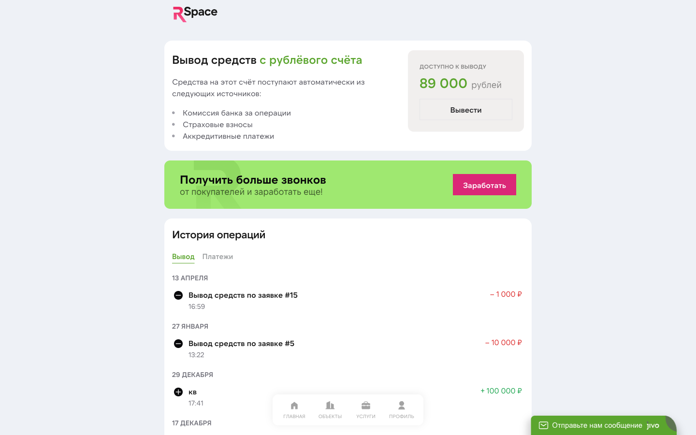

# Баланс и выплаты

У каждого агента в RSpace **два разных «кошелька»** — и это важно не путать. В кабинете (раздел «Кошелёк» на главной `/my`) они показаны рядом:

| Кошелёк | Единица | Откуда берётся | Куда тратится | Можно ли вывести |
|---|---|---|---|---|
| **Баллы** (внутренний баланс) | **баллы** (1 балл = 1 рубль) | Пополнение через банковскую карту (CloudPayments); иногда — бонусные начисления от RSpace | Подписка, услуги, продвижение на классифайдах | **Нет** |
| **Рубли** (баланс вывода) | **рубли** | Комиссии банков по ипотеке; страховые взносы; аккредитивы от партнёров; клубные сделки с застройщиками | Только вывод на банковский счёт / карту / перевод на внутренний баланс (в баллы) | **Да**, заявкой на вывод |

**Принцип:** баллы — это ваш **инструмент оплаты** внутри платформы (подписка, юр. услуги, промо). Рубли — это ваш **доход** от партнёров, который вы выводите на карту или реинвестируете обратно в баллы для новых услуг.

## Баллы (внутренний баланс)

### Зачем нужны

Баллы — это **основной способ оплаты** внутри RSpace:

- **Подписка** — автосписание с баллов каждый расчётный период (30 дней). Карта не списывается напрямую.
- **Юридические услуги** — юрист на сделку, проверки, ДКП сверх лимита.
- **Продвижение на классифайдах** — Avito/ЦИАН платные опции.
- **Дополнительные публикации** — если нужно больше объектов, чем включено в тариф.

С баллов списывается мгновенно, без 3DS и подтверждений.

### Как пополнить

1. На главной кабинета (`lk.rspace.pro/my`) в блоке «Кошелёк» нажмите **«Пополнить баланс»**.
2. Укажите сумму (1 балл = 1 рубль — пополняете рублями, получаете столько же баллов).
3. Выберите способ:
 - **Привязанная карта** — списание в 1 клик (если уже привязывали при регистрации или подписке).
 - **Новая карта** — откроется страница CloudPayments для ввода.
4. Пройдите 3-D Secure (подтверждение из банка по SMS или push).
5. После успеха — баллы появляются на балансе в течение нескольких секунд.

Чек за пополнение уходит на email (если указали в профиле).

### История операций по баллам

Раздел «История платежей» в админ-панели показывает все транзакции. В кабинете юзера — сводно в блоке «Кошелёк» с датой, назначением и суммой. Примеры операций:

- «Пополнение баланса R-Space» (+5 000 ₽ / 5 000 баллов) — через CloudPayments.
- «Покупка услуги "Публикация объекта (Столицы)"» (−2 000 баллов).
- «Автосписание подписки Профи» (−5 000 баллов).

### Баллы нельзя вывести

Баллы **не конвертируются в рубли**. Это внутренняя валюта для оплаты услуг. Если пополнили больше, чем нужно — неиспользованный остаток просто хранится на балансе и тратится на будущие услуги.

Если пополнили по ошибке сразу после оплаты и не начали пользоваться — напишите в поддержку, обсудим индивидуально (в течение 3 дней).

## Рубли (баланс вывода)

### Зачем нужен

Когда партнёры RSpace платят вам за сделку — деньги в **рублях** приходят на этот счёт. Источники (по данным FAQ в самом кабинете):

- **Комиссии банков** за проведённые ипотечные сделки (до 1,5% от суммы кредита).
- **Страховые взносы** — страховые компании за оформленные страховки (обычно 10 000-15 000 ₽ за одну сделку).
- **Аккредитивы** — от партнёров за завершённые сделки.
- **Клубные сделки с застройщиками** — часть комиссии с квартиры в новостройке.

**Пример:** клиент взял ипотеку на 6 млн ₽ через банк-партнёр. Банк заплатил вам 1,5% = 90 000 ₽. Эти деньги приходят на ваш рублёвый баланс в течение 1-4 недель после выдачи кредита (сроки определяет банк).

### Как вывести

1. В кабинете на главной → блок «Кошелёк» → **«ВЫВОД СРЕДСТВ»** (или `lk.rspace.pro/my/withdrawal`).
2. Нажмите **«Вывести»**.
3. Выберите получателя:
 - **На банковский счёт** — укажите ФИО, реквизиты (ИНН, БИК, номер счёта, корреспондентский счёт, банк). Подходит и физлицам, и ИП/ООО.
 - **На баланс** — моментальный перевод рублей на внутренний счёт в баллы (1 рубль = 1 балл). Так можно реинвестировать заработанное обратно в услуги RSpace.
4. Введите сумму.
5. Подтвердите.

Запрос получает ID заявки (например, #15) и попадает в очередь к администратору.

### Сроки обработки

По FAQ в самом кабинете: **заявка на вывод обрабатывается в течение 3-5 рабочих дней**. Если прошло больше 5 — обращайтесь в поддержку.

- **Перевод на внутренний баланс** — мгновенно, без ручной обработки.
- **Перевод на банковский счёт** — обрабатывается администратором + банковский перевод сверху (обычно 1-3 рабочих дня у банка). Итого до 5 рабочих дней.

Когда деньги уходят — видно в истории операций со статусом «Завершена».

### Статусы заявки на вывод

| Статус | Что значит |
|---|---|
| **Создана** | Заявка в очереди, администратор ещё не взял в работу |
| **В работе** | Администратор начал обработку (RSpace готовит платёж) |
| **Завершена** | Деньги ушли — должны прийти в течение 1-3 банковских дней с момента перевода |
| **Отклонена** | Ошибка в реквизитах или другая причина — в поле «Причина отклонения» видно, что исправить |

### Минимальная сумма вывода

- **На банковский счёт** — от 1 000 ₽.
- **На внутренний баланс** — без лимита.

## Платёжные методы (сохранённые карты)

Раздел **«Кошелёк» → «Мои карты»** на главной кабинета.

### Когда привязывается карта

**При активации триала** — карта привязывается **обязательно**: через CloudPayments, 3-D Secure + холд 1 ₽ для подтверждения. В течение 30 дней триала списаний нет.

После триала карту **можно отвязать** (кнопка в «Мои карты»). Подписка продолжит работать, пока на внутреннем балансе (баллах) достаточно средств для автосписания. Если баллов не хватит — система попросит снова привязать карту для пополнения.

### Как привязать карту повторно

1. На главной кабинета → **«Мои карты»** → **«Добавить карту»**.
2. Проходит микро-платёж 1 ₽ (блокировка, не списание).
3. Подтверждаете 3-D Secure.
4. 1 ₽ автоматически разблокируется банком в течение 3-5 дней.

### Где используются привязанные карты

- **Пополнение баллов** — основной сценарий (чтобы хватило на подписку и услуги).
- **Быстрое пополнение в 1 клик** — без повторного ввода реквизитов.

Карта **не списывается напрямую за подписку или услуги** — все оплаты проходят через **баллы**. Карта — это только канал для пополнения баллов.

### Как удалить карту

На главной кабинета → **«Мои карты»** → рядом с картой — иконка удаления.

Если баллов на балансе недостаточно для следующего списания подписки, система попросит привязать карту заново (перед автосписанием).

### Безопасность карт

- **Данные карты не хранятся в RSpace.** Мы храним только токен (идентификатор в CloudPayments), маскированные последние 4 цифры и срок действия.
- **Все платежи через 3-D Secure** (подтверждение через банк-SMS или push в банковском приложении).
- **CloudPayments** — наш эквайер, российский, сертифицирован PCI DSS.

## Возвраты

### Если услуга не оказана

Пример: заказали юриста на сделку, юрист не начал работу, хотите отменить.

1. В разделе услуги → **«Запросить возврат»**.
2. Опишите причину.
3. Администратор обработает в течение 1-2 рабочих дней.
4. Деньги возвращаются **на внутренний баланс (баллы)**, тем же путём, каким оплачивали.

### Если услуга уже оказана

Возврат по логике «деньги назад» не делается (работа выполнена). Если качество не устраивает:
- Напишите в поддержку с описанием.
- Мы рассмотрим индивидуально — возможна частичная компенсация.

### Подписка

Стандарт:
- **В течение 3 дней после первой оплаты**, если не пользовались — возврат 100% через поддержку.
- **После первых активных действий** (публикация объекта, заказ услуги) — возврата нет. Можно отменить, подписка доработает до конца оплаченного периода.

## Счета (для ИП / ООО)

Если вы работаете как ИП или ООО, нужны акты / счета-фактуры:

1. Напишите в поддержку, укажите реквизиты.
2. После каждой оплаты формируется фискальный чек через CloudPayments.
3. Мы высылаем пакет документов на email в начале следующего месяца.

## Промокоды

Если у вас есть промокод на скидку подписки:

1. На странице оформления подписки, в поле **«Промокод»**, введите код.
2. Если код валиден — увидите размер скидки.
3. Подтвердите оформление — цена будет с учётом скидки.

**Правила:**
- Один промокод — одна активация на пользователя.
- Промокоды работают только на **подписку** (пока не на отдельные услуги).
- Срок действия — в описании кода.
- Пример действующего промокода: **SUPERSTAR** — 30% скидка на подписку.

## Частые вопросы

**В: В чём разница между баллами и рублями на балансе?**
О: Баллы — это внутренняя валюта для оплаты подписки и услуг (1 балл = 1 рубль, но **не выводится**, можно только потратить на RSpace). Рубли — это ваш доход от банков, страховщиков и застройщиков, который **можно вывести** на банковский счёт за 3-5 рабочих дней или конвертировать в баллы для новых услуг.

**В: Можно ли перевести баллы в рубли (на вывод)?**
О: Нет. Баллы предназначены только для внутреннего использования в сервисе. Если нужны живые деньги — заработайте комиссию через банковского партнёра или страховку, и они придут сразу на рублёвый баланс.

**В: Пополнил баллы, деньги не пришли. Что делать?**
О: Обычно зачисление мгновенное. Если прошло больше 10 минут — напишите в поддержку и приложите:
- Номер транзакции из CloudPayments (из email от CP).
- Скриншот списания из банка.
Разберёмся в течение часа.

**В: Вывел комиссии на карту, прошло 5 дней, денег нет.**
О: Проверьте в разделе «Вывод средств» статус заявки:
- Если «Создана» — администратор ещё не взял в работу, напишите нам.
- Если «В работе» — перевод запущен, банк может тянуть до 3 рабочих дней.
- Если «Завершена» — деньги уже ушли, проверьте все карты / счета, указанные в заявке.

**В: Можно ли вывести комиссии на криптокошелёк / PayPal / зарубежную карту?**
О: Нет, только российские банковские счета и карты. Мы работаем в РФ и платим в рублях.

**В: Почему комиссия банка за ипотеку пришла через месяц, а не сразу?**
О: Банки выплачивают комиссию не в момент сделки клиента, а после факта выдачи ипотеки + своих внутренних процессов. Типично 1-4 недели. Точный срок — в условиях конкретного банка.

**В: Баллы закончились, подписка не списалась — что будет?**
О: Если на момент списания на балансе недостаточно баллов, система попросит пополнить (через привязанную карту или через привязку новой карты). Без напоминания подписка не отключится — за 3 дня до списания приходит уведомление в Telegram (если привязан бот) и email.

**В: Налоги с комиссий. Кто платит?**
О: Вы. Мы переводим комиссии как есть (без удержания НДФЛ). Вы самостоятельно декларируете и платите налоги. Для ИП и самозанятых — упрощённые режимы.

**В: Автосписание подписки не прошло — что будет?**
О: Если на балансе не хватило баллов и карта не привязана — подписка через несколько дней переходит в статус **«Истекла»**, публикация объектов на классифайдах приостанавливается. Вы получаете уведомления в Telegram и email. Решение: пополнить баллы (привязать карту и внести нужную сумму) — подписка возобновится автоматически.

## Что дальше

- [Тарифы и подписки](./01-tariffs.md) — цены, скидки, агентская комиссия риелтору.
- [Ипотечный брокер](./06-mortgage.md) — как генерируются комиссии.
- [Юридические услуги](./07-legal.md) — что можно оплатить с баллов.
- [Настройки](./12-settings.md) — управление платёжными методами.

## Известные ограничения

- **Промокоды** работают только на подписку, не на отдельные услуги.
- **Вывод рублей** требует ручной обработки администратором (не мгновенно, 3-5 рабочих дней).
- **Возвраты по услугам** обрабатываются индивидуально через поддержку — нет кнопки «возврат» в UI.
- **Налоговые чеки** формируются CloudPayments — если нужна отчётность в бухгалтерию, запрашивайте у поддержки.
- **Баллы не конвертируются в рубли** (и обратно).

---

*Финансовые вопросы — всегда в поддержку. Биллинг разбирает каждый кейс вручную.*
