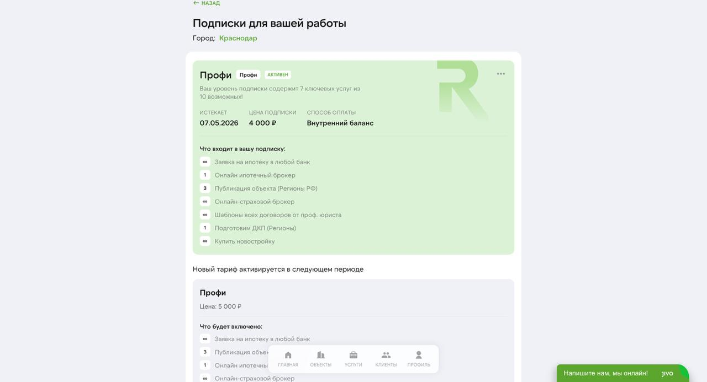

# Аналитика в кабинете

Аналитика в RSpace показывает, **что происходит с вашими объектами**: сколько просмотров, звонков, сделок, сколько экономите. Живые данные — в кабинете.

## Где смотреть

### Главная кабинета

На главной `/my` сводка за текущий месяц:
- **Активные объекты** — сколько у вас опубликовано / в работе.
- **Лиды за месяц** — количество с разбивкой по источникам.
- **Экономия** — сколько сэкономили на услугах со скидкой (если пользовались).
- **Комиссия баланса** — ваши заработанные деньги, готовые к выводу.

### Карточка объекта

Для каждого объекта — статистика по площадкам:
- **Показы** (импрессии) — сколько раз объявление мелькнуло в ленте.
- **Просмотры** (клики) — сколько открыли карточку.
- **Контакты** — сколько нажимали «Позвонить» или «Написать».
- **Сохранения** — добавили в избранное.
- **CTR** — процент кликов от показов.

Данные обновляются:
- Авито, ЦИАН — несколько раз в день.

### Раздел «Лиды»

Полная история всех входящих с фильтрами по источнику, дате.

## Что ещё покажем в будущем

Риелторы часто спрашивают про:
- **Скоринг лида** — «горячий» или «холодный» (например, клиент смотрел объект 3 раза и сохранил в избранное).
- **Воронка сделок** — от лида до заключения.
- **Сравнение месяц-к-месяцу** — динамика по показам, лидам, сделкам.
- **Лучшие фото** — какие фото в карточке получают больше внимания.
- **Конкуренты в районе** — сколько похожих объявлений, какие цены.

Это в планах. Сейчас базовая аналитика — показы, лиды, экономия.

## Яндекс.Метрика на лендинге

На лендинге (`rspace.pro`) стоит **Яндекс.Метрика** — но это внутренняя аналитика RSpace, не ваша. Вы её не видите.

Для своего брендинга (public offer объекта — `/offer/{id}`) — пока нет встраивания собственной аналитики. В планах.

## Экспорт данных

- **Лиды в CSV** — через поддержку (не в UI).
- **Статистика объекта** — скриншоты / ручной экспорт.

## Частые вопросы

**В: Почему у объекта 500 показов, но ни одного звонка?**
О: Возможные причины:
- Цена выше рынка (клиенты смотрят другие объявления).
- Слабая обложка / фото.
- Неполное описание.
- Высокая конкуренция в районе.
Проведите A/B — меняйте обложку / цену / описание, следите за динамикой.

**В: Статистика ЦИАН задерживается — это нормально?**
О: Да. ЦИАН обновляет данные раз в сутки. Если сегодня 100 просмотров, вы увидите их завтра.

**В: Могу ли я видеть, кто именно смотрел мой объект?**
О: Нет. Площадки не раскрывают личности просмотривших (GDPR / защита персональных данных). Только агрегированные числа.

**В: Как узнать, с какого объявления пришёл конкретный лид?**
О: В разделе «Лиды» — рядом с телефоном стоит `source` (`avito` / `cian` / `jivo`). По Avito API также приходит `item_id` — в деталях лида.

**В: Как посчитать конверсию из показов в сделку?**
О: Пока вручную: берёте показы / звонки / сделки из кабинета и считаете. В планах — готовый отчёт.

**В: Экономия за месяц — что включает?**
О: Сумму, которую вы бы заплатили без подписки, минус то, что заплатили по тарифу. Пример: 2 проверки объекта по 8 750 ₽ без подписки = 17 500 ₽. С Ультимой (−30%) — 12 250 ₽. Экономия = 5 250 ₽. Плюс бесплатные подготовки ДКП в лимите тарифа и агентская комиссия до 1,5% от банков по ипотеке — её учтёт полный раздел [«Баланс и выплаты»](./09-balance.md).

## Что дальше

- [Публикация на порталах](./04-publishing.md) — более детальная статистика по каждой площадке.
- [Лиды](./05-leads.md) — обработка входящих.
- [Баланс и выплаты](./09-balance.md) — заработанные комиссии.

## Известные ограничения

- **Конверсия «показ → сделка»** пока не рассчитывается автоматически.
- **Скоринг лида** — планируется.
- **Дашборд «ваш месяц»** с графиками — в разработке.
- **Экспорт в Excel** — через поддержку, не в UI.

---

*Что бы вы хотели видеть в аналитике? Напишите в поддержку — мы собираем запросы.*
