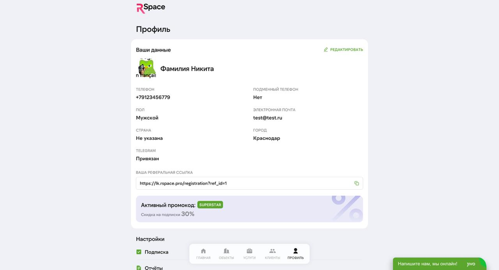

# Уведомления

RSpace отправляет уведомления по четырём каналам: в кабинете, Telegram-бот, Email, SMS. Настройте под свой стиль — и не пропустите ни одного лида.

## Каналы

### Кабинет
Всё сохраняется в кабинете — обычно самый медленный канал.

### Telegram-бот (рекомендуем)
**Самый быстрый канал.** Если привязали — push-сообщение появляется через секунду после события.

Привязка — см. [«Начало работы»](./02-start.md) → шаг 3. Подробнее — [«Баланс»](./09-balance.md).

### Email
Уведомления приходят на адрес, указанный в профиле. Настройте частоту и типы.

### SMS
**Только критичные** — код верификации при регистрации, восстановление пароля. Массовых SMS-рассылок нет.

## Типы уведомлений

### 1. Новый лид
- **Где:** Кабинет + Telegram
- **Когда:** мгновенно при поступлении
- **Пример:** _«Михаил П. · +7 915 000-12-34 · Avito · Тверская, 8»_
- **Действие:** кнопка «Позвонить в 1 клик» в Telegram

### 2. Модерация объекта
- **Где:** Кабинет + Telegram
- **Когда:** когда площадка приняла/отклонила объект
- **Типы:** «Объект опубликован», «Объект отклонён» (с причиной)

### 3. Оплата подписки
- **Где:** Кабинет + Telegram + Email (чек)
- **Когда:** при успешном списании / ошибке списания
- **Пример:** _«Подписка Премиум продлена до 24 мая, с карты \*1234 списано 9 000 ₽»_

### 4. Истечение подписки
- **Где:** Telegram + Email
- **Когда:** за 3 дня до окончания подписки
- **Пример:** _«Ваша подписка истекает через 3 дня. Привяжите карту или выберите тариф»_

### 5. Статус услуги
- **Где:** Кабинет + Telegram
- **Когда:** юрист взял в работу / запросил документы / выполнил
- **Пример:** _«Проверка объекта (Строгино) готова — скачайте PDF в кабинете»_

### 6. Ипотечный статус
- **Где:** Кабинет + Telegram
- **Когда:** брокер сменил статус заявки
- **Пример:** _«Заявка на ипотеку (Иван Петров) одобрена Альфа-Банком»_

### 7. Агентская комиссия начислена
- **Где:** Telegram + Email
- **Когда:** банк или страховая выплатили агентскую комиссию за сделку
- **Пример:** _«+90 000 ₽ на рублёвый баланс. Сделка: Иван Петров, Альфа-Банк»_

### 8. Выплата обработана
- **Где:** Telegram
- **Когда:** админ завершил вывод на карту/счёт
- **Пример:** _«Запрос на вывод 90 000 ₽ выполнен. Ожидайте 1-3 банковских дня»_

## Частота email-уведомлений

По умолчанию каждое событие → отдельный email. Если мешает — в настройках можно выбрать:
- **Все события** (по умолчанию)
- **Только критичные** (оплаты, статусы услуг)
- **Дайджест раз в день** (в планах)
- **Никаких** (только критичная безопасность)

Настройка — «Профиль» → «Уведомления».

## Настройка Telegram

В профиле → Telegram:
- **Только лиды** — хотите слышать только о новых контактах.
- **Только биллинг** — только платежи и подписка.
- **Всё** (по умолчанию).

Отключить все Telegram-уведомления — отвязать бота (кнопка «Отвязать»). Снова привязать в любой момент.

## Многоканальная доставка

Одно событие обычно приходит **на два канала минимум**: кабинет + Telegram или Email. Это страховка на случай блокировки / перехода на другое устройство.

## Email шаблоны

RSpace использует **6 email-шаблонов** (по дизайн-системе):
1. **Приветствие после регистрации** — welcome-письмо с 3 шагами старта.
2. **Код подтверждения** (OTP) — для входа на новом устройстве.
3. **Новая заявка** — моментальное уведомление о лиде.
4. **Еженедельный отчёт** — сводка по неделе (запланировано, ещё не активно — см. Known Issues).
5. **Триал заканчивается** — за 3 дня до окончания пробного.
6. **Клубное предложение** — эксклюзивные акции от застройщиков (когда есть).

## Частые вопросы

**В: В Telegram перестали приходить уведомления. Что делать?**
О: Проверьте, не заблокировали ли бота — найдите чат с ботом RSpace в списке Telegram, если там «Bot blocked» — разблокируйте. Если не помогает — в профиле «Отвязать» → привязать заново через кнопку.

**В: Не приходит email. Проверял спам — тоже нет.**
О: Проверьте, правильный ли email в профиле. Некоторые корпоративные почты блокируют transactional email. Попробуйте Gmail / Yandex. Напишите в поддержку — отправим вручную.

**В: SMS со стартовым кодом не пришла.**
О: Запросите повторно через 90 секунд. Если не пришла за 5 минут — напишите в поддержку.

**В: Могу ли я отключить уведомления только по воскресеньям?**
О: Пока нет. В планах — расписание «тихих часов». Временный workaround: отвязать бот на выходные → привязать в понедельник.

**В: Хочу уведомления ещё и в WhatsApp — возможно?**
О: Нет. WhatsApp Business для transactional в РФ работает сложно. Основной канал — Telegram. Если WhatsApp принципиален — пишите, изучаем спрос.

**В: Еженедельный отчёт — где его включить?**
О: Пока не активен (в разработке). Бета-тестеры получают — напишите в поддержку, добавим вас.

**В: Приходит по 5 уведомлений в минуту, когда сделка активная — можно ли объединить?**
О: В планах — агрегация (один email/Telegram с 5 событиями вместо 5 отдельных). Пока — настройте Telegram как единственный канал (email отключите), чат в Telegram не спамит inbox.

## Что дальше

- [Начало работы](./02-start.md) — привязка Telegram.
- [Лиды](./05-leads.md) — главный источник уведомлений.
- [Настройки](./12-settings.md) — профиль.

## Известные ограничения

- **Дайджест раз в день** — планируется, пока каждое событие = отдельное сообщение.
- **Расписание «тихих часов»** — в разработке.
- **Еженедельный отчёт** — шаблон готов, автоматическая отправка — в разработке.
- **WhatsApp / Viber** — не поддерживаем.
- **Push в мобильное приложение** — приложения нет, поэтому push нет. Используем Telegram как замену.
- **Кастомизация текста писем** — не поддерживается.

---

*Слишком много / слишком мало уведомлений — напишите в поддержку, отрегулируем настройки под вас.*

