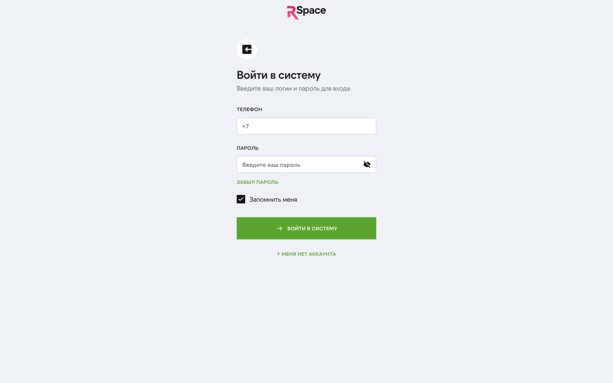

# Решение проблем (Troubleshooting)

Частые проблемы и как их решать. Если не помогло — [связывайтесь с поддержкой](./17-contacts.md).

## Регистрация и вход

### Не пришёл SMS с кодом
1. Проверьте номер — указан правильно (без пробелов, +7 в начале).
2. Подождите 30-60 секунд.
3. Если всё равно нет — запросите повторно через 90 секунд.
4. Проверьте, нет ли у вас включённой блокировки коротких номеров (у некоторых операторов — настройка в личном кабинете оператора).
5. Если не помогло — напишите в поддержку, пришлём код вручную.

### Код неверный
- Код живёт **5 минут**. Если прошло больше — запросите новый.
- Каждый запрос нового кода аннулирует предыдущий.
- Код **одноразовый** — ввести можно один раз.

### Пароль не подходит
1. Проверьте раскладку клавиатуры.
2. Убедитесь, что не нажата Caps Lock.
3. Попробуйте ввести пароль в другом поле (блокнот), потом скопировать в форму.
4. Восстановление: «Забыли пароль» → SMS → новый пароль.

### Заблокировался вход (слишком много попыток)
- **5 попыток в минуту** — лимит. Подождите минуту.
- Если забыли пароль — восстановление через SMS.

### Ошибка «Пользователь деактивирован»
Ваш аккаунт кто-то деактивировал. Возможные причины:
- Вы сами в прошлом нажали «Деактивировать».
- Нарушение правил использования (редко).
- Системная ошибка.

**Решение:** напишите в поддержку с указанием телефона — разберёмся.

## Публикация и объекты

### «undefined» или битые данные в карточке подписки
**Известный баг** (BUG-001 из QA-отчёта). На странице «Услуги» может показываться «Ваш уровень подписки содержит **undefined** ключевых услуг». Это **визуальная ошибка**, подписка работает нормально.

**Обходной путь:** обновите страницу (Ctrl+F5). Если не помогло — разработчики уже знают, ждите фикс.

### Тарифные карточки обрезаны
**Известный баг** (BUG-004). Карточка «Ультима» справа не помещается в контейнер. Текст вида «10 публика...», «3 онлайн и...» — обрезан.

**Обходной путь:** увеличьте ширину браузера / выйдите из полноэкранного режима / зум 90%. Фикс в работе.

### Объект не публикуется («Опубликовать» серая)
Проверьте, что заполнено:
- Адрес (через Dadata).
- Цена (не 0).
- Тип и основные параметры (комнаты для квартиры, площадь для участка).
- **Минимум 3 фото.**
- Данные собственника — минимум ФИО.

Если всё заполнено и кнопка всё ещё серая — F12 → Console → посмотреть ошибки, скриншот в поддержку.

### Объект отклонён модерацией
В карточке увидите статус «Отклонено» + причину от площадки. Типичные:
- **Авито**: «плохое качество фото», «водяной знак на фото», «недостаточно информации».
- **ЦИАН**: «нет ДДУ для новостройки», «неадекватная цена», «не указан юридический статус».
- **ДомКлик**: обычно не явно присылает причину, просто не появляется.

**Что делать:** исправьте → «Опубликовать повторно». Если причина непонятна — скриншот в поддержку.

### Публикация зависла в «На модерации»
- Авито: норма до 4 часов, редко до суток.
- ЦИАН: до суток — норма. Если прошло 48 часов — напишите в поддержку.
- ДомКлик: до 12 часов — норма.

### Фото не загружается
1. Размер файла — до ~15 МБ.
2. Формат — JPEG / PNG (не HEIC, не TIFF).
3. Разрешение — минимум 1024×768.
4. Попробуйте другой браузер.
5. Если всё равно — уменьшите фото (TinyPNG) и попробуйте.

### Фото перевернулось после загрузки
Фото с телефона иногда имеют EXIF-поворот, который не все серверы обрабатывают. Перед загрузкой — откройте фото на компьютере, исправьте поворот, сохраните и загрузите заново.

### Загрузил 10 фото, а в публикации только 7
- Авито лимит: до 20 фото, обычно проходит.
- ЦИАН: до 20.
- ДомКлик: до 50.

Если где-то меньше — возможно, площадка отклонила часть по качеству. Проверьте в кабинете площадки.

## Платежи и подписка

### Списали деньги, подписка не активна
**Частая проблема** — webhook от CloudPayments не дошёл.

**Что делать:**
1. Подождите 2-3 минуты (webhook может отставать).
2. Обновите страницу подписки.
3. Проверьте раздел «История платежей» в «Финансах» — если платёж «Оплачен», а подписка не активна — напишите в поддержку с номером транзакции.

### Автосписание не прошло
Подписка перейдёт в статус «Истекла» → публикации приостановятся.

**Причины:**
- Недостаточно средств на карте.
- Карта заблокирована / протухла.
- Банк отклонил из-за лимитов.

**Что делать:**
1. В «Финансы» → «Платёжные методы» → добавить новую карту.
2. Вручную оплатите подписку на следующий период.
3. Старая карта → сделать не «по умолчанию» или удалить.

### Ошибка 3DS
- **Введите код от банка правильно.** У некоторых банков код — 4 цифры, у других — 6.
- Если push в банк-приложении — подтвердите в нём.
- Если код не приходит — свяжитесь с банком.

### CloudPayments выдаёт ошибку карты
- «Insufficient funds» — недостаточно денег на счёте.
- «Do not honor» — банк отклонил (лимиты, подозрение на фрод). Звоните в банк.
- «Expired card» — карта просрочена, перевыпустите.
- «Invalid card» — номер или CVV неверны.

### Не могу удалить карту
Ошибка «Карта привязана к активному автосписанию» — сначала привяжите другую карту как основную для подписки.

## Telegram

### Бот не присылает уведомления
1. Откройте @rspace_bot в Telegram.
2. Если видите «Bot blocked» — нажмите «Unblock».
3. Если чат пустой — нажмите «Start» / `/start` заново.
4. В профиле RSpace → «Отвязать Telegram» → «Привязать заново».

### «Привязать Telegram» не работает — deeplink не открывается
- Проверьте, установлен ли Telegram.
- Попробуйте открыть ссылку вручную в Telegram (скопируйте).
- Попробуйте в другом браузере.

## Выплаты комиссий

### Запрос на вывод «Ожидает обработки» уже 2 дня
Админы обрабатывают в рабочее время (пн-пт 10-19). Если дольше 2 рабочих дней — напишите в поддержку, напомним.

### Вывел на карту, деньги не пришли
Банковский перевод — 1-3 рабочих дня. В некоторых случаях до 5.

1. Проверьте статус в «Финансы» → «Комиссии» → «История выводов».
2. Если «Завершён» — проверьте историю карты / счёт. Ищите платёж от RSpace.
3. Если больше 5 дней — напишите в поддержку с датой запроса.

## Авторизация и токены

### Внезапно разлогинило
Возможные причины:
- TTL токена истёк (1 день обычно, 30 дней с Remember Me).
- Кто-то зашёл в ваш аккаунт и нажал «Выйти везде».
- Системная ошибка.

Войдите заново. Если повторяется часто — напишите в поддержку.

### Не могу войти в ЛК, хотя только что зарегистрировался
Попробуйте через 1-2 минуты (возможно, БД ещё синхронизируется). Если не помогает — через «Забыли пароль».

## Общие советы

### Что-то не работает — что делать?
1. **F12 → Console** — посмотрите ошибки в браузере. Скриншот в поддержку.
2. **Hard refresh** — Ctrl+Shift+R (Chrome/Firefox) или Cmd+Shift+R (Mac).
3. **Попробуйте другой браузер** — сработало в другом? Значит браузер-специфичный баг.
4. **Incognito** — помогло? Значит проблема в расширениях / cache.
5. **Выйдите → войдите** — простой, но часто помогает.

### Напишите в поддержку правильно
Чтобы мы быстрее разобрались, пришлите:
1. **Телефон** вашего аккаунта.
2. **Точный шаг** где всё ломается.
3. **Скриншот** экрана (желательно с URL в адресной строке).
4. **F12 → Console** ошибки, если видно.
5. **Время** когда случилось (нужно для логов).

## Связанные разделы

- [FAQ](./13-faq.md) — если проблема на самом деле — вопрос «как это работает».
- [Контакты](./17-contacts.md) — если не помогло.

---

*Застряли — не бойтесь писать. Большинство «проблем» решаются за 5 минут переписки с поддержкой.*
