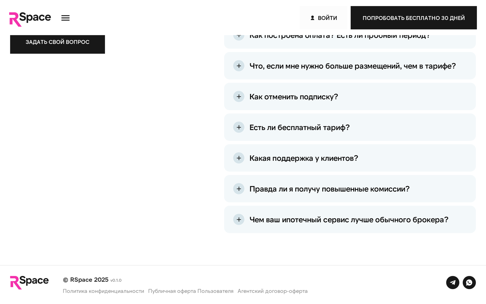

# Юридические документы

Все документы, регулирующие использование RSpace. Перед регистрацией вы **соглашаетесь с офертой** и **согласием на обработку персональных данных** (два отдельных чекбокса, оба обязательные).

Этот раздел — **обзор и ссылки**. Полные тексты документов публикуются на `rspace.pro/docs/*` (HTML-страницы, не PDF).

### Полный перечень документов

У RSpace **четыре** публичных документа:

1. [**Публичная оферта Пользователя**](https://rspace.pro/docs/oferta/) — основной договор на доступ к платформе и услуги.
2. [**Политика конфиденциальности**](https://rspace.pro/docs/privacy/) — как мы обрабатываем персональные данные.
3. [**Согласие на обработку персональных данных**](https://rspace.pro/docs/consent) — отдельная галочка при регистрации (требуется 152-ФЗ).
4. [**Агентский договор-оферта**](https://rspace.pro/docs/oferta-vivod/) — для риелторов, получающих агентские комиссии и вознаграждения (ипотечные/страховые сделки, реферальная программа).

> Если в кабинете встретили упоминание старых условий тарифов — напишите в поддержку, пришлём актуальный документ.

## Публичная оферта

**Что это:** основной договор между вами и RSpace. Регулирует оказание услуг (подписка, услуги, ипотечный брокер).

**Ключевые положения:**
- Стороны: ООО «ЭРСПЕЙС» (исполнитель) и пользователь (заказчик).
- Предмет: доступ к платформе + оказание услуг согласно выбранной подписке.
- Стоимость: по выбранному тарифу (см. [«Тарифы»](./01-tariffs.md)).
- Срок: подписка — помесячно с автопродлением.
- Оплата: через CloudPayments, с 3-D Secure.
- Расторжение: по желанию любой стороны (для пользователя — через «Отмена подписки»).

**Где:** [rspace.pro/docs/oferta/](https://rspace.pro/docs/oferta/) — HTML-страница (не PDF).

**Версионирование:** обновления оферты публикуются на сайте. Вас уведомим за 30 дней о существенных изменениях.

## Политика обработки персональных данных (ПД)

**Что это:** документ в соответствии с **152-ФЗ** («О персональных данных»).

**Кратко, что собираем:**
- **При регистрации:** телефон, email, имя, UTM-метки.
- **В кабинете:** данные объектов (адрес, цена), данные собственников (ФИО, паспорт — для юр.услуг), фото.
- **При оплате:** идентификатор карты (не номер), последние 4 цифры для отображения.
- **Автоматически:** IP, браузер, действия в системе (для безопасности и аналитики).

**Зачем:**
- Оказание услуг (работа платформы).
- Связь (уведомления, поддержка).
- Соблюдение законов РФ (налоговая, финмониторинг).
- Аналитика (обезличенная).

**Как храним:**
- Сервера в РФ (требование 152-ФЗ для ПД граждан РФ).
- Пароли хранятся в хешированном виде (нельзя восстановить).
- Данные банковских карт хранит платёжный партнёр CloudPayments (PCI DSS), не RSpace.
- Базы данных шифруются.

**Ваши права:**
- Получить копию ваших ПД (через поддержку, по 152-ФЗ).
- Исправить ошибочные данные.
- Удалить аккаунт и ПД (полностью, не «деактивировать»).
- Отозвать согласие на обработку (приведёт к удалению аккаунта).

**Где:** [rspace.pro/docs/privacy/](https://rspace.pro/docs/privacy/) — HTML-страница (не PDF).

## Cookie Policy

RSpace использует cookies для:
- **Сессии** — чтобы вы не выходили при каждой странице.
- **Аналитики** — Yandex.Metrika, PostHog (когда включится).
- **CloudPayments** — токены безопасности при платежах.

**Вы можете:**
- Отключить cookies в браузере (но кабинет может перестать работать).
- Очистить cookies → разлогин.

**Где:** отдельного Cookie Policy-документа **на лендинге нет**. Информация про cookies включена в Политику конфиденциальности (`/docs/privacy/`).

## Пользовательское соглашение (Terms of Service)

Правила использования платформы — что можно и нельзя.

**Нельзя:**
- Публиковать заведомо ложные объявления.
- Нарушать законы РФ через платформу (мошенничество, отмывание).
- Автоматизировать действия (боты, парсинг массовый).
- Создавать несколько аккаунтов одним лицом для обхода лимитов.
- Пытаться взломать платформу или API.

**При нарушении:** блокировка аккаунта. В серьёзных случаях — передача материалов в правоохранительные органы.

**Где:** отдельного Terms-документа **на лендинге нет** — правила использования прописаны в Публичной оферте (`/docs/oferta/`).

## Договор публичной оферты на юридические услуги

Отдельный документ для услуг юриста / проверок / сопровождения сделки.

**Ключевые положения:**
- Юрист, выполняющий работу, — **нанятый партнёр RSpace**.
- Ответственность юриста — в рамках его работы (не предсказания рыночной цены, а именно юридическая).
- Возврат средств — если работа не была начата.

**Где:** включён в Публичную оферту на `rspace.pro/docs/oferta/`.

## Реквизиты RSpace

**Полное наименование:** Общество с ограниченной ответственностью «ЭРСПЕЙС» (ООО «ЭРСПЕЙС»)

**ИНН:** 5260499800
**КПП:** 526001001
**ОГРН:** 1255200009382 (от 10 апреля 2025 г.)
**Уставный капитал:** 14 286 ₽
**Генеральный директор:** Козлов Алексей Валерьевич (с 10 апреля 2025 г.)

**Юридический адрес:** 603001, Российская Федерация, Нижегородская область, г. Нижний Новгород, ул. Рождественская, д. 26, помещ. П3

**Email:** `support@rspace.pro` (подтверждено в тексте Политики конфиденциальности на `https://rspace.pro/docs/privacy/`)

**Телефон:** `+7 (929) 047-24-77`

## Связь с Роскомнадзором и 152-ФЗ

Оператор персональных данных: **ООО «ЭРСПЕЙС»**. Сведения о регистрации в Реестре операторов ПД запрашивайте в поддержке.

## Налоги и отчётность

### Для вас (как пользователя)
- Комиссии, заработанные через RSpace (ипотечные, страховые), — **ваш доход**. Вы самостоятельно декларируете и платите налоги.
- Самозанятые (НПД) — 4-6% от выручки.
- ИП — по своей системе налогообложения.
- Физлица — 13% НДФЛ (или 15% для высоких доходов).

RSpace **не удерживает налоги** с ваших комиссий — переводит как есть.

### Для ООО «ЭРСПЕЙС»
- Юридическое лицо РФ, работает по российскому законодательству.
- Работаем по российскому законодательству.
- Оформляем счета-фактуры для юр.лиц.

### Документы для бухгалтерии
Если вы ИП / ООО и нужны закрывающие документы:
1. Напишите в поддержку, укажите реквизиты.
2. В начале следующего месяца пришлём акты и счета-фактуры.
3. Для электронного документооборота (ЭДО) — уточните оператора (СБИС, Диадок, Контур) в поддержке.

## Возвраты

Подробнее — [«Баланс и выплаты»](./09-balance.md) → Возвраты.

**Краткая политика:**
- Подписка, не использованная ≤3 дней → полный возврат через поддержку.
- Подписка, использованная → работает до конца периода, возврата нет.
- Услуга, не начатая юристом → возврат на внутренний баланс.
- Услуга, выполненная → возврата нет (работа сделана).

## Разрешение споров

1. **Напрямую:** напишите в поддержку. 90% споров решаются без формальностей.
2. **Претензионный порядок:** если не договорились — отправьте письменную претензию на support@rspace.pro или юридический адрес.
3. **Суд:** если претензия не удовлетворена за 30 дней — в соответствии с оферой, споры рассматриваются в суде по месту нахождения RSpace (или по правилам ГПК РФ для потребителей).

## Частые вопросы

**В: Я — самозанятый. Могу ли использовать RSpace?**
О: Да. Подписка оплачивается с личной карты, работа — от вашего имени. Комиссии идут вам, декларируете по НПД.

**В: Получил комиссию, нужно ли платить налог?**
О: Да. RSpace не удерживает. Вы декларируете сами. Формат зависит от статуса (ИП, самозанятый, физлицо).

**В: Где взять справки о выплатах (для налоговой)?**
О: Запросите в поддержке. Мы выдадим подтверждение о полученных комиссиях за год.

**В: Можно ли работать от имени ООО?**
О: Да. В реквизитах укажите ИНН ООО. Оплата — с карты юр.лица или по счёту. Комиссии — на счёт ООО.

**В: Почему я не вижу подписанный со мной договор?**
О: Работаем по публичной оферте — она заменяет индивидуальный договор. Факт согласия — ваша регистрация. Если нужен подписанный договор — напишите в поддержку, сделаем (обычно для крупных Enterprise-клиентов).

**В: RSpace хранит мои ПД за рубежом?**
О: Нет. Все данные — в РФ, в соответствии с 152-ФЗ. Карты — в CloudPayments (Россия). OpenAI (для AI-описаний) — отправляются обобщённые данные об объекте без паспортов и ПД клиентов.

## Что дальше

- [Контакты](./17-contacts.md) — куда писать.
- [Баланс и выплаты](./09-balance.md) — возвраты.
- [Тарифы](./01-tariffs.md) — оферта.

## Известные ограничения

- **Реестр операторов ПД** — сведения о регистрации в Роскомнадзоре запрашивайте в поддержке.
- **Подписанный бумажный договор** — по умолчанию работаем по публичной оферте. Для Enterprise-клиентов можем подготовить бумажный договор по запросу.
- **Электронный документооборот (ЭДО)** — подключаем по запросу (СБИС, Диадок, Контур). Напишите в поддержку.

---

*Все юридические вопросы — в поддержку. Если нужен подписанный договор — отправим.*
