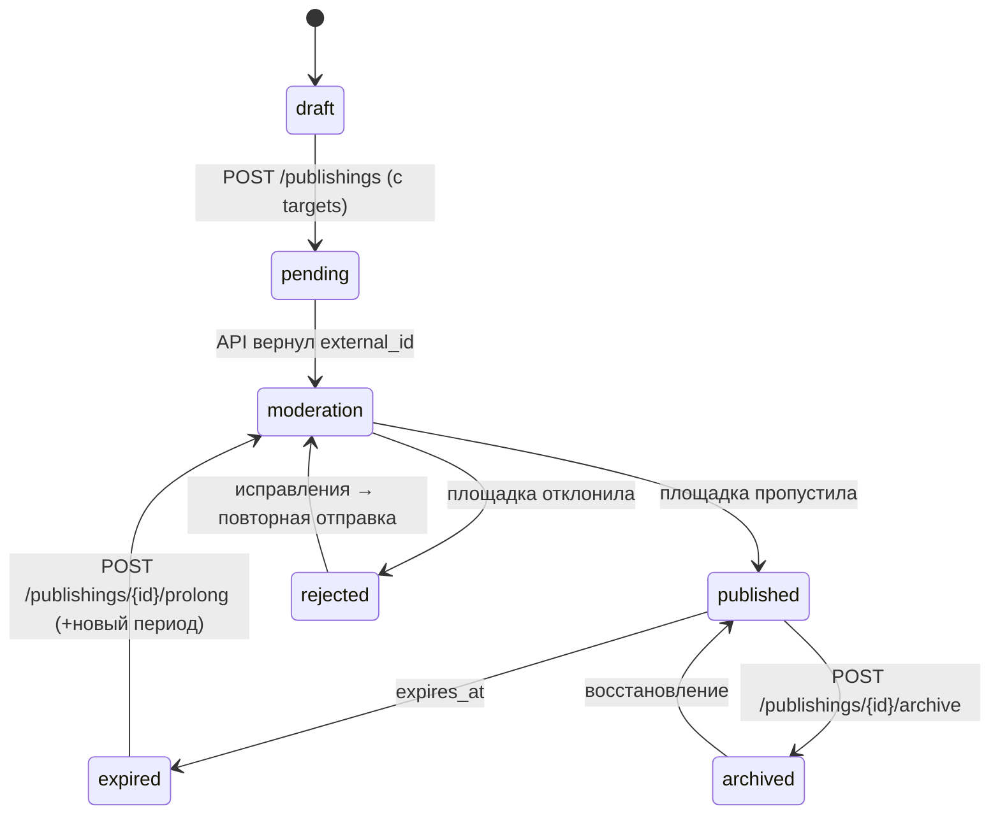

# Модуль: Publishings

> **Домен:** Publishings (публикация объектов на классифайдах)
> **Репозиторий:** `rspase/project/backend`
> **Путь:** `backend/app/Publishings/` + `backend/app/Http/Controllers/Publishings/` + `backend/app/Models/Publishings/`
> **Ветка prod:** `dev`
> **Статус:** production

## Назначение

Публикация объектов на внешних площадках (Avito, ЦИАН, ДомКлик), получение статистики (просмотры, звонки, сохранения), платное продвижение (топ-лист, выделение, закрепление), продление срока размещения. Один объект (`Realty`) может иметь несколько платформенных публикаций.

## Архитектурная схема

```
Realty (1) ───hasMany──▶ Publishing (N)
                            │
                ┌───────────┼───────────┐
                ▼           ▼           ▼
         AvitoPublishing  CianPublishing  (DomClick — через feed, без своей модели)
                │           │
                ▼           ▼
         статистика    статистика
         звонки        звонки
         сообщения     сообщения
         продвижения   продвижения
```

`Publishing` — агрегатор: привязка объекта к «событию размещения». Внутри него — платформо-специфичные child-записи.

## Ключевые сущности

### Publishing (общее)

| Модель | Путь | Описание |
|---|---|---|
| `Publishing` | `app/Models/Publishings/Publishing.php` | Корневая публикация. Поля: `realty_id`, `user_id`, `status`, `archived_at`, `expires_at` |
| `PublishingStatus` (enum) | `app/Models/Publishings/PublishingStatus.php` | Статусы: `active`, `archived`, `expired` |
| `PublishingStatusInfo` | `app/Models/Publishings/PublishingStatusInfo.php` | Человекочитаемые названия |
| `PublishingPlatform` (enum) | `app/Publishings/Models/PublishingPlatform.php` | `avito`, `cian`, `domclick` |
| `PublishingCallInfo` | `app/Publishings/Models/PublishingCallInfo.php` | Объединённая модель звонка (из Avito + CIAN), для админки |

### Avito

| Модель | Путь | Описание |
|---|---|---|
| `AvitoPublishing` | `app/Models/Publishings/Avito/Publishings/AvitoPublishing.php` | Дочерняя запись для Avito. `publishing_id`, `external_id` (номер объявления на Avito), `status`, `published_at`, `url` |
| `AvitoPublishingStatus` (enum) | там же | `pending`, `moderation`, `published`, `rejected`, `archived` |
| `AvitoSyncDto` | там же | DTO для синхронизации данных с Avito API |
| `AvitoMessage` | там же | Сообщения от клиентов через Avito (встроенный чат) |
| `AvitoMessageType` | enum | Типы сообщений (текст, звонок, просмотр) |
| `AvitoMessagesCast` | там же | Eloquent-cast для JSON-поля messages |
| `AvitoPublishingStatistics` | `app/Models/Publishings/Avito/Statistics/` | Агрегаты: просмотры, контакты, сохранения |
| `AvitoPublishingCall` | там же | Звонок клиента — номер, время, длительность, запись |

### Avito Promotions (платное продвижение)

| Модель | Описание |
|---|---|
| `AvitoPromotion` | Каталог продуктов (топ, выделение, закрепление) |
| `AvitoPromotionType` (enum) | Тип (VIP, Premium, XL, Highlight, ...) |
| `AvitoPromotionOrder` | Заказ юзера на продвижение |
| `AvitoPromotionOrderStatus` | `pending`, `paid`, `active`, `completed`, `failed` |
| `AvitoPromotionRequest` | Заявка агента админу на покупку (админ обрабатывает вручную) |

### CIAN (зеркально структуре Avito)

| Модель | Путь |
|---|---|
| `CianPublishing` | `app/Models/Publishings/Cian/Publishings/CianPublishing.php` |
| `CianPublishingStatus` | enum |
| `CianSyncDto` | DTO синхронизации |
| `CianPublishingStatistics` | просмотры / контакты |
| `CianPublishingCall` | звонки |
| `CianPromotion` / `CianPromotionRequest` / `CianPromotionType` | промо-продукты |

## API-эндпоинты (публичные)

Префикс: `/publishings`. Middleware: `auth:user`. Controller: `app/Http/Controllers/Publishings/PublishingController.php`.

### Общие

| Метод | URL | Описание |
|---|---|---|
| `GET` | `/publishings` | Список публикаций юзера |
| `POST` | `/publishings` | Создать (на этапе `POST /realties/{id}/publish` обычно; ручная альтернатива) |
| `GET` | `/publishings/charges` | Текущее использование лимитов по подписке (сколько публикаций активно) |
| `GET` | `/publishings/{id}` | Получить одну публикацию |
| `PUT` | `/publishings/{id}` | Обновить (после изменения объекта — sync) |
| `POST` | `/publishings/{id}/archive` | Архивировать (снять со всех площадок) |
| `POST` | `/publishings/{id}/prolong` | Продлить срок публикации |
| `PATCH` | `/publishings/{id}/external-id` | Ручная привязка внешнего ID (например если объявление создано вне RSpace) |

### Avito-specific

| Метод | URL | Controller | Описание |
|---|---|---|---|
| `POST` | `/publishings/{id}/avito` | `PublishingController::addAvito` | Опубликовать на Avito |
| `DELETE` | `/publishings/{id}/avito` | `PublishingController::deleteAvito` | Удалить с Avito |
| `GET` | `/publishings/{id}/avito/statistics` | `AvitoPublishingController::getAvitoStatistics` | Просмотры, контакты |
| `GET` | `/publishings/{id}/avito/calls` | `AvitoPublishingController::getAvitoCalls` | Звонки (с записями, если есть) |
| `GET` | `/publishings/{id}/avito/called-phone-numbers` | `AvitoPublishingController::getCalledPhoneNumbers` | Уникальные номера позвонивших |
| `GET` | `/publishings/{id}/avito/promotions/order/prices` | `AvitoPromotionController::getPromotionPrices` | Цены на продвижение |
| `POST` | `/publishings/{id}/avito/promotions/order` | `AvitoPromotionController::orderPromotion` | Заказать продвижение (онлайн) |
| `POST` | `/publishings/{id}/avito/promotions/request` | `PublishingController::requestAvitoPromotion` | Заявка админу (ручное согласование) |

### CIAN-specific

Зеркально Avito:

| Метод | URL |
|---|---|
| `POST` | `/publishings/{id}/cian` |
| `DELETE` | `/publishings/{id}/cian` |
| `GET` | `/publishings/{id}/cian/statistics` |
| `GET` | `/publishings/{id}/cian/calls` |
| `GET` | `/publishings/{id}/cian/called-phone-numbers` |
| `POST` | `/publishings/{id}/cian/promotions/request` |

Детали — [../03-api-reference/publishings.md](../03-api-reference/publishings.md).

### ДомКлик

Отдельных эндпоинтов нет. Публикация через feed-файл:

| Метод | URL | Описание |
|---|---|---|
| `GET` | `/feed/avito` | XML-feed для Avito (резерв, если API не сработало) |
| `GET` | `/feed/cian` | XML-feed для ЦИАН (резерв) |

**ДомКлик** на 2026-04-23 в коде не имеет отдельного feed-endpoint'а. В `routes/api.php` только `/feed/avito` и `/feed/cian`. Проверено через `_verification/routes-dev-2026-04-23.json`. Если ДомКлик подключается — то через ручную выгрузку или Avito-feed с собственным парсером на стороне ДомКлика.

Детали — [../05-integrations/domclick.md](../05-integrations/domclick.md).

## Сервисы и бизнес-логика

Фактическая структура — разделена между `app/Services/Publishings/` (основной flow публикаций) и `app/Publishings/Services/` (life-cycle, expiration):

| Сервис | Путь | Что делает |
|---|---|---|
| `PublishingService` | `app/Services/Publishings/PublishingService.php` | Центральный оркестратор: create/update/archive |
| `AvitoPublishingService` (+ `DefaultAvitoPublishingService`) | `app/Services/Publishings/` | Синхронизация с Avito API |
| `CianPublishingService` | **Не найдено отдельного файла** — логика CIAN-публикаций живёт в `CianPublishingController` + `app/Services/Cian/NewObject/CianNewObjectService.php` (для XML-подачи). Выделенного service-класса нет — **tech debt** для выравнивания с Avito |
| `PromotionService` (+ `DefaultPromotionService`) | `app/Services/Publishings/` | Заказ и обработка промо-продуктов Avito и CIAN |
| `AvitoPromotionOrderSpecification` / `PromotionPrice` | `app/Services/Publishings/` | DTO/спецификации для промо-заказов |
| `PublishingChargeService` (+ `DefaultPublishingChargeService`) | `app/Services/Publishings/` | Расчёт использования лимитов подписки |
| `ExpirationService` (+ `DefaultExpirationService`) | `app/Publishings/Services/` | Логика окончания срока публикации (уведомления, архивирование) |

## События и очереди

### Events

Фактический набор событий в коде:

| Event | Путь | Когда |
|---|---|---|
| `PublishingCreated` | `app/Events/Publishings/PublishingCreated.php` | Публикация создана (агент нажал «опубликовать») |
| `PublishingArchived` | `app/Events/Publishings/PublishingArchived.php` | Архивирование (агентом или по сроку) |
| `PublishingExpired` | `app/Publishings/Events/PublishingExpired.php` | Срок действия истёк (из `ProcessPublishingExpirationCommand`) |
| `AvitoPublishingActivated` | `app/Events/Publishings/Avito/AvitoPublishingActivated.php` | Avito подтвердил публикацию. Listener: `DispatchAvitoObjectPublished` (в AmoCrm) + `TriggerAvitoPublishingActivated` |
| `AvitoPublishingStatusChanged` | `app/Events/Publishings/Avito/AvitoPublishingStatusChanged.php` | Avito вернул новый статус (обычно через feed) |
| `AvitoPublishingFeedErrorOccurred` | там же | Ошибка при парсинге feed Avito |
| `CianPublishingPublished` | `app/Events/Publishings/Cian/CianPublishingPublished.php` | CIAN опубликовал |
| `CianPublishingStatusChanged` | там же | CIAN вернул новый статус |
| `CianPublishingFeedErrorOccurred` | там же | Ошибка feed CIAN |
| `AvitoPromotionRequested` | `app/Events/Publishings/Promotion/AvitoPromotionRequested.php` | Агент заказал промо на Avito |
| `CianPromotionRequested` | `app/Events/Publishings/Promotion/CianPromotionRequested.php` | Агент заказал промо на CIAN |

`RealtyPublished` event в коде отсутствует — публикация диспатчит `PublishingCreated`, а не `RealtyPublished` (доку старых версий можно считать устаревшей).

### Scheduled commands (cron)

В `app/Publishings/Console/Scheduler.php` зарегистрирована одна задача:

```php
$this->schedule->command(ProcessPublishingExpirationCommand::class)
    ->everyThirtyMinutes()
    ->runInBackground();
```

- `ProcessPublishingExpirationCommand` — **каждые 30 минут**. Находит публикации с `expires_at < now()`, архивирует и/или шлёт уведомление «срок истёк».

Синхронизация статистики и звонков с Avito/CIAN запускается **при каждом GET `/publishings/{id}/avito/statistics`** (pull-модель), а не по расписанию.

### Jobs

- Публикация на Avito → Job → Avito API → `AvitoPublishing.external_id` сохраняется.
- Публикация на CIAN → Job → CIAN API.
- Получение статистики и звонков — батчами (TBD частота).

## Интеграции

| Интеграция | Что делает |
|---|---|
| **Avito API** | Создание/обновление/удаление объявления; pull статистики и звонков; заказ промо-услуг. Детально — [avito.md](../05-integrations/avito.md) |
| **CIAN API** | То же, но для ЦИАН. — [cian.md](../05-integrations/cian.md) |
| **ДомКлик** | Через feed-файл (pull со стороны ДомКлик). — [domclick.md](../05-integrations/domclick.md) |
| **AmoCRM** | Публикация → event → `DispatchAvitoObjectPublished` / `DispatchCianObjectPublished` listeners → webhook в AmoCRM |
| **Telegram Bot** | Уведомления о модерации (принято / отклонено) |
| **Dadata** | (косвенно, через `Location` объекта — для корректной отправки адреса на площадку) |

## Статусы публикации (lifecycle)



Каждая платформа имеет свой `status` (`AvitoPublishingStatus`, `CianPublishingStatus`). Общий `Publishing.status` — агрегат.

## Лимиты по тарифу

Активных публикаций: Триал/Профи — 3, Премиум — 5, Ультима — 10.

Счёт ведётся через `PublishingChargeService::getCharges()` → `GET /publishings/charges`. Возвращает:
```json
{
  "data": {
    "used": 3,
    "limit": 5,
    "plan": "premium",
    "items": [
      { "realty_id": 789, "started_at": "2026-04-20T10:00:00Z" }
    ]
  }
}
```

Превышение → `403` при попытке новой публикации.

## Frontend-привязка

| Страница | URL frontend | Использует |
|---|---|---|
| Список публикаций | `/my/publishings` | `GET /publishings` |
| Детали публикации | `/my/realties/{id}` (блок «Публикации») | `GET /publishings/{id}` + platform-specific stats |
| Звонки по объекту | `/my/realties/{id}/calls` (встроенная вкладка) | `GET /publishings/{id}/avito/calls` + `/cian/calls` |
| Продвижение | модал в карточке | `GET /publishings/{id}/avito/promotions/order/prices` + `POST /order` |

## Known issues и технический долг

- **Модели в двух местах**: `app/Models/Publishings/` (основная) + `app/Publishings/Models/` (новая). Идёт миграция, не завершена.
- **ДомКлик**: нет прямого API-интеграции. Работает только через feed. Валидация на стороне ДомКлик происходит асинхронно, статусы не возвращаются в RSpace оперативно.
- **Яндекс.Недвижимость**: в паспорте указана как партнёр, но интеграция в коде **не найдена**. TBD.
- **Звонки**: запись звонка приходит с задержкой (от площадки). Для CIAN — часть звонков без записи (платный тариф площадки нужен).
- **Promotions Online vs Request**: Online (`/order`) работает только для Avito. CIAN — только `/request` (ручное согласование админом). В документации фронту важно показывать это различие.
- **Scheduled sync** — в `app/Publishings/Console/Scheduler.php` зарегистрирована только expiration-задача (каждые 30 минут). Отдельной периодической синхронизации статистики/звонков нет — статистика подтягивается on-demand при GET-запросах юзера.
- **Avito Messages**: встроенный чат — читается из `AvitoMessage`, но в UI кабинета пока не выведен (статус TBD).

## Связанные разделы

- [realty.md](./realty.md) — модуль объектов (инициатор публикаций).
- [leads.md](./leads.md) — как обрабатываются звонки → лиды.
- [../05-integrations/avito.md](../05-integrations/avito.md), [cian.md](../05-integrations/cian.md), [domclick.md](../05-integrations/domclick.md)
- [../03-api-reference/publishings.md](../03-api-reference/publishings.md)
- [../05-integrations/amocrm.md](../05-integrations/amocrm.md) — event dispatch

## Ссылки GitLab

- [Publishings/](https://git.rs-app.ru/rspase/project/backend/-/tree/dev/app/Publishings)
- [Models/Publishings/](https://git.rs-app.ru/rspase/project/backend/-/tree/dev/app/Models/Publishings)
- [PublishingController.php](https://git.rs-app.ru/rspase/project/backend/-/blob/dev/app/Http/Controllers/Publishings/PublishingController.php)
- [AvitoPublishingController.php](https://git.rs-app.ru/rspase/project/backend/-/blob/dev/app/Publishings/Http/Controllers/AvitoPublishingController.php)
- [CianPublishingController.php](https://git.rs-app.ru/rspase/project/backend/-/blob/dev/app/Publishings/Http/Controllers/CianPublishingController.php)
