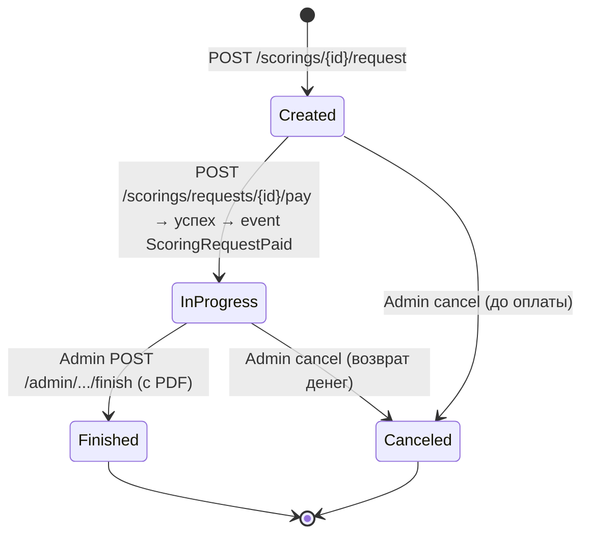
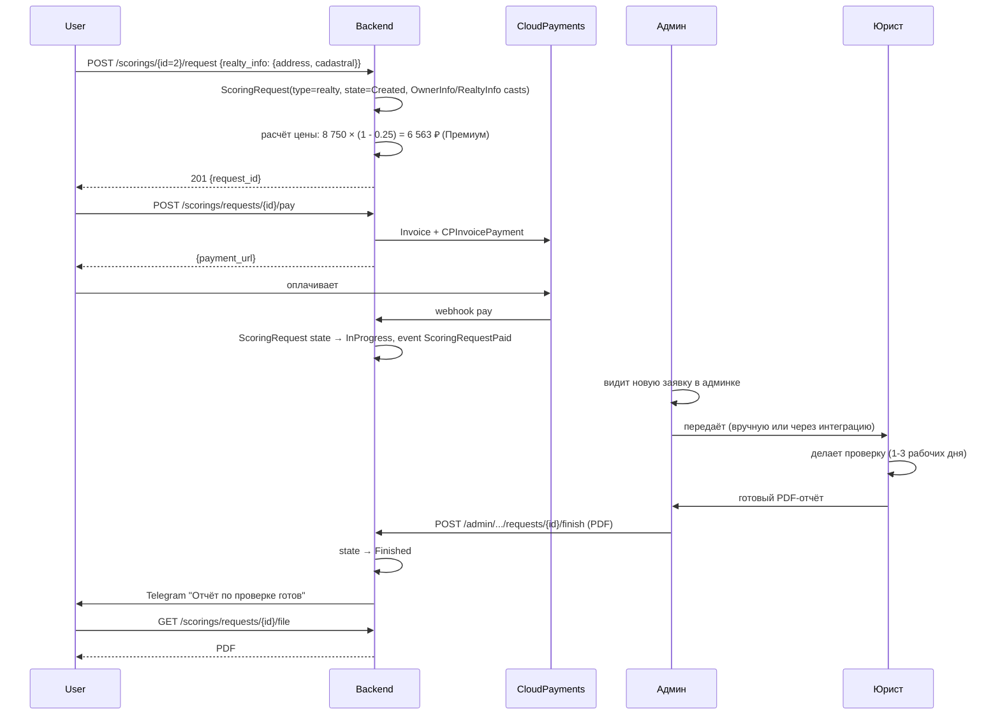

# Модуль: Scoring

> **Домен:** Scoring (платная юридическая проверка — собственник, объект, комбо)
> **Репозиторий:** `rspase/project/backend`
> **Путь:** `backend/app/Scoring/`
> **Ветка prod:** `dev`
> **Статус:** production

## Назначение

Scoring — это **полноценная юридическая проверка** с заключением юриста: проверка правоустанавливающих документов, истории переходов собственности, наличия обременений, судебных споров, банкротства владельца. Результат — **PDF-отчёт**, который агент передаёт клиенту.

Три типа проверок:
1. **Собственник** (`owner`) — проверка по ФИО + паспорту: банкротство, суды, исполнительные производства.
2. **Объект** (`realty`) — проверка по адресу / кадастровому номеру: правоустанавливающие, обременения, история.
3. **Собственник + объект** (`realty_and_owner`) — комбо.

В UI проходит как услуга, но на бэкенде — отдельный модуль со своим жизненным циклом (State pattern).

### 🔴 Tech-debt: параллельная таблица `services` с теми же проверками

В `services` таблице БД существуют **отдельные записи** для проверки объекта и проверки собственника (id=12, 15, 16, 17) с другими ценами, чем в `scorings`. Сверено 2026-04-23 через админку:

| Услуга | `scorings` (цена) | `services` (Столицы, цена) |
|---|---:|---:|
| Проверка объекта | 5 000 ₽ | 7 000 ₽ (id=16) |
| Проверка собственника | 2 500 ₽ | 3 000 ₽ (id=17) |
| Комбо (Полная проверка) | 8 000 ₽ | 8 000 ₽ (id=28) ✓ только тут совпадает |

То есть в prod-среде **две параллельные реализации одной смысловой услуги**: `Scoring` (этот модуль) и `Service` (внутри [Services module](./services.md)). Как юзер покупает — через какой поток — неизвестно. Вероятно, дубли созданы для разных UI-сущностей (общий каталог услуг vs отдельный блок скорингов). Требует продуктового решения — оставить одну, обе или объединить. Занесено в [14-tech-debt](../14-tech-debt.md) как TD-V10.

## Ключевые сущности

### Основные модели

| Модель | Путь | Описание |
|---|---|---|
| `Scoring` | `app/Scoring/Models/Scoring.php` | Тип скоринга (собственник / объект / комбо) + базовая цена и параметры |
| `ScoringType` (enum) | `app/Scoring/Models/ScoringType.php` | `owner`, `realty`, `realty_and_owner` |
| `ScoringRequest` | `app/Scoring/Models/ScoringRequest.php` | Конкретная заявка юзера |
| `ScoringRequestStatus` (enum) | там же | Статус через `ScoringRequestState` (State pattern) |
| `OwnerInfo` | `app/Scoring/Models/OwnerInfo.php` | Данные собственника в заявке (value-object) |
| `PassportInfo` | `app/Scoring/Models/PassportInfo.php` | Паспортные данные (value) |
| `RealtyInfo` | `app/Scoring/Models/RealtyInfo.php` | Данные объекта (адрес, кадастр) в заявке |
| `ScoringRequestOwnerInfoCast` | там же | Eloquent cast JSON → `OwnerInfo` |
| `ScoringRequestRealtyInfoCast` | там же | То же для realty |

### State pattern

Статусы реализованы через абстрактный класс + конкретные states:

```
app/Scoring/Models/States/
├── ScoringRequestState.php         (абстракт)
├── ScoringRequestCreatedState.php
├── ScoringRequestInProgressState.php
├── ScoringRequestFinishedState.php
└── ScoringRequestCanceledState.php
```

Каждый state знает, какие переходы разрешены (`canBeCanceled()`, `canBeFinished()`, `canBePaid()`). Exceptions при невозможных переходах:
- `ScoringRequestCantBeCanceledException`
- `ScoringRequestCantBeFinishedException`
- `ScoringRequestCantBePaidException`

### DTO для создания

```
app/Scoring/Dto/
├── CreateOwnerScoringRequestDto.php       - собственник
├── CreateRealtyScoringRequestDto.php      - объект
├── CreateRealtyAndOwnerScoringRequestDto.php  - комбо
└── CreateScoringDto.php                   - общее (админ, создание типа)
```

## API-эндпоинты (публичные)

Префикс: `/scorings`. Middleware: **без явного `auth:user` в группе** — но контроллер проверяет auth внутри. Controllers: `ScoringsController`, `ScoringRequestsController`.

### Каталог

| Метод | URL | Описание |
|---|---|---|
| `GET` | `/scorings` | Список типов проверок (owner/realty/combo) |
| `GET` | `/scorings/{id}` | Детали типа |

### Заявки

| Метод | URL | Описание |
|---|---|---|
| `POST` | `/scorings/{id}/request` | Создать заявку на проверку (передаются `OwnerInfo` или `RealtyInfo`) |
| `GET` | `/scorings/requests` | Список заявок юзера |
| `GET` | `/scorings/requests/{id}` | Детали заявки |
| `POST` | `/scorings/requests/{id}/pay` | Оплатить заявку (если создана, но не оплачена) |
| `GET` | `/scorings/requests/{id}/file` | Скачать PDF-отчёт (когда finished) |

### Admin

Под `/admin/scorings*`. Controllers: `AdminScoringsController`, `AdminScoringRequestsController`.

- CRUD типов скоринга (создать/обновить/архивировать).
- Обработка заявок: `cancel`, `finish` (с прикреплением PDF-файла через `POST /admin/scorings/requests/{id}/finish`).
- Ручное назначение статуса.

## Life cycle (States)



## Сервисы

| Сервис | Путь | Что делает |
|---|---|---|
| `ScoringService` / `DefaultScoringService` | `app/Scoring/Services/` | CRUD типов, цен |
| `ScoringRequestService` / `DefaultScoringRequestService` | там же | Создание заявок, оплата, смена status через state-pattern |

### Permissions

`app/Scoring/Permissions/` — 4 класса:
- `ScoringPermission`, `ScoringPolicy` — для доступа к типам скоринга (админ/юзер).
- `ScoringRequestPermission`, `ScoringRequestPolicy` — для заявок (юзер видит только свои).

Используется через Laravel Gate.

### QueryBuilders

- `ScoringQueryBuilder`, `ScoringRequestQueryBuilder` — кастомные скоупы для запросов.

## События

- `ScoringRequestPaid` (`app/Scoring/Events/`) — выстреливает после успешной оплаты `CPInvoicePayment` за scoring request. Listeners:
  - Telegram-уведомление админу: «новая заявка на проверку».
  - AmoCRM (через `InvoicePaid` общий listener).

## Flow: проверка объекта



## Resources (API response structures)

- `ScoringResource` — каталог
- `ScoringAdminResource` — админский вариант
- `ScoringRequestResource` — заявка для юзера
- `ScoringRequestAdminResource` — админский
- `OwnerInfoResource`, `PassportInfoResource`, `RealtyInfoResource` — встроенные

## Frontend-привязка

| Страница | URL | Использует |
|---|---|---|
| Каталог скорингов | `/my/services` (интегрирован в общую витрину) | `GET /scorings` |
| Создание заявки | через виджет объекта или отдельный поток | `POST /scorings/{id}/request` |
| Мои заявки | `/my/scoring-requests` | `GET /scorings/requests` |
| PDF отчёта | ссылка в карточке | `GET /scorings/requests/{id}/file` |

## Известные ограничения

- **Ручной процесс**: проверка делается юристом RSpace, не автоматизирована. Скорость зависит от очереди (1-3 рабочих дня).
- **Нет SLA в UI**: юзер не видит точного ETA, только статус «в работе».
- **Реальные интеграции с Росреестром/ФНС** в коде не видны — юрист пользуется внутренними инструментами. TBD для API-интеграции.
- **Отмена заявки**: после `Finished` — не возвращается. До — через админа (возврат в кабинете СП).
- **Комбо-скидки** — open question в ТЗ пересборки (как комбо + скидка по тарифу накладывать).

## Связанные разделы

- [services.md](./services.md) — смежный модуль (юрист, ДКП и т.д.)
- [billing.md](./billing.md) — оплата.
- [../03-api-reference/scorings.md](../03-api-reference/scorings.md)
- [../05-integrations/cloudpayments.md](../05-integrations/cloudpayments.md)

## Ссылки GitLab

- [Scoring/](https://git.rs-app.ru/rspase/project/backend/-/tree/dev/app/Scoring)
- [ScoringsController.php](https://git.rs-app.ru/rspase/project/backend/-/blob/dev/app/Scoring/Http/Controllers/ScoringsController.php)
- [ScoringRequestsController.php](https://git.rs-app.ru/rspase/project/backend/-/blob/dev/app/Scoring/Http/Controllers/ScoringRequestsController.php)
