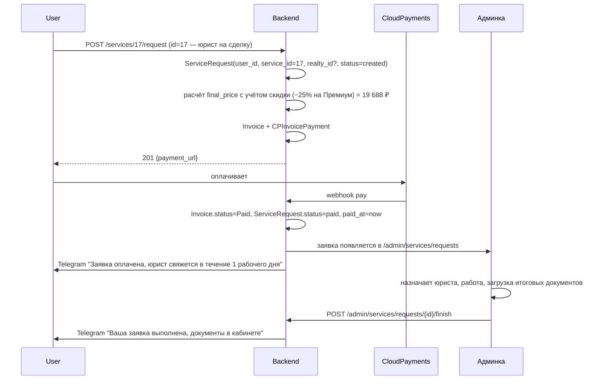

# Модуль: Services

> **Домен:** Services (заявки на юр. и иные услуги)
> **Репозиторий:** `rspase/project/backend`
> **Путь:** `backend/app/Http/Controllers/Services/` + `backend/app/Models/Services/`
> **Ветка prod:** `dev`
> **Статус:** production

## Назначение

Каталог услуг, заказ услуг агентом (юрист на сделку, сопровождение, подготовка ДКП, 2D/3D планировка и т.д.), отслеживание заявок. Связан с тарифами: скидка на услуги зависит от подписки пользователя (см. [subscriptions.md](./subscriptions.md)). Для глубоких «проверок» (собственник/объект) есть отдельный модуль [Scoring](./scoring.md).

### 🔴 Tech-debt: каталог `services` дублирует `scorings`

В `services` есть отдельные записи для проверки объекта / собственника (`id=12, 15, 16, 17` + комбо `id=28`) с ценами, отличающимися от `scorings`-таблицы. Tech-debt TD-V10 в [14-tech-debt](../14-tech-debt.md). На 2026-04-23 непонятно, какая из двух реализаций активна при заказе из UI — требует проверки в коде и принятия продуктового решения.

## Ключевые сущности

### Основные модели

| Модель | Путь | Описание |
|---|---|---|
| `Service` | `app/Models/Services/Service.php` | Тип услуги: «Юрист на сделку», «Подготовка ДКП», «Сопровождение покупателя» и т.д. Цены (столица/регионы), связь с категорией |
| `ServiceCategory` | `app/Models/Services/ServiceCategory.php` | Группировка (Юридические, Ипотека, Страховка, Планировки) |
| `ServiceType` | `app/Models/Services/ServiceType.php` | enum: `standard` / `urgent` (срочный вариант — двойная цена) |
| `ServiceRequest` | `app/Models/Services/ServiceRequest.php` | Заявка юзера: `user_id`, `service_id`, `realty_id?`, `status`, `final_price`, `paid_at`, поля контакта клиента |
| `ServiceRequestStatus` | `app/Models/Services/ServiceRequestStatus.php` | enum из 4 значений: `created`, `in_progress`, `completed`, `canceled` (именно через один `l`). Оплата — отдельная сущность `Invoice`, не статус заявки |
| `ServiceRequestAdminComment` | `app/Models/Services/ServiceRequestAdminComment.php` | Комментарии админов к заявке |

### Charges (лимиты подписки)

| Модель | Описание |
|---|---|
| `ServiceCharge` | Запись «юзер X имеет право на N услуг типа Y». Создаются при активации подписки, по `PlanServicePivot` |
| `ServiceChargeUsage` | Запись использования (N-ная консультация юриста, вторая проверка объекта). Связывает `ServiceCharge` с `ServiceRequest` |

Лимиты подписки (1 проверка объекта у Профи, 2 у Премиума, 3 у Ультимы) реализованы как `ServiceCharge` + счётчик через `ServiceChargeUsage`.

## API-эндпоинты (публичные, `auth:user`)

Префикс: `/services`. Controller: `app/Http/Controllers/Services/ServiceController.php`.

| Метод | URL | Описание |
|---|---|---|
| `GET` | `/services` | Каталог услуг для юзера (с ценами по его тарифу) |
| `GET` | `/services/{id}` | Подробности одной услуги |
| `POST` | `/services/{id}/request` | Заказать услугу — создаётся `ServiceRequest`, возвращается `payment_url` |
| `POST` | `/services/charges/order` | Ордер дополнительных charges (когда лимит исчерпан, купить +1 проверку сверх тарифа) |

Widget-эндпоинты живут в модуле [Widget](./widget.md):
- `GET /realties/{id}/widget`
- `POST /realties/{id}/widget/order`

## Сервисы

Всё живёт в `app/Services/Services/` (интерфейс `FooService` + имплементация `DefaultFooService`). Request-сервисы с state-pattern — отдельно.

| Класс | Путь | Что делает |
|---|---|---|
| `ServiceRequestService` (+ `DefaultServiceRequestService`) | `app/Services/Services/Requests/` | Создание заявок, смена статуса, привязка к `ServiceCharge` |
| `ServiceRequestState` (+ 4 конкретных: `CreatedState`, `InProgressState`, `CompletedState`, `CanceledState`, `AbstractServiceRequestState`) | `app/Services/Services/Requests/States/` | State-pattern переходов между статусами заявки. Логика start/complete/cancel изолирована в State-объектах, не в сервисе |
| `ServicePriceService` (+ `DefaultServicePriceService`) | `app/Services/Services/` | Расчёт финальной цены услуги с учётом тарифа юзера |
| `ServicePriceCalculator` | `app/Services/Services/ServicePriceCalculator.php` | Низкоуровневый калькулятор: base_price × (1 − discount%) |
| `ServiceChargeService` | `app/Services/Services/ServiceChargeService.php` | Управление лимитами (сколько проверок юзер ещё может бесплатно) |
| `TierService` (из `Billing/`) | `app/Services/Billing/Tier/TierService.php` | Возвращает тарифный срез — скидку, лимиты — для применения в прайсинге |

## События и очереди

Фактический набор событий в коде (`app/Events/Service/`):

- `ServiceRequested` (`app/Events/Service/Request/ServiceRequested.php`) — заявка создана. Диспатчится из State-перехода `CreatedState`.

**Других event'ов** (`ServiceRequestPaid`, `ServiceRequestFinished`) в коде на 2026-04-23 **нет**. Смена статуса `in_progress → completed` и уведомление юзеру идут напрямую из `CompletedState`. AmoCRM об оплате узнаёт через общий `InvoicePaid` (из Billing) и listener `DispatchAmoCrmPaymentSuccess` (см. [05-integrations/amocrm.md](../05-integrations/amocrm.md)).

Если в будущем понадобятся отдельные `ServiceRequestCompleted`/`ServiceRequestCanceled` события (для PostHog-аналитики, многоканальных уведомлений) — это tech-debt, State-объекты на переход готовы их добавить.

### Jobs

Заявки обрабатываются админом вручную (нет автоматических jobs по выполнению самой услуги; юрист пишет по почте / в WhatsApp).

## Каталог услуг

Примеры из `_sources/01a-tariffs-quickref.md`:

| Услуга | Столица (без подп.) | Регионы (без подп.) |
|---|---|---|
| Юрист на сделку | 26 250 ₽ | 18 750 ₽ |
| Сопровождение покупателя | 23 750 ₽ | 16 250 ₽ |
| Сопровождение продавца | 20 000 ₽ | 12 500 ₽ |
| Подготовка ДКП | 2 500 ₽ | 1 875 ₽ |
| Проверка задатка / аванса | 2 000 ₽ | 1 875 ₽ |
| Проверка объекта (Scoring) | 8 750 ₽ | 6 875 ₽ |
| Проверка собственника (Scoring) | 3 750 ₽ | 3 125 ₽ |
| 2D/3D планировка | 625 ₽ | 625 ₽ |

«Срочный» (`urgent`) вариант — x2 цена (указано в `ServiceType`).

Скидки по тарифу:
- Профи — −20%
- Премиум — −25%
- Ультима — −30%
- Энтерпрайс — −40%

## Flow: заказ услуги «Юрист на сделку»



## Связь с лимитами подписки

Если юзер Премиум и у него в подписке **2 проверки объекта**:

```
Юзер → POST /services/{проверка}/request
Backend → проверяет ServiceCharge для этого юзера на этот Service
       → если use_count < limit: списание «бесплатное» (цена 0, списывается из charges)
         → ServiceChargeUsage создаётся
       → если use_count >= limit: обычный платный flow
```

Это позволяет UX «у вас 1 из 2 проверок осталось, бесплатно».

## Admin

Префикс `/admin/services`, middleware `auth:admin`. Кратко:

- `GET /admin/services` — каталог (AdminServiceController)
- CRUD услуг
- `GET /admin/service-requests` — все заявки
- `POST /admin/service-requests/{id}/start` — взять в работу
- `POST /admin/service-requests/{id}/finish` — завершить
- `POST /admin/service-requests/{id}/files` — загрузить файлы (ДКП, отчёт юриста)
- `POST /admin/service-requests/{id}/comments` — комментарии
- `POST /admin/services/charges/*` — выдача доп. charges вручную

Детали — [../03-api-reference/admin/services.md](../03-api-reference/admin/services-scorings.md) (Волна 7).

## Frontend-привязка

| Страница | URL frontend | Использует |
|---|---|---|
| Витрина услуг | `/my/services` | `GET /services`, карточки с ценами |
| Детали услуги | `/my/services/{id}` | `GET /services/{id}` |
| Заказ (модал / страница) | в виджете объекта или отдельно | `POST /services/{id}/request` |
| Мои заявки | `/my/service-requests` | (список из профиля, TBD точный endpoint) |
| Виджет услуг на карточке объекта | в `/my/realties/{id}` | `GET /realties/{id}/widget` + `POST /order` |

## Known issues

- **Scoring vs Service**: проверка объекта / собственника — **отдельный модуль** Scoring, но с общей моделью скидок. В UI выглядит как ещё одна услуга, но на бэкенде — другая сущность.
- **Commerce-промокоды на услуги**: промокоды работают только на подписку, не на услуги (из ТЗ пересборки).
- **Автоматизация юриста**: живой процесс, заявка идёт к конкретному юристу вручную. Масштабирование — Bus factor на Юле (паспорт v1.0).
- **Комбо-скидки** (проверка объекта + собственника): как совмещать с скидкой по тарифу — TBD, open question в ТЗ.

## Связанные разделы

- [subscriptions.md](./subscriptions.md) — где определены скидки по тарифу.
- [scoring.md](./scoring.md) — отдельный модуль для проверок.
- [widget.md](./widget.md) — заказ услуг через виджет объекта.
- [billing.md](./billing.md) — оплата.
- [../03-api-reference/services.md](../03-api-reference/services.md)

## Ссылки GitLab

- [Http/Controllers/Services/](https://git.rs-app.ru/rspase/project/backend/-/tree/dev/app/Http/Controllers/Services)
- [Models/Services/](https://git.rs-app.ru/rspase/project/backend/-/tree/dev/app/Models/Services)
