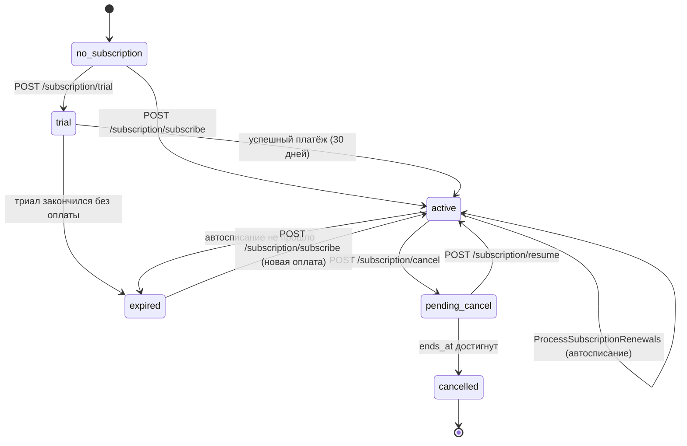

# Модуль: Subscriptions

> **Домен:** Subscriptions (тарифы, подписки, пробный период, автопродление)
> **Репозиторий:** `rspase/project/backend`
> **Путь:** `backend/app/Subscriptions/`
> **Ветка prod:** `dev`
> **Статус:** production

## Назначение

Управление тарифными планами (Plan) и подписками пользователей (Subscription): триал, активация, смена тарифа, автосписание, отмена, возобновление. Связан с `Billing` (платежи CloudPayments) и `Services` (скидки на услуги по тарифу).

Актуальная ценовая модель (релиз 24.03.2026) описана в `_sources/01-tariffs-tz.md`. Quick reference с цифрами — `_sources/01a-tariffs-quickref.md`.

## Ключевые сущности

> **Тарифы юзеру vs тарифы в БД.** На лендинге и в user-doc'ах перечислены **5 публичных тарифов** (Триал / Профи / Премиум / Ультима / Энтерпрайс). В таблице `plans` на 2026-04-23 — **13 записей**, включая внутренние/legacy: Early Birds, Demo, региональные варианты, архивные. Не путайте: «уровни» (`PlanLevel`) — фиксированный enum (4 шт.: Профи/Премиум/Ультима/Демо), тарифы (`Plan`) — конкретные строки с ценой+регионом, их больше.

| Модель | Путь | Описание |
|---|---|---|
| `Plan` | `app/Subscriptions/Models/Plan.php` | Тарифный план (строка БД). Поля: цена, уровень, активен/архивен, регион (Столица/Регионы). Записей в БД больше, чем тарифов на лендинге |
| `PlanLevel` | `app/Subscriptions/Models/PlanLevel.php` | Уровень плана (enum-like). Столбцы — идентификатор, сортировка, цвет в UI и пр. |
| `PlanLevelInfo` | `app/Subscriptions/Models/PlanLevelInfo.php` | Метаданные уровня: название, описание, скидка на услуги |
| `PlanLevelSettings` | `app/Subscriptions/Models/PlanLevelSettings.php` | **Настраиваемая админом** матрица скидок: скидка на услугу по уровню подписки. Позволяет менять % без релиза |
| `PlanServicePivot` | `app/Subscriptions/Models/PlanServicePivot.php` | Связь план ↔ услуга (лимиты: сколько проверок объекта / ипотечных брокеров в подписке) |
| `Subscription` | `app/Subscriptions/Models/Subscription.php` | Подписка пользователя. Поля ниже |

### Поля `Subscription`

```
id                    bigint     PK
user_id               FK users   владелец
plan_id               FK plans   текущий план
new_plan_id           FK plans   план со следующего периода (при downgrade)
status                enum       SubscriptionStatus
started_at            ts         первая активация
ends_at               ts         когда заканчивается текущий период
cancelled_at          ts|null    когда юзер нажал «отменить»
first_paid_at         ts|null    первая успешная оплата (не null = не триал)
payment_method_id     FK         сохранённая карта для автосписания
```

### Статусы `SubscriptionStatus`

- `trial` — пробный период (30 дней, не требует карты)
- `active` — активна, автопродление включено
- `pending_cancel` — отменена, доработает до `ends_at`, не продлится
- `expired` — истекла, не продлена
- `cancelled` — завершена (после `ends_at` на `pending_cancel`)
- (возможны и другие — проверить enum `SubscriptionStatus.php`)

### Связи `Subscription`

- `belongsTo` → `User` (`user`)
- `belongsTo` → `Plan` (`plan`, текущий)
- `belongsTo` → `Plan` (`newPlan`, следующий при смене тарифа)
- `belongsTo` → `PaymentMethod` (`paymentMethod`)

### QueryBuilder

`SubscriptionQueryBuilder` (`app/Subscriptions/QueryBuilders/`) — кастомные скоупы: `active()`, `expiring()`, `forUser()`, etc.

## API-эндпоинты (публичные, `auth:user`)

Префикс: `/subscription`. Controller: `app/Subscriptions/Http/Controllers/SubscriptionController.php`.

| Метод | URL | Описание |
|---|---|---|
| `GET` | `/subscription/info` | Текущая подписка пользователя + лимиты |
| `GET` | `/subscription/plans` | Список доступных тарифов (из `PlanController`) |
| `POST` | `/subscription/trial` | Запустить триал (если ещё не использовался) |
| `POST` | `/subscription/subscribe` | Оформить подписку (plan_id, payment_method) — возвращает ссылку на оплату |
| `POST` | `/subscription/cancel` | Отменить автопродление; подписка работает до `ends_at` |
| `POST` | `/subscription/resume` | Возобновить отменённую |
| `PUT` | `/subscription/new-plan` | Изменить план на следующий период (downgrade); upgrade — обычно через `subscribe` |
| `PUT` | `/subscription/payment-method` | Сменить привязанную карту |

### Admin эндпоинты

Префикс: `/admin/subscription` и `/admin/plans`. Контроллеры `AdminSubscriptionController`, `AdminPlanController`. Админ может:
- CRUD тарифов (создание, архивирование, восстановление).
- Изменение `PlanLevelSettings` (скидки на услуги по уровню).
- Ручное назначение подписки юзеру.
- Ручной запуск триала.
- Смена способа оплаты у юзера.

Детально — [../03-api-reference/admin/subscriptions.md](../03-api-reference/admin/plans-and-billing.md) (в Волне 7).

## Сервисы и бизнес-логика

### `SubscriptionService`

**Путь:** `app/Subscriptions/Services/SubscriptionService.php` (или `DefaultSubscriptionService`).

**Точки входа:**
- `startTrial(User $user): Subscription` — создаёт триал-подписку на 30 дней. Бросает `CantStartTrialException`, если уже был триал.
- `subscribe(User $user, Plan $plan, PaymentMethod $paymentMethod): Subscription` — активирует план. Инициирует оплату через `PaymentService` (CloudPayments).
- `cancel(Subscription $sub): void` — помечает `cancelled_at = now()`, переводит статус в `pending_cancel`.
- `resume(Subscription $sub): void` — убирает `cancelled_at`, статус → `active`.
- `updateNewPlan(Subscription $sub, Plan $newPlan): void` — задаёт `new_plan_id` (downgrade со следующего периода).
- `renew(Subscription $sub): void` — движок автопродления (вызывается из cron command).

**DTO и исключения:**
- `CreatePlanDto` — создание плана (админ).
- `CreatePlanServiceDto` — привязка услуги к плану (лимит, скидка).
- Exceptions: `CantStartTrialException`, `SubscriptionExistsException`, `SubscriptionMissingException`, `InvalidPlanException`.

### `TierService`

**Путь:** `app/Services/Billing/Tier/TierService.php` (интерфейс — `app/Contracts/Services/Billing/Tier/TierService.php`). Использует модель `app/Models/Billing/Tier.php`. Вызывается в `SubscriptionController::info`.

**Что делает:**
- Рассчитывает **tier** (уровень подписки + текущие скидки + лимиты) для пользователя.
- Используется на фронте для показа цен на услуги в ЛК.

### Permissions

`app/Subscriptions/Permissions/` — проверки типа «доступна ли услуга этому юзеру на текущем тарифе». Используются в `Services` и `Scoring` для гейтинга (например, AI-юрист доступен только Премиум+).

## События и очереди

### Events

- `SubscriptionActivated` — после успешной первой оплаты или активации триала. Обработчики: Telegram, AmoCRM, PostHog.
- `SubscriptionAssigned` — админ присвоил подписку юзеру вручную.
- `SubscriptionTrialStarted` — отдельный event для триала (чтоб не путать с платным `Activated`).

### Scheduled commands (cron)

В `app/Subscriptions/Console/Commands/`:

| Команда | Класс | Расписание |
|---|---|---|
| `subscriptions:process-expiring` | `ProcessExpiringSubscriptionsCommand` | **каждую минуту** (см. `app/Subscriptions/Console/Scheduler.php`) — уведомления за N дней до окончания |
| `subscriptions:process-renewals` | `ProcessSubscriptionRenewalsCommand` | **каждую минуту** — автосписание за подписки, у которых `ends_at` наступил |

`Scheduler.php` (`app/Subscriptions/Console/Scheduler.php`) — регистрация задач в Laravel Scheduler.

## Жизненный цикл подписки



## Связь с Billing

Подписка активируется через **PaymentService** (из `Billing`), который создаёт `CPInvoicePayment` → CloudPayments → webhook. При успехе:
- `Subscription.status = active`
- `first_paid_at = now()` (если первая оплата)
- Выстреливает `SubscriptionActivated`.

При фейле webhook'а:
- Подписка остаётся в `trial` или `expired`.
- Юзер видит ошибку в UI.

Детали — [02-modules/billing.md](./billing.md) и [05-integrations/cloudpayments.md](../05-integrations/cloudpayments.md) (Волна 4).

## Связь с Services / Scoring

Скидки на услуги (−20 / −25 / −30 / −40%) считаются через `PlanLevelSettings`:

```php
// псевдокод
$discount = PlanLevelSettings::for($user->activeSubscription->plan->level, $service)->discount_percent;
$finalPrice = $service->base_price * (1 - $discount / 100);
```

Админка позволяет менять `PlanLevelSettings` без релиза.

Лимиты (3 проверки объекта, 2 ипотечных брокера, и т.д.) — через `PlanServicePivot`.

## Resources

- `SubscriptionResource` — публичный ресурс (агент видит у себя).
- `AdminSubscriptionResource` — админский (расширенный).
- `PlanResource` — публичный (в каталоге тарифов).
- `PlanAdminResource` — админский.

## Known issues

- **Автопродление без уведомлений** (было известно из паспорта v1.0) — напоминания за 3 дня до списания обещаны, но статус реализации TBD. Проверить в `ProcessExpiringSubscriptionsCommand`.
- **Энтерпрайс-тариф** — расчёт TBD до возвращения Юли (из ТЗ Пересборки).
- **Downgrade с Премиум на Профи** — `new_plan_id` работает, но UX «что поменяется со следующего периода» в ЛК недопилен (TBD).
- **Триал повторный**: не даётся, проверяется по `first_paid_at != null` или по флагу `used_trial`. Требует проверки в коде.
- **SMS-провайдер** — в `.env.example` нет, но все нотификации про подписку работают через SMS/Telegram.

## Связанные разделы

- [billing.md](./billing.md) — платежи, CP, баланс (Волна 4 подробнее).
- [services.md](./services.md) — услуги, где применяется скидка (Волна 5).
- [scoring.md](./scoring.md) — проверки, тоже с лимитами (Волна 5).
- [../03-api-reference/subscription.md](../03-api-reference/subscription.md)
- [../03-api-reference/plans.md](../03-api-reference/admin/plans-and-billing.md)
- [../05-integrations/cloudpayments.md](../05-integrations/cloudpayments.md) (Волна 4)
- `_sources/01-tariffs-tz.md` — ТЗ актуальной модели.
- `_sources/01a-tariffs-quickref.md` — Quick reference по ценам.

## Ссылки GitLab

- [SubscriptionController.php](https://git.rs-app.ru/rspase/project/backend/-/blob/dev/app/Subscriptions/Http/Controllers/SubscriptionController.php)
- [Subscription.php](https://git.rs-app.ru/rspase/project/backend/-/blob/dev/app/Subscriptions/Models/Subscription.php)
- [ProcessExpiringSubscriptionsCommand.php](https://git.rs-app.ru/rspase/project/backend/-/blob/dev/app/Subscriptions/Console/Commands/ProcessExpiringSubscriptionsCommand.php)
- [Subscriptions/](https://git.rs-app.ru/rspase/project/backend/-/tree/dev/app/Subscriptions)
