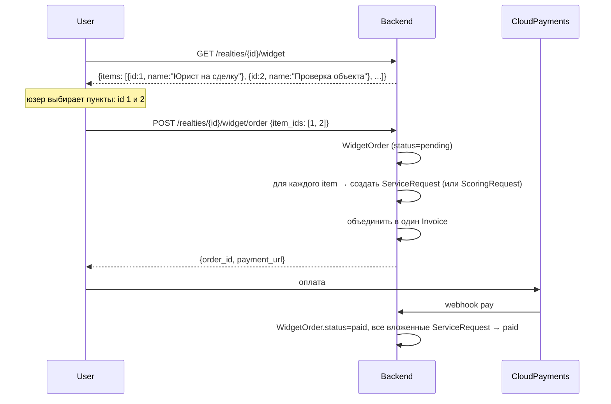

# Модуль: Widget

> **Домен:** Realty Widget (встраиваемый блок услуг под карточкой объекта)
> **Репозиторий:** `rspase/project/backend`
> **Путь:** `backend/app/Realty/Widget/`
> **Ветка prod:** `dev`
> **Статус:** production

## Назначение

Виджет — это дополнительный UI-блок на публичной странице объекта (public-offer) и в кабинете агента. Показывает список услуг (юрист, проверка, планировка и т.д.), которые агент может предложить клиенту одним кликом. Агент может настраивать, какие именно услуги показывать.

## Ключевые сущности

| Модель | Путь | Описание |
|---|---|---|
| `WidgetItem` | `app/Realty/Widget/Models/WidgetItem.php` | Элемент виджета — услуга (или лид-магнит). Активирован/деактивирован админом |
| `WidgetItemData` | там же | Данные элемента (текст, иконка, ссылка на услугу) |
| `WidgetData` | там же | Агрегат данных виджета для рендера |
| `WidgetOrder` | там же | Заказ, который агент сделал через виджет (корзина) |
| `WidgetOrderItem` | там же | Конкретный пункт заказа (услуга + количество) |
| `WidgetOrderStatus` (enum) | там же | `pending`, `paid`, `processing`, `completed`, `cancelled` |

## API-эндпоинты

Публичные (`auth:user`), под `/realties/{realty_id}/widget`:

| Метод | URL | Описание |
|---|---|---|
| `GET` | `/realties/{id}/widget` | Получить виджет для объекта (список доступных услуг) |
| `POST` | `/realties/{id}/widget/order` | Заказать услуги одним заказом (несколько items) |

Admin (`auth:admin`), под `/admin/widget/*` (точные пути — в routes/api.php admin-блок):

- CRUD `WidgetItem` (создание, заполнение, активация/деактивация).
- Просмотр всех `WidgetOrder`.
- Ручная обработка заказов.

Admin controller: `app/Realty/Widget/Http/Controllers/WidgetAdminController.php`.

## Сервисы

| Сервис | Путь | Что делает |
|---|---|---|
| `WidgetService` / `DefaultWidgetService` | `app/Realty/Widget/Services/` | Выдача конфигурации виджета для объекта |
| `WidgetOrderService` / `DefaultWidgetOrderService` | там же | Приём заказов, конверсия в `ServiceRequest` |

## Flow



**Ключевое**: виджет — это корзина для нескольких услуг в один приём. Внутри — обычные `ServiceRequest` / `ScoringRequest`, только оплата объединена.

## Исключение: лимит активных items

- `ActiveWidgetItemsLimitExceededException` — админ не может активировать слишком много items одновременно (чтобы виджет не разросся).

## Admin: создание item

```
Admin → POST /admin/widget/items {service_id, data: {title, icon, description}}
     → WidgetItem создан (is_active=false)
     → POST /admin/widget/items/{id}/fill — заполнить данные
     → POST /admin/widget/items/{id}/activate — опубликовать
```

## Frontend-привязка

Виджет рендерится:
1. **Public offer** объекта (`/offer/{realty_id}`) — клиент видит услуги. Заказ через виджет идёт через `POST /realties/{realty_id}/widget/order`, middleware `auth:user` — то есть **клиент-self-service недоступен**: заказ может только авторизованный агент. Для client-side self-service в будущем потребовался бы либо публичный endpoint, либо временный токен.
2. **Кабинет агента** (`/my/realties/{id}`) — агент видит доступные для объекта услуги, одним заказом берёт сразу несколько.

## Known issues

- **UI-данные виджета** конфигурируются в админке — вручную, каждое обновление требует работы админа.
- **Связь Service vs Scoring**: `WidgetItemData` (`app/Realty/Widget/Models/WidgetItemData.php`) содержит поле `public Service $service` — то есть виджет **всегда** ссылается на `Service`. Scoring подаётся через Service (это отдельный модуль, но с общей точки входа в каталоге услуг).
- **Клиентский self-service**: заблокирован на уровне middleware (`auth:user` на `/realties/{realty_id}/widget/order`). Если понадобится публичный self-service — нужен отдельный endpoint без `auth:user` или одноразовый токен от агента.
- **Аналитика**: какие items чаще заказывают, какие клики → заказ — PostHog events на клики пока не заведены. Open для трекинг-спринта.

## Связанные разделы

- [realty.md](./realty.md) — виджет живёт на уровне объекта.
- [services.md](./services.md) — WidgetItem обычно ссылается на Service.
- [scoring.md](./scoring.md) — некоторые items могут вести на scoring.
- [../03-api-reference/realties.md](../03-api-reference/realties.md#widget) — API виджета.

## Ссылки GitLab

- [Widget/](https://git.rs-app.ru/rspase/project/backend/-/tree/dev/app/Realty/Widget)
- [WidgetController.php](https://git.rs-app.ru/rspase/project/backend/-/blob/dev/app/Realty/Widget/Http/Controllers/WidgetController.php)
