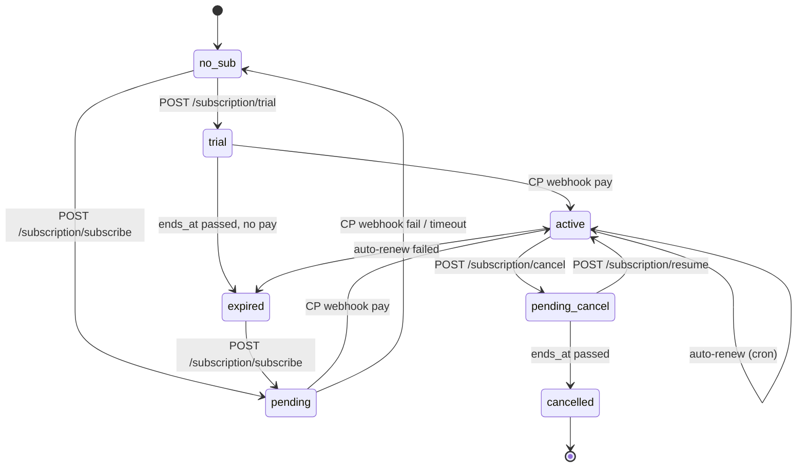

# API: Subscription

Тарифы и подписки. Префикс: `/subscription`. Middleware: `auth:user`.

Модуль: [Subscriptions](../02-modules/subscriptions.md). ТЗ: `_sources/01-tariffs-tz.md`. Quick-ref: `_sources/01a-tariffs-quickref.md`.

---

## `GET /subscription/plans`

Список доступных тарифов для текущего пользователя (с учётом региона — Столица/Регионы).

**Ответ:** `200 OK`
```json
{
  "data": [
    {
      "id": 1,
      "level": "professional",
      "name": "Профи",
      "price": 500000,
      "currency": "RUB",
      "region": "capital",
      "discount_percent": 20,
      "limits": {
        "active_realties": 3,
        "mortgage_broker": 1,
        "object_verification": 1
      },
      "features": {
        "ai_lawyer": false,
        "unlimited_mortgage_applications": true,
        "unlimited_insurance": true,
        "contract_templates": true
      }
    },
    { "level": "premium", "price": 900000, ... },
    { "level": "ultima", "price": 1700000, ... }
  ]
}
```

**Цены** — копейки (`500000` = 5 000 ₽).

---

## `GET /subscription/info`

Информация о текущей подписке пользователя.

**Ответ:** `200 OK`
```json
{
  "data": {
    "id": 45,
    "status": "active",
    "plan": {
      "id": 2,
      "level": "premium",
      "name": "Премиум",
      "price": 900000,
      "discount_percent": 25
    },
    "new_plan": null,
    "started_at": "2026-03-24T00:00:00Z",
    "ends_at": "2026-05-24T00:00:00Z",
    "cancelled_at": null,
    "first_paid_at": "2026-03-24T12:15:00Z",
    "payment_method": {
      "id": 7,
      "brand": "mir",
      "last4": "1234",
      "expiry": "12/28"
    },
    "tier": {
      "used_realties": 3,
      "limit_realties": 5,
      "used_verifications": 1,
      "limit_verifications": 2,
      "ai_lawyer_available": true
    }
  }
}
```

**Состояния `status`:** `trial`, `active`, `pending_cancel`, `cancelled`, `expired`.

**`new_plan`** — заполнен, когда юзер сделал downgrade: текущий период работает на `plan`, со следующего — на `new_plan`.

**`tier`** — использование лимитов (отображается в виджете подписки).

---

## `POST /subscription/trial`

Запустить пробный 30-дневный период.

**Request body:** пустое.

**Ответ:** `200 OK` с созданной подпиской (`status: trial`).

**Ошибки:**
- `400 CantStartTrialException` — триал уже был использован (`first_paid_at != null` или другой маркер).

**Эффекты:**
- `Subscription` создаётся, `status=trial`, `ends_at = now + 30 days`.
- Event `SubscriptionTrialStarted`.
- Онбординг-шаг «Активация пробного периода» отмечается.

---

## `POST /subscription/subscribe`

Оформить подписку (платную).

**Request body:**
```json
{
  "plan_id": 2,
  "payment_method_id": 7
}
```

**Поля:**
- `plan_id` — из `GET /subscription/plans`.
- `payment_method_id` — из `GET /billing/payment_methods`. Опционально — если не передан, создаётся новый через `/billing/payment_methods/authorize`.

**Ответ:** `200 OK`
```json
{
  "data": {
    "subscription_id": 45,
    "invoice_id": 123,
    "payment_url": "https://widget.cloudpayments.ru/..."
  }
}
```

**Flow:**
1. Создаётся `Invoice` (invoiceable → Subscription).
2. `CPInvoicePayment` в статусе `pending`.
3. Возвращается `payment_url` — фронт делает redirect на CloudPayments.
4. Юзер проходит 3DS.
5. CP отправляет webhook `POST /webhook/cloud-payments/pay`.
6. Подписка активируется: `status=active`, `started_at`, `first_paid_at`.

**Ошибки:**
- `400 subscription_already_active` — у юзера уже активная подписка.
- `400 invalid_plan` — план неактивен / не подходит по региону.
- `422` — валидация.

---

## `POST /subscription/cancel`

Отменить автопродление. Подписка работает до `ends_at`, потом переходит в `cancelled`.

**Request body:** может содержать `reason` (TBD).

**Ответ:** `200 OK`.

**Эффекты:**
- `cancelled_at = now()`, `status = pending_cancel`.
- Автосписание на следующем периоде не запускается.
- Событие (TBD — `SubscriptionCancelled`).

---

## `POST /subscription/resume`

Возобновить отменённую подписку (если `status = pending_cancel` и `ends_at > now()`).

**Ответ:** `200 OK`.

**Эффекты:**
- `cancelled_at = null`, `status = active`.
- Автосписание снова запускается.

---

## `PUT /subscription/new-plan`

Изменить тариф на следующий период. Обычно для **downgrade** (Премиум → Профи). Upgrade — лучше через `/subscribe` с новым `plan_id` (мгновенно, с пересчётом).

**Request body:**
```json
{ "plan_id": 1 }
```

**Ответ:** `200 OK`.

**Эффекты:**
- `Subscription.new_plan_id` заполняется.
- На следующем `ProcessSubscriptionRenewalsCommand` будет применён новый план.

**Ошибки:**
- `400 invalid_plan`.
- `422`.

---

## `PUT /subscription/payment-method`

Сменить привязанную карту для автосписания.

**Request body:**
```json
{ "payment_method_id": 8 }
```

**Ответ:** `200 OK`.

---

## Состояния подписки (flow)



---

## Связанные эндпоинты

- [billing.md](./billing.md) — `payment_methods`, `invoices`, `promo-codes`.
- [webhooks.md](./webhooks.md) — CloudPayments webhook'и (Волна 4).

## Ссылки GitLab

- [SubscriptionController.php](https://git.rs-app.ru/rspase/project/backend/-/blob/dev/app/Subscriptions/Http/Controllers/SubscriptionController.php)
- [PlanController.php](https://git.rs-app.ru/rspase/project/backend/-/blob/dev/app/Subscriptions/Http/Controllers/PlanController.php)
