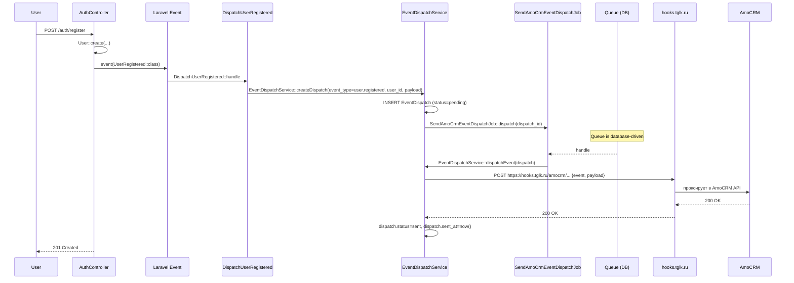

# Интеграция: AmoCRM

> **Тип:** CRM (синхронизация бизнес-событий)
> **Направление:** outbound (event dispatch)
> **Статус:** production
> **Ответственный:** (уточнить — владельца интеграции в команде)

## Назначение

Отправка ключевых бизнес-событий RSpace в AmoCRM — внешнюю CRM-систему, где команда ведёт воронку продаж (новые регистрации, активированные карты, оплаченные подписки, опубликованные объекты). AmoCRM создаёт сделки/контакты и обновляет их статусы на основе этих событий.

Интеграция **одностороннняя (out)**: RSpace шлёт events, AmoCRM их применяет. Обратной синхронизации (статусы сделок из AmoCRM → RSpace) нет.

## Поставщик

- **AmoCRM** (https://www.amocrm.ru)
- **Механизм**: HTTP POST на webhook-URL внешнего агрегатора `hooks.tglk.ru` (tglk.ru — ретранслятор, превращает hook-событие в действие в AmoCRM: создание сделки, движение по воронке и т.д.).

## Конфигурация

Находится в `config/amo_crm.php`. **URL'ы трёх webhook'ов захардкожены в коде** (не в env), env-переменная контролирует только enable-флаг:

```php
// config/amo_crm.php
return [
    'hooks' => [
        'enabled' => env('AMO_CRM_HOOKS_ENABLED', false),
        'url' => [
            'user_registered'  => 'https://hooks.tglk.ru/in/MJdpGvE2dgZMZ3I6eRt8QZnPwXAoO6',
            'object_published' => 'https://hooks.tglk.ru/in/Q4ZozN17okGgGxh59etZDR76ELlvAO',
            'payment_success'  => 'https://hooks.tglk.ru/in/RpqNEZ67ROJ8JpIZEkUmK1V9vWyKY8',
        ],
    ],
];
```

- `AMO_CRM_HOOKS_ENABLED=true` в `.env.example` — **по умолчанию включено**. В dev/staging для отсечки можно ставить `false`.
- URL'ы — публично видимы в коде. Если один из них скомпрометируется, потребуется менять и деплоить (это **tech-debt** — переложить URL'ы в env или секретный vault).

## Код

| Компонент | Путь |
|---|---|
| Service Provider | `app/AmoCrm/AmoCrmServiceProvider.php` |
| HTTP-клиент | `app/AmoCrm/Clients/HooksClient.php` + `DefaultHooksClient.php` |
| Сервис оркестрации | `app/AmoCrm/Services/EventDispatchService.php` + `DefaultEventDispatchService.php` |
| Job (queue) | `app/AmoCrm/Jobs/SendAmoCrmEventDispatchJob.php` |
| Модель события | `app/AmoCrm/Models/EventDispatch.php`, `EventType.php` |
| Listeners | `app/AmoCrm/Listeners/*` (подписчики на Laravel events) |
| Exception | `app/AmoCrm/Exceptions/EventDispatchException.php` |
| Контроллер (test/debug) | `app/AmoCrm/Http/Controllers/AmoCrmController.php` — `listEventDispatches` |

## Типы событий (`EventType`)

Из кода (`app/AmoCrm/Models/EventType.php`) и listener-классов в `app/AmoCrm/Listeners/`:

| Event type | Listener | Когда | Webhook URL |
|---|---|---|---|
| `user.registered` | `DispatchUserRegistered` | Новый юзер зарегистрировался (успешно верифицировал SMS) | ✓ `hooks.tglk.ru/in/MJdp...` |
| `object.published` | `DispatchAvitoObjectPublished`, `DispatchCianObjectPublished` | Объект опубликован на Avito ИЛИ CIAN | ✓ `hooks.tglk.ru/in/Q4Zo...` |
| `payment.success` | `DispatchPaymentSuccess` | Оплата любого invoice'а (подписка, пополнение баланса, услуги) | ✓ `hooks.tglk.ru/in/RpqN...` |
| `card.authorized` | `DispatchCardAuthorized` | Юзер привязал карту (CP webhook pay с Token) | **Нет выделенного URL в config/amo_crm.php** — listener есть, но отдельной записи в `hooks.url` для card-events не зарегистрировано. Требует проверки — возможно, шлётся на один из 3 имеющихся URL с `event_type=card.authorized` в payload |

Маппинг на Laravel-events:

```php
// AmoCrmServiceProvider::registerEventListeners()

Event::listen(AvitoPublishingActivated::class, DispatchAvitoObjectPublished::class);
Event::listen(CianPublishingPublished::class, DispatchCianObjectPublished::class);
Event::listen(InvoicePaid::class, DispatchPaymentSuccess::class);
Event::listen(UserRegistered::class, DispatchUserRegistered::class);
Event::subscribe(DispatchCardAuthorized::class);
```

`DispatchCardAuthorized` — через `Event::subscribe`, внутри подписчик сам указывает, на какие события реагирует (вероятно на несколько CP-событий).

## Flow: регистрация → AmoCRM



**Observation**: job асинхронный, поэтому регистрация не блокируется падением AmoCRM.

## Retry-политика

**SendAmoCrmEventDispatchJob** использует Laravel queue retry с точной стратегией backoff:

```php
public int $tries = 5;

public function backoff(): array
{
    return [60, 60, 300, 3600, 3600 * 12];
}
```

Переводя в человеческое:

| Попытка | Задержка до следующей |
|---|---|
| 1 | — (первая попытка) |
| 2 | 1 минута |
| 3 | 1 минута |
| 4 | 5 минут |
| 5 | 1 час |
| 6 (если бы была) | 12 часов (последнее значение массива) |

Итого: **5 попыток** в интервале ~1 час 7 минут. После — job уходит в `failed_jobs` (Laravel стандарт), админ видит.

Ключевая стратегия: **exponential backoff с длинным хвостом**, чтобы покрыть короткие сбои AmoCRM (1 мин) и восстановление после падений на час. 12-часовое значение — запас на ночные инциденты.

Release vs fail: при `EventDispatchException` job вызывает `$this->release($delay)` — возвращает в очередь с задержкой. Любое другое исключение — фатальное, job идёт в failed.

## Модель `EventDispatch`

**Путь:** `app/AmoCrm/Models/EventDispatch.php`

Поля (приблизительно):
```
id                string/uuid  PK
event_type        enum         EventType
user_id           int          → users.id
payload           json         данные события (userId, entityId, и т.д.)
status            enum         pending, sending, sent, failed
attempts          int
sent_at           ts?
last_error        text?
created_at, updated_at
```

Диспатчи хранятся для аудита и дебага (через `AmoCrmController::listEventDispatches` в test-режиме).

## Payload-формат

Payload у каждого `EventType` свой. Примерно:

**`user.registered`:**
```json
{
  "event": "user.registered",
  "user_id": 123,
  "phone": "+79123456789",
  "email": null,
  "name": "Анна",
  "utm_source": "yandex",
  "utm_medium": "cpc",
  "utm_campaign": "realtor_moscow",
  "registered_at": "2026-04-23T12:00:00Z"
}
```

**`payment.success`:**
```json
{
  "event": "payment.success",
  "user_id": 123,
  "invoice_id": 456,
  "amount": 900000,
  "currency": "RUB",
  "invoiceable_type": "Subscription",
  "invoiceable_id": 45,
  "paid_at": "2026-04-23T12:15:00Z"
}
```

Точная структура — в соответствующем Listener (`DispatchUserRegistered::handle`, `DispatchPaymentSuccess::handle` и т.д.).

## Обработка ошибок

| Ошибка | Поведение |
|---|---|
| Network error / timeout при POST в hooks | `EventDispatchException` → `release($delay)` (по backoff-стратегии) |
| 4xx / 5xx от hooks | Та же логика: EventDispatchException + retry |
| Внутренние ошибки Listener'а (nullable не обработан, exception в payload) | Throwable не-EventDispatchException → job падает в failed_jobs без retry |
| EventDispatch не найден в БД | `logs()->critical`, job завершается без ошибки |

## Observability

- **Логи**: префикс `[AMO_CRM]`.
- **failed_jobs**: таблица Laravel queue, можно мониторить через админку.
- **Test endpoint (в debug-режиме только)**: `GET /test/amo-crm/event-dispatches` — список диспатчей для ручного просмотра.

## Безопасность

- Endpoint AmoCRM hooks — HTTPS.
- Токены — в `.env` (не коммитим, не логируем тело POST-запросов).
- Payload'ы — без паролей/банковских данных (только event-факты + identifiers).

## Known issues

- **Одностороннняя синхронизация**: если сделка в AmoCRM закрывается как «успешная», RSpace об этом не узнаёт. Для полного workflow — нужен обратный sync (pull с AmoCRM), сейчас не реализован.
- **Posthog ≠ AmoCRM**: events в AmoCRM не дублируются в PostHog автоматически, нужна отдельная интеграция. Некоторые listeners это делают, некоторые — нет.
- **Payload вариативность**: разные события шлют разные поля. Если AmoCRM workflow предполагает одинаковое поле `user_id` — иногда оно есть, иногда нет (для `object.published` вероятно есть, для `card.authorized` — проверить).
- **Proxy через hooks.tglk.ru**: единая точка отказа. Если tglk-сервис упадёт — все события в AmoCRM перестают идти. Backoff защищает до 12 часов, потом — вручную пересылать через админку (TBD).
- **Commit**: последний merged MR в backend на `develop` — «Updated amo events» (17 апр). Возможно, после этого изменился маппинг events — проверить актуальность этого документа.

## Связанные разделы

- [cloudpayments.md](./cloudpayments.md) — источник `InvoicePaid` и `CardAuthorized`.
- [../02-modules/billing.md](../02-modules/billing.md).
- [../02-modules/identity.md](../02-modules/identity.md) — источник `UserRegistered`.
- [../02-modules/publishings.md](../02-modules/publishings.md) — источник `ObjectPublished` (Avito + CIAN).

## Ссылки GitLab

- [AmoCrm/](https://git.rs-app.ru/rspase/project/backend/-/tree/dev/app/AmoCrm)
- [AmoCrmServiceProvider.php](https://git.rs-app.ru/rspase/project/backend/-/blob/dev/app/AmoCrm/AmoCrmServiceProvider.php)
- [SendAmoCrmEventDispatchJob.php](https://git.rs-app.ru/rspase/project/backend/-/blob/dev/app/AmoCrm/Jobs/SendAmoCrmEventDispatchJob.php)
- [EventType.php](https://git.rs-app.ru/rspase/project/backend/-/blob/dev/app/AmoCrm/Models/EventType.php)
