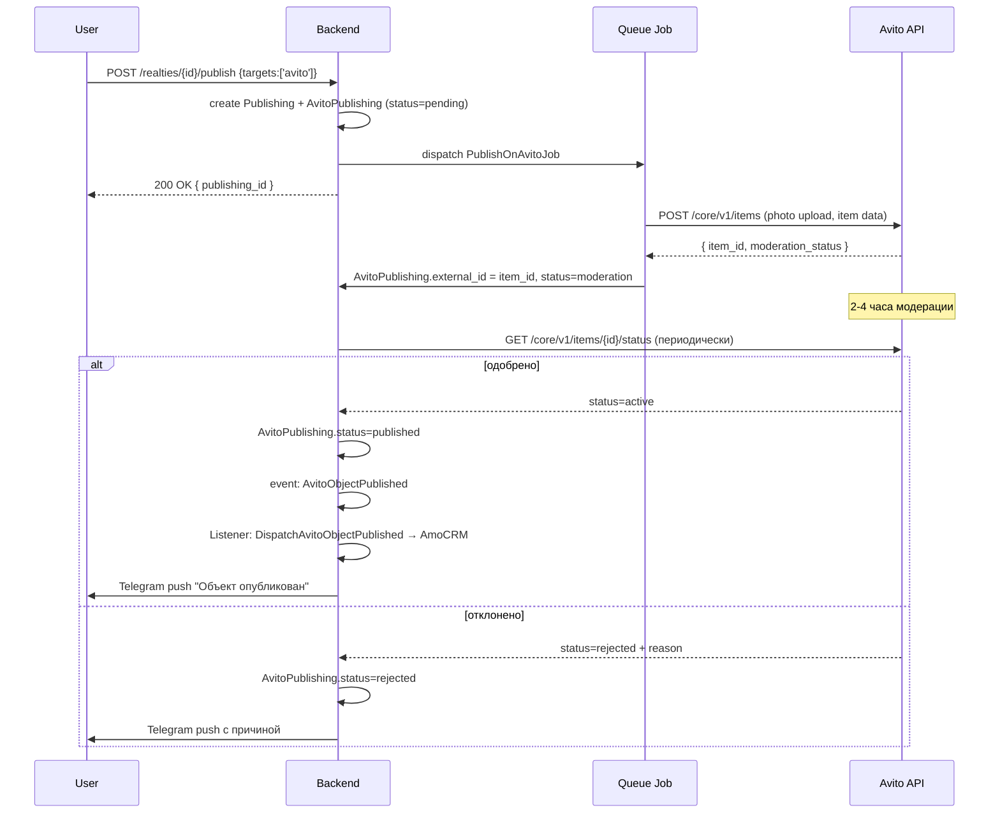

# Интеграция: Avito API

> **Тип:** классифайд (публикация объектов)
> **Направление:** bidirectional (publish out, statistics / calls / messages pull in)
> **Статус:** production
> **Ответственный:** TBD (разработчик — `a.lyah`?)

## Назначение

Публикация объектов RSpace на Авито, получение статистики показов, звонков клиентов, сообщений через встроенный чат Avito, заказ платных услуг продвижения. Основной источник трафика для агентов.

## Поставщик

- **Avito** (https://www.avito.ru) — крупнейший классифайд в РФ.
- **API docs:** `developers.avito.ru` (требуется аккаунт разработчика).
- **Типы аккаунтов:** общий аккаунт RSpace (по умолчанию все публикации идут от имени платформы) + персональные аккаунты агентов (опциональная привязка, TBD статус).

## Конфигурация

Конфиг живёт **не в `config/services.php`, а в `config/integration.php`** (вместе с CIAN):

```php
// config/integration.php
'avito' => [
    'enabled' => env('AVITO_INTEGRATION_ENABLED', false),
    'credentials' => [
        'client_id'     => env('AVITO_CLIENT_ID'),
        'client_secret' => env('AVITO_CLIENT_SECRET'),
        'user_id'       => env('AVITO_USER_ID'),
    ],
],
```

Env-переменные из `.env.example`:
```
AVITO_INTEGRATION_ENABLED=false
AVITO_CLIENT_ID=
AVITO_CLIENT_SECRET=
AVITO_USER_ID=
```

- `AVITO_API_URL` в коде **не задан через env** — URL хардкодится в клиент. Если потребуется staging-endpoint, это tech-debt.
- `AVITO_INTEGRATION_ENABLED=false` по умолчанию → в dev-окружении ничего на Avito не уходит. На prod должно быть `true`.

## Код

| Компонент | Путь |
|---|---|
| Сервис публикации | `app/Services/Publishings/AvitoPublishingService.php` + `DefaultAvitoPublishingService.php` |
| Promo-service | `app/Services/Publishings/PromotionService.php` (общий для Avito и CIAN) + `AvitoPromotionOrderSpecification.php` |
| Контроллер публикации | `app/Publishings/Http/Controllers/AvitoPublishingController.php` |
| Promo-контроллер (user) | `app/Http/Controllers/Publishings/AvitoPromotionController.php` |
| Avito Calls/Statistics | `app/Publishings/Http/Requests/Avito/*` + `AvitoPromotionRequestController` |
| Модели | `app/Models/Publishings/Avito/*` (см. [publishings.md](../02-modules/publishings.md)) |
| Events (outbound → листенеры) | `app/Events/Publishings/Avito/AvitoPublishingActivated.php`, `AvitoPublishingStatusChanged.php`, `AvitoPublishingFeedErrorOccurred.php`, `app/Events/Publishings/Promotion/AvitoPromotionRequested.php` |
| NewDevelopment (каталог новостроек) | `app/Services/Avito/NewDevelopment/AvitoNewDevelopmentService.php` + XML-reader |
| Scheduler | expiration каждые 30 минут (`ProcessPublishingExpirationCommand`) |

## Сценарии

### 1. Публикация объекта на Avito



**Шаги в коде:**
1. `RealtyController::publish` → `PublishingService::publish(realty, ['avito'])`.
2. Создаётся `Publishing` + `AvitoPublishing(status=pending)`.
3. Диспатчится job (вероятно `PublishOnAvitoJob`).
4. В job: фото заливаются на Avito CDN → создаётся item → external_id сохраняется.
5. Периодическая sync-команда (через Scheduler) пуллит статусы и обновляет `AvitoPublishing.status`.

### 2. Получение статистики

```
Cron (через Scheduler) → SyncAvitoStatisticsCommand (TBD имя)
  → для каждой активной AvitoPublishing:
    → Avito API: GET /stats/v1/accounts/{user_id}/items/{item_id}/views
    → upsert в AvitoPublishingStatistics (views, contacts)
```

Статистика обновляется N раз в день (TBD частота).

### 3. Получение звонков

```
Cron → SyncLeadsCommand → AvitoApi::getCalls(sinceTime)
  → для каждого звонка:
    → upsert AvitoPublishingCall (caller_phone, duration, recording_url, started_at)
    → LeadService::createFromExternal(source='avito', phone)
      → новый Lead, event LeadCreated
```

### 4. Заказ промо-продукта (онлайн)

```
User → GET /publishings/{id}/avito/promotions/order/prices
     → список доступных опций (VIP, Premium, XL, Highlight, Zakreplenie...)
User → POST /publishings/{id}/avito/promotions/order {promotion_type, payment_method}
Backend → создаёт AvitoPromotionOrder (status=pending)
        → PaymentService (CloudPayments, см. billing.md)
        → после оплаты: webhook → order.status=paid
        → Job: AvitoApi::applyPromotion(external_id, type)
        → order.status=active
```

### 5. Заявка на промо (через админа)

Используется, когда онлайн не работает или нужен ручной согласовательный процесс.

```
User → POST /publishings/{id}/avito/promotions/request {type, comment}
Backend → создаёт AvitoPromotionRequest (status=pending_admin)
Admin (в админке) → обрабатывает: одобряет/отклоняет → применяет вручную.
```

## Webhooks (inbound)

**Явных webhook-эндпоинтов для Avito в `routes/api.php` нет.** Весь sync — pull-based (через scheduled commands).

Если Avito будет присылать push-уведомления (новые сообщения в чат, изменения статуса), — **потребуется** endpoint типа `/webhook/avito/:token`. Сейчас не реализовано.

## Обработка ошибок

| Ошибка | Что происходит |
|---|---|
| `401` (истёк access_token) | Автообновление OAuth, retry |
| `429` (rate limit) | Job rescheduled через X секунд (exponential backoff) |
| `400` (bad request — невалидные поля) | Лог + пометка `AvitoPublishing.status = rejected` + сообщение агенту |
| `500-503` (Avito side) | 3 попытки retry, потом — в failed-очередь, админ видит |
| `timeout` | Retry (30s, 60s, 120s) |

Failed jobs — в таблице `failed_jobs` (стандарт Laravel). Мониторинг через админку (`/admin/balances` включает некоторые external health-метрики через `ExternalBalancesAdminController`).

## Лимиты и квоты

**Avito API limits** (из публичной документации):
- **5 RPS** на аккаунт (точное значение — уточнить, т.к. платный тариф другой).
- Итемов на аккаунт — зависит от статуса аккаунта (обычно 500-1000 на коммерческий).
- Статистика — обновляется не чаще 1 раза в сутки для бесплатных, чаще — для платных.

**Стоимость:**
- Публикация стандартной квартиры в Москве — ~1 200 ₽ / объект / период (из ТЗ пересборки).
- Регионы — ~600 ₽.
- Промо-услуги — от 500 ₽ (Highlight) до 4 000 ₽ (VIP / Zakreplenie).

Цены пересчитываются после обновлений прайса Avito — см. `_sources/01a-tariffs-quickref.md`.

## Безопасность

- OAuth 2.0 Client Credentials Flow для API-аутентификации.
- Access-token кешируется (TTL из ответа Avito), обновляется при expiry.
- Все запросы — через HTTPS.
- Логируются только метаданные запросов (method, url, status), не тела запросов с пользовательскими данными.

## Как тестировать локально

1. Получить sandbox-credentials у Avito (аккаунт разработчика).
2. В `.env` указать `AVITO_API_URL=https://api-sandbox.avito.ru` (если есть sandbox — TBD).
3. Использовать тестовые объявления (Avito помечает их special-тегом).
4. Локально: `php artisan leads:sync` и `php artisan publishings:process-expiration` для ручного триггера синхронизаций.
5. **Внимание:** в debug-режиме есть test-endpoint `POST /test/publishings/{publishing_id}/avito/update` (`PublishingTestController::updateAvito`) — можно менять статусы без реального API-вызова.

## Known issues

- **Имена env-переменных и точные пути классов** — частично TBD, не сверены с актуальным `.env.example` прода.
- **Sync частота** — точная cron-периодичность (`Scheduler.php`) не задокументирована публично. TBD.
- **Webhook от Avito** — не реализован; все обновления pull-based, задержка до часа для статистики, до 15 минут для звонков.
- **Avito Messages** (встроенный чат) — pull работает, но UI в кабинете не выводит сообщения. TBD: вывести или убрать из sync.
- **Персональные аккаунты агентов** — поддержка привязки `avito_user_id` к `User` — TBD. Сейчас большинство публикаций — через общий аккаунт RSpace.
- **Rate-limit fallback** — при 429 стратегия retry работает, но при систематическом превышении (например, массовая публикация) очередь забьётся. Мониторинг failed_jobs — TBD.

## Связанные разделы

- [../02-modules/publishings.md](../02-modules/publishings.md) — как модуль использует Avito-интеграцию.
- [../02-modules/leads.md](../02-modules/leads.md) — как звонки Avito становятся лидами.
- [cian.md](./cian.md) — зеркальная интеграция с ЦИАН.
- [amocrm.md](./amocrm.md) — `DispatchAvitoObjectPublished` listener.
- [../03-api-reference/publishings.md](../03-api-reference/publishings.md) — эндпоинты.

## Ссылки GitLab

- [Publishings/](https://git.rs-app.ru/rspase/project/backend/-/tree/dev/app/Publishings)
- [Models/Publishings/Avito/](https://git.rs-app.ru/rspase/project/backend/-/tree/dev/app/Models/Publishings/Avito)
- [AvitoPublishingController.php](https://git.rs-app.ru/rspase/project/backend/-/blob/dev/app/Publishings/Http/Controllers/AvitoPublishingController.php)
