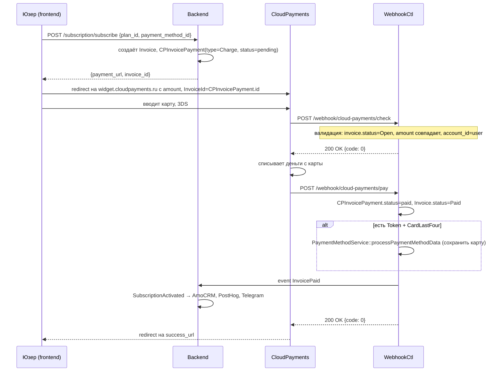

# Интеграция: CloudPayments

> **Тип:** платежи (эквайринг)
> **Направление:** bidirectional (out API + inbound webhooks)
> **Статус:** production
> **Ответственный:** Света (биллинг, см. RACI)

## Назначение

Приём платежей картами для:
- Оплаты подписок (Профи / Премиум / Ультима).
- Пополнения внутреннего баланса.
- Оплаты отдельных услуг (юрист, проверка, промо Avito).
- Авторизации карты для автосписания без списания суммы (`CPInvoicePaymentType::Auth`).

Провайдер — **CloudPayments** (российский эквайринг, 3-D Secure, поддержка Mir/Visa/MasterCard/СБП).

## Поставщик

- **CloudPayments** (https://cloudpayments.ru)
- **API docs:** https://developers.cloudpayments.ru
- **Личный кабинет:** https://merchant.cloudpayments.ru
- **Поддержка:** в kabinete отвечают быстро (1-2 часа)

## Конфигурация

Из `config/services.php` (фактические имена):

```php
// config/services.php
'cloud_payments' => [
    'public_id' => env('CLOUD_PAYMENTS_PUBLIC_ID'),
    'secret'    => env('CLOUD_PAYMENTS_SECRET'),
],
```

`.env.example` содержит:
```
CLOUD_PAYMENTS_PUBLIC_ID=
CLOUD_PAYMENTS_SECRET=
```

**Всего две переменные.** Дополнительные (receipt email, tax system, webhook secret отдельно от API secret) — **не заведены**. Если CP требует HMAC-подпись на webhook'ах, используется тот же `CLOUD_PAYMENTS_SECRET`. Поля фискализации (ОФД) в коде не найдены — значит они настроены на стороне CP-ЛК, а не в нашем бэке.

## Код

| Компонент | Путь |
|---|---|
| Webhook-controller | `app/Http/Controllers/Webhook/CloudPayments/CloudPaymentsWebhookController.php` |
| Admin-контроллер (history) | `app/Http/Controllers/Billing/Payments/CloudPayments/CloudPaymentsController.php` + `AdminCloudPaymentsController.php` |
| Контракт платёжного сервиса | `app/Contracts/Services/Billing/Payment/CPPaymentService.php` |
| DTO для успеха/фейла | `CPPaymentPaidDataObject`, `CPPaymentFailedDataObject` |
| DTO для токена карты | `app/Contracts/Services/Billing/PaymentMethod/CardTokenDataObject.php` |
| Payment method service | `app/Contracts/Services/Billing/PaymentMethod/PaymentMethodService.php` |
| Invoice service | `app/Services/Billing/Invoice/InvoiceService.php` |
| Модели | `app/Models/Billing/CPInvoicePayment.php`, `CPInvoicePaymentStatus`, `CPInvoicePaymentType`, `CPInvoicePaymentFailCode`, `Invoice`, `InvoiceStatus` |

## Модель `CPInvoicePayment`

**Путь:** `app/Models/Billing/CPInvoicePayment.php`

**Поля** (ключевые):
```
id                bigint    PK (используется как InvoiceId в запросах CP)
invoice_id        FK        → invoices.id
transaction_id    string    ID транзакции в CP
status            enum      CPInvoicePaymentStatus: pending, paid, failed, cancelled
type              enum      CPInvoicePaymentType: Charge, Auth
amount            int       копейки
currency          enum      Currency (обычно RUB)
fail_code         enum?     CPInvoicePaymentFailCode при ошибке (do_not_honor, insufficient_funds, …)
card_last4        string?
card_brand        string?   (mir, visa, mastercard)
created_at, updated_at
```

**CPInvoicePaymentType:**
- `Charge` — обычная оплата, сумма списывается.
- `Auth` — авторизация (блокировка) без списания. Для привязки новой карты: списываем 1 ₽ и отменяем, токен сохраняется.

## Сценарии

### 1. Оплата подписки



**Коды ответа webhook'а `check`** (по CP API):
- `0` — OK, можно проводить
- `10` — Invoice не найден (CPInvoicePayment отсутствует)
- `11` — Неверный user_id (AccountId не совпадает с владельцем invoice)
- `12` — Сумма или валюта не совпадают
- `13` — Invoice уже оплачен или неверный тип платежа
- `20` — Invoice отменён / истёк

### 2. Пополнение внутреннего баланса

Аналогично подписке, но invoiceable — `BalanceDeposit`, не `Subscription`. После успеха `BalanceService` зачисляет сумму на `user.balance`.

### 3. Авторизация новой карты (для автосписания)

Юзер хочет привязать карту без немедленной оплаты:

```
User → POST /billing/payment_methods/authorize
Backend → создаёт CPInvoicePayment(type=Auth, amount=100 [1 рубль])
       → возвращает payment_url
User → CP: вводит карту, 3DS
CP → webhook pay (status=Authorized): Token, CardLastFour, …
Webhook → PaymentMethodService::processPaymentMethodData → PaymentMethod создан
       → CPInvoicePayment.status=paid (с type=Auth), но деньги CP автоматически возвращает (Auth, не Charge)
```

### 4. Автопродление подписки

```
Cron ProcessSubscriptionRenewalsCommand (каждую минуту через app/Subscriptions/Console/Scheduler.php)
  → найти Subscriptions где ends_at <= today + 1 и status=active
  → для каждой:
    → PaymentService::chargeWithSavedToken(subscription.payment_method, amount)
    → запрос в CP API (прямое списание по токену, без 3DS)
    → если успех: Subscription.ends_at + 30 дней, InvoicePaid event
    → если фейл: Subscription.status=expired, уведомление юзеру
```

### 5. Возврат (refund)

Возвратов через API не инициируем автоматически. Возвраты делаются:
- В админ-панели CloudPayments вручную.
- В админке RSpace (TBD: есть ли эндпоинт `POST /admin/billing/refund` — проверить).

## Webhooks (inbound)

Без `auth`-middleware, но защищены **HMAC-подписью**. Проверка — в методе `authorizeRequest` контроллера.

| URL | Назначение | Что делает |
|---|---|---|
| `POST /webhook/cloud-payments/check` | Pre-check перед списанием | Валидирует invoice, возвращает код 0/10/11/12/13/20 |
| `POST /webhook/cloud-payments/pay` | Успешная оплата / авторизация | Обновляет статусы, сохраняет PaymentMethod, выстреливает `InvoicePaid` event |
| `POST /webhook/cloud-payments/fail` | Неудачная попытка | Пишет `fail_code`, уведомляет юзера |

### Payload `pay` (пример)

```json
{
  "TransactionId": 987654321,
  "InvoiceId": 123,
  "AccountId": 45,
  "DateTime": "2026-04-23 15:30:00",
  "Status": "Completed",
  "Token": "tkn_abcdef1234567890",
  "CardLastFour": "1234",
  "CardExpDate": "12/28",
  "CardType": "Mir",
  "Issuer": "Сбербанк",
  "Amount": 9000,
  "Currency": "RUB"
}
```

**Важно**: `InvoiceId` в CP — это **id записи `CPInvoicePayment`**, не бизнесовый `invoices.id`. Controller находит payment по этому ID, затем через него — invoice.

### Возможные коды ошибок `fail`

`CPInvoicePaymentFailCode` — enum из CP:
- `insufficient_funds` — недостаточно средств
- `do_not_honor` — отклонено банком
- `expired_card` — карта просрочена
- `invalid_card` — карта некорректна
- `3ds_failed` — не прошёл 3DS
- `card_blocked`, `limit_exceeded`, `timeout`, и т.д.

## Безопасность

- **HMAC-подпись** webhook'ов: заголовок `Content-HMAC` (sha256 от тела запроса, ключ — `CP_WEBHOOK_SECRET`). Валидируется в `CloudPaymentsWebhookController::authorizeRequest` — до любой логики.
- **Транзакции БД** (`DB::transaction` + `sharedLock`/`lockForUpdate`) для всех модификаций invoice/payment — предотвращает race-conditions при двойных webhook'ах.
- **Идемпотентность**: повторный вызов `pay` с тем же `TransactionId` не задваивает начисление — invoice уже `Paid`, возвращается код 13 (Invoice already paid).
- **Токены карт хранятся у CP**, не у нас. В `PaymentMethod` — только токен CP + метаданные (last4, expiry, brand).

## Обработка ошибок

| Ошибка | Поведение |
|---|---|
| Невалидный HMAC | `authorizeRequest` выбрасывает 401, CP retry'ит webhook ~3 раза |
| Invoice не найден | Ответ `{code: 10}`, CP считает нерешённым, вернёт юзеру ошибку |
| CP 500 / timeout | CP retry'ит webhook, но не чаще 30 сек. После 3 попыток — marked failed |
| `fail` webhook без payload | Лог `[CLOUD_PAYMENTS] ... invalid` + исключение, ответ 500 |

Все критичные события логируются: `logs()->info`/`alert`/`critical` с префиксом `[CLOUD_PAYMENTS]`.

## Лимиты

- **Rate limit CP**: не публикуется, на прод-нагрузках RSpace проблем не было.
- **3DS** — включён принудительно для всех card-платежей (настройка в кабинете CP).
- **Минимальная сумма** — 1 ₽ (100 копеек).
- **Фискальные чеки** — отправляются на email юзера (обязательно по закону). Настраивается в кабинете CP + через поля в запросе.

## Как тестировать локально

1. В кабинете CP включить **тестовый режим** — выдаст sandbox-ключи.
2. В `.env`:
    ```
    CP_PUBLIC_ID=test_api_xxxxxxx
    CP_API_SECRET=test_xxxxxxx
    CP_WEBHOOK_SECRET=test_webhook_xxxxxxx
    ```
3. Использовать тестовые карты (CP документация):
    - `4242 4242 4242 4242` — всегда успех
    - `4000 0000 0000 0002` — всегда отклонено (do_not_honor)
    - `4000 0000 0000 3220` — требует 3DS
4. Webhook'и из CP в sandbox идут на ваш локальный backend — использовать `ngrok` или аналог для публичного URL.
5. Ручная проверка: `php artisan tinker` → создать `Invoice` + `CPInvoicePayment` и симулировать webhook через `curl POST /webhook/cloud-payments/pay` с правильной подписью.

## Admin-эндпоинты

Префикс: `/admin/billing/payments/cloud-payments`. Middleware: `auth:admin`.

| Метод | URL | Описание |
|---|---|---|
| `GET` | `/admin/billing/payments/cloud-payments` | Полный список платежей с фильтрами |

Admin views и export — через `AdminCloudPaymentsController`.

## Known issues

- **Env-переменные точные имена** — TBD, пока не сверены с `.env.example`.
- **Refund через API** — не реализован, только ручной в кабинете CP.
- **Фискальные чеки при ошибках** — статус отправки чека не трекается отдельно (CP автономно).
- **Отозванные карты** (`expired_card` после успешной авторизации): если юзер авторизовал карту, но она потом протухла — автосписание упадёт, `Subscription.status=expired`, нотификация юзеру пойдёт, но может быть задержка 1-2 дня.
- **Idempotency-keys** — CP их не требует, но при сетевых сбоях возможен двойной вебхук. Защита — через `DB::transaction` + `sharedLock` на invoice.

## Связанные разделы

- [../02-modules/billing.md](../02-modules/billing.md) — бизнес-домен.
- [../02-modules/subscriptions.md](../02-modules/subscriptions.md) — подписочный flow.
- [../03-api-reference/billing.md](../03-api-reference/billing.md) — эндпоинты.
- [../03-api-reference/webhooks.md](../03-api-reference/webhooks.md) — webhooks API.
- [amocrm.md](./amocrm.md) — `InvoicePaid` event → AmoCRM.

## Ссылки GitLab

- [CloudPaymentsWebhookController.php](https://git.rs-app.ru/rspase/project/backend/-/blob/dev/app/Http/Controllers/Webhook/CloudPayments/CloudPaymentsWebhookController.php)
- [CloudPaymentsController.php](https://git.rs-app.ru/rspase/project/backend/-/blob/dev/app/Http/Controllers/Billing/Payments/CloudPayments/CloudPaymentsController.php)
- [Models/Billing/](https://git.rs-app.ru/rspase/project/backend/-/tree/dev/app/Models/Billing)
