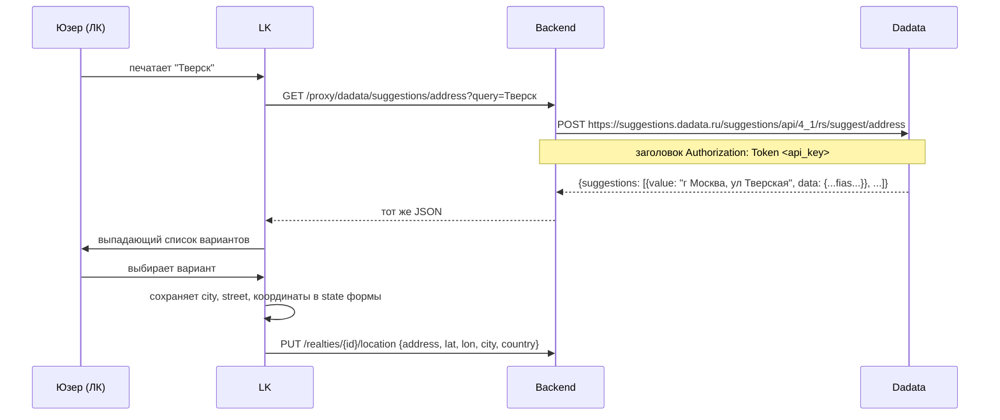

# Интеграция: Dadata

> **Тип:** suggestions (адреса, организации, люди)
> **Направление:** outbound
> **Статус:** production

## Назначение

Dadata — сервис проверки и обогащения данных (адреса, ФИО, ИНН, КПП, реквизиты). В RSpace используется для:
1. **Подсказок адресов** при заполнении локации объекта.
2. **Городов** при настройке профиля (определение Столица / Регионы).
3. **Проверки ИНН** собственника или юр.лица застройщика.

## Поставщик

- **Dadata** (https://dadata.ru)
- **PHP SDK:** `hflabs/dadata` версии `^24.4` (из `composer.json`, обновлён 2024)
- **Docs:** https://dadata.ru/api/
- **Региональность:** российские данные (ФИАС, КЛАДР, ЕГРЮЛ, ЕГРИП).

## Конфигурация

В `config/services.php`:

```php
'dadata' => [
    'api_key' => env('DADATA_API_KEY'),
    'secret'  => env('DADATA_SECRET'),
],
```

Env (`.env.example`):
```
DADATA_API_KEY=
DADATA_SECRET=
```

Обе переменные используются SDK `hflabs/dadata`.

## Код

Директория `app/Dadata/` **пуста или не существует** в дереве — интеграция живёт в других местах:

| Компонент | Путь |
|---|---|
| Proxy-контроллер | `app/Http/Controllers/Proxy/DadataController.php` — проксирует Dadata API через наш backend |
| City-контроллер | `app/Http/Controllers/Dadata/Cities/DadataCityController.php` — cities list/search |
| Avito suggestions | `app/Http/Controllers/Suggestions/AvitoSuggestionController.php` — связан (новостройки через Dadata) |
| Cian suggestions | `app/Http/Controllers/Suggestions/CianSuggestionController.php` |

**Почему proxy**: клиентский JS на лендинге и в ЛК не должен светить API-ключ Dadata. Фронт запрашивает наш `/proxy/dadata/suggestions/*`, backend проксирует в Dadata с секретным ключом.

## API эндпоинты RSpace

### Публичные

Префикс: `/proxy/dadata/` (middleware: `auth:user,admin`).

```
GET /proxy/dadata/suggestions/{path}
```

`{path}` — любой путь Dadata API (например, `address`, `fio`, `party`). Backend пробрасывает запрос как есть.

Пример:
```
GET /proxy/dadata/suggestions/address?query=Тверская
```

Префикс `/suggestions/cities` (`middleware: auth:user,admin`):
```
GET /suggestions/cities?query=Мос
```

### Прочие suggestion-эндпоинты

Используют Dadata косвенно:
- `GET /suggestions/avito/new-developments` — поиск новостройки в Avito по городу (сам поиск в Avito API, но через Dadata-нормализованный город).
- `GET /suggestions/cian/new-objects` — аналогично для ЦИАН.

## Сценарий: ввод адреса объекта



## Что получаем от Dadata

Для **адреса** — структурированный объект:
- Полный адрес (`value`)
- Регион / область / город / улица / дом
- Координаты (`geo_lat`, `geo_lon`)
- ФИАС-ID, КЛАДР-ID
- Timezone, налоговая

Для **ИНН**:
- Наименование организации
- Юр. адрес
- Статус (действующая / ликвидирована)
- Руководитель
- КПП, ОГРН

## Лимиты и квоты

- **Dadata бесплатный тариф**: 10 000 запросов / день.
- **Платный**: от 2 000 ₽/мес за 30 000 запросов.
- **RPS**: зависит от тарифа (обычно 30-50 RPS).

Если лимит исчерпан — Dadata возвращает ошибку, фронт должен уметь fallback (ручной ввод без подсказок).

## Обработка ошибок

- `429` (rate limit) — возвращаем клиенту ошибку, UX: «Подсказки временно недоступны, введите вручную».
- `500/503` — лог, fallback на ручной ввод.
- `401` (истёк ключ) — сервис падает, нужно обновить `DADATA_API_KEY`.

## Безопасность

- **API-ключ в env**, не в коде.
- **Secret-ключ** (для обратного гео / организаций) — только backend.
- **Rate-limit на нашем proxy**: TBD — нужно защитить, чтобы один юзер не исчерпал наш квота Dadata.

## Кеширование

Для часто запрашиваемых значений (города) можно кешировать ответы Dadata. Реализация TBD — проверить в `DadataCityController`.

## Known issues

- **Модуль `app/Dadata/` не существует** в дереве — всё размазано по `Http/Controllers/`. Можно отрефакторить.
- **Rate-limit proxy** не реализован (TBD подтвердить).
- **Валидация ответа**: если Dadata вернёт некорректную структуру — возможно 500 из-за null-references. Надо валидировать.
- **Кеш городов**: Москва, СПб и другие крупные города запрашиваются сотнями раз — кеш сильно снизил бы нагрузку на Dadata (и ускорил бы UX).

## Связанные разделы

- [../02-modules/realty.md](../02-modules/realty.md) — главный потребитель (location).
- [../02-modules/identity.md](../02-modules/identity.md) — профиль юзера (город).
- [../03-api-reference/suggestions.md](../03-api-reference/suggestions.md) (Волна 6).

## Ссылки GitLab

- [DadataController.php](https://git.rs-app.ru/rspase/project/backend/-/blob/dev/app/Http/Controllers/Proxy/DadataController.php)
- [DadataCityController.php](https://git.rs-app.ru/rspase/project/backend/-/blob/dev/app/Http/Controllers/Dadata/Cities/DadataCityController.php)
