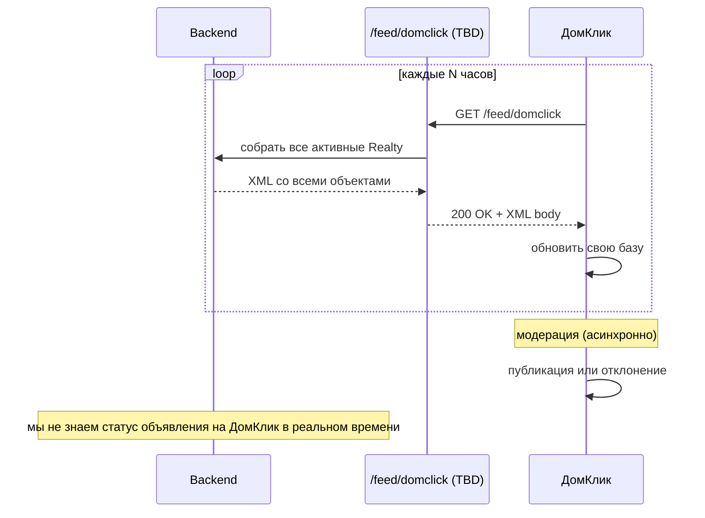

# Интеграция: ДомКлик (feed)

> **Тип:** классифайд (публикация объектов)
> **Направление:** планируется outbound (feed, pull со стороны ДомКлик)
> **Статус:** ❌ **НЕ реализовано в коде на 2026-04-29.** Ни endpoint'а `/feed/domclick`, ни env-переменных `DOMCLICK_*`, ни моделей `DomClickPublishing`. На лендинге ДомКлик упоминается как партнёр (планируемый), фактически публикации идут только в Avito и ЦИАН.

## Назначение (план)

Публикация объектов на ДомКлик — маркетплейс недвижимости от Сбербанка. Особенность: у ДомКлик **нет публичного API для создания объявлений** — площадка использует модель «feed»: наш backend будет отдавать XML-файл со всеми активными объектами, ДомКлик раз в N часов будет забирать и обновлять свою базу.

**Когда будем строить — добавить:**
1. Endpoint `/feed/domclick` в `routes/api.php` (по аналогии с `/feed/avito`, `/feed/cian`).
2. Адаптер для XML-формата ДомКлик (формат YML/XML — уточнить у партнёра).
3. (Опционально) Модель `DomClickPublishing` если нужна обратная связь от площадки.
4. Env-переменные `DOMCLICK_*` (вероятно, нужен только токен партнёра / IP whitelist).
5. Обновить user-facing документацию: пока что ДомКлик в публичных доках не упоминается явно, и это правильно.

## Поставщик

- **ДомКлик** (https://domclick.ru) — сервис Сбербанка, крупный источник ипотечных клиентов.
- **Как принимает объявления:** регулярный pull XML/YML feed'а с нашего сервера.
- **Партнёрский контакт:** TBD — уточнить (через команду sales RSpace).

## Конфигурация

**В `config/services.php` и `config/integration.php` записи о DomClick нет.** В `.env.example` переменных `DOMCLICK_*` также не заведено. Никаких env-контролируемых toggle для ДомКлик-интеграции не существует.

Это соответствует тому, что выделенного endpoint'а `/feed/domclick` в `routes/api.php` тоже нет (подтверждено `_verification/routes-dev-2026-04-23.json`).

## Код

| Компонент | Путь |
|---|---|
| Feed-контроллер | `app/Http/Controllers/Feeds/FeedController.php` |
| Feed-модели | `app/Models/Feeds/` (`FeedType`, etc.) |
| Генератор XML для Avito | связан с `/feed/avito` |
| Генератор XML для CIAN | `/feed/cian` |
| Генератор для ДомКлик | TBD — в `routes/api.php` endpoint'а `/feed/domclick` **не видно**; возможно, ДомКлик использует один из существующих feed'ов или есть отдельный механизм |

**Важный факт**: в `routes/api.php` есть только два feed'а:
```
GET /feed/avito  → FeedController::getAvitoFeed  (name: Api::AVITO_FEED)
GET /feed/cian   → FeedController::getCianFeed   (name: Api::CIAN_FEED)
```

Feed для ДомКлик отдельно не обнаружен. **Варианты:**
1. ДомКлик pull'ит один из существующих feed'ов (Avito/CIAN совместимый формат).
2. ДомКлик-публикация настроена где-то ещё (например, в админке, вне кода).
3. Интеграция работает не через feed, а через партнёрский кабинет RSpace в ДомКлик.

**Это открытый вопрос для уточнения у команды (Лена Шитова / разработка).**

## Сценарий



В отличие от Avito/CIAN (где у нас есть `AvitoPublishing`/`CianPublishing` с полем `status`), для ДомКлик нет подобной модели в БД. **Контроль состояния:** агент должен сам проверять в кабинете ДомКлик или ждать отклика.

## Обработка ошибок

- Feed-эндпоинт должен **всегда возвращать валидный XML** — даже при ошибках в отдельных объектах (skipping, error tag внутри feed).
- Логи генерации feed'а — в Laravel Log (стандарт).
- Если ДомКлик не pull'ит feed долго — проверять, не упал ли cron на стороне ДомКлик (вне нашей ответственности).

## Лимиты и квоты

- **Частота pull'а** — определяется ДомКлик, не нами. Обычно 6-12 часов.
- **Размер feed'а** — объект-лимита нет, но XML объёмом >100 MB может начать рваться; нужен мониторинг.

## Known issues

- **Нет API для обратной связи** (статусы публикации).
- **Задержка до 12 часов** между публикацией в RSpace и появлением на ДомКлик.
- **Нет автоматической коммуникации об ошибках модерации** ДомКлик.
- **Endpoint `/feed/domclick` в коде не найден** — интеграция, возможно, работает через Avito/CIAN feed или вручную.

## Что надо уточнить (TBD)

1. Какой точно endpoint используется для ДомКлик pull? (проверить в кабинете партнёра ДомКлик).
2. Формат feed'а для ДомКлик (собственный или Avito-совместимый?).
3. Есть ли мониторинг pull-активности ДомКлик на нашей стороне?
4. Контактное лицо ДомКлик (партнёр-менеджер).

## Связанные разделы

- [../02-modules/publishings.md](../02-modules/publishings.md)
- [avito.md](./avito.md), [cian.md](./cian.md)
- [../03-api-reference/feeds.md](../03-api-reference/feeds.md)

## Ссылки GitLab

- [FeedController.php](https://git.rs-app.ru/rspase/project/backend/-/blob/dev/app/Http/Controllers/Feeds/FeedController.php)
- [Models/Feeds/](https://git.rs-app.ru/rspase/project/backend/-/tree/dev/app/Models/Feeds)
