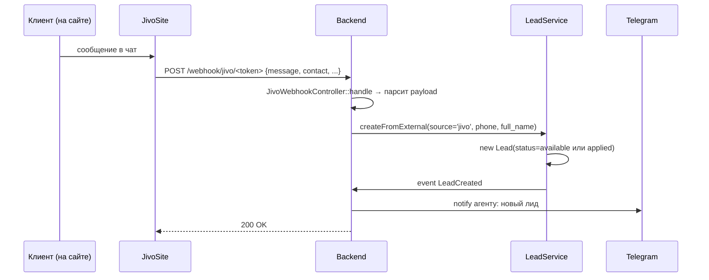

# Интеграция: JivoSite

> **Тип:** чаты поддержки
> **Направление:** inbound (webhook)
> **Статус:** production (минимальная)

## Назначение

JivoSite — провайдер чат-виджетов (на сайте `rspace.pro`, возможно в ЛК). Когда клиент/лид пишет сообщение в чат, JivoSite присылает webhook в RSpace. Backend парсит сообщение, извлекает контакт, создаёт `Lead` с `source='jivo'`.

## Поставщик

- **JivoSite** (https://jivo.ru)
- **Webhook docs:** https://www.jivochat.com/webhooks/

## Конфигурация

**Env-переменные:** минимальны.

**Webhook URL в JivoSite-кабинете:**
```
https://api.rspace.pro/webhook/jivo/3752813899114971
```

Токен `3752813899114971` — **захардкожен в `routes/api.php`**:
```php
Route::post('/jivo/3752813899114971', [JivoWebhookController::class, 'handle']);
```

Это **tech debt** — должен быть в `.env`. Миграция — open task.

## Код

| Компонент | Путь |
|---|---|
| Service Provider | `app/Jivo/JivoServiceProvider.php` |
| Webhook-controller | `app/Jivo/Http/Controllers/JivoWebhookController.php` |

Модуль **минималистичный** — у Jivo только webhook, нет исходящих запросов, нет отдельной модели. Сообщения конвертируются в `Lead`.

## Сценарий



## Формат webhook

JivoSite шлёт разные типы событий:
- `chat.accepted` — агент принял чат
- `chat.closed` — чат закрыт
- `message.received` — новое сообщение от клиента
- `visitor.updated` — обновление данных посетителя (обычно — оставил контакт)

Конкретная обработка — в `JivoWebhookController::handle`. В RSpace нас интересуют в основном события с контактом клиента (телефон / email).

Пример payload (упрощённо):
```json
{
  "event_name": "message_received",
  "chat_id": "chat_abc123",
  "visitor": {
    "id": "vis_def456",
    "name": "Анна Иванова",
    "phone": "+79250001234",
    "email": "anna@example.com"
  },
  "message": {
    "text": "Здравствуйте, хочу узнать про квартиру на Тверской"
  }
}
```

## Извлечение лида

Backend логика (приблизительно):
1. Если `visitor.phone` отсутствует — лид **не создаём** (без телефона не можем перезвонить).
2. Дедупликация: если такой `phone` уже есть как лид и статус `available` / `applied` → обновить timestamp, не создавать дубль.
3. Новый лид → `Lead.source = 'jivo'`, `Lead.full_name = visitor.name`.
4. Event LeadCreated.

**Дедупликация**: точная логика в `LeadService::createFromExternal` — TBD проверить.

## Безопасность

- Секретный токен в URL (`3752813899114971`) — **единственная защита**.
- Проверка IP JivoSite: TBD, возможно не реализовано — любой, кто знает токен, может эмулировать webhook.
- **Верификация подписи** — у JivoSite есть опция HMAC-подписи webhook'а, но реализация TBD.

## Known issues

- **Захардкоженный токен в route** — должен быть в env. Tech debt.
- **Нет верификации источника** (IP allowlist / HMAC).
- **Не все события обрабатываются**: focus на `message_received`, остальные, возможно, игнорируются.
- **Нет интеграции «наоборот»**: сообщения из кабинета RSpace в Jivo-чат (агент отвечает через Jivo, не через наш UI).
- **Логи**: запросы от Jivo логируются (TBD — с `[JIVO]` префиксом).

## Связанные разделы

- [../02-modules/leads.md](../02-modules/leads.md) — потребитель webhook'ов.
- [../03-api-reference/webhooks.md](../03-api-reference/webhooks.md) — endpoint.

## Ссылки GitLab

- [JivoWebhookController.php](https://git.rs-app.ru/rspase/project/backend/-/blob/dev/app/Jivo/Http/Controllers/JivoWebhookController.php)
- [JivoServiceProvider.php](https://git.rs-app.ru/rspase/project/backend/-/blob/dev/app/Jivo/JivoServiceProvider.php)
