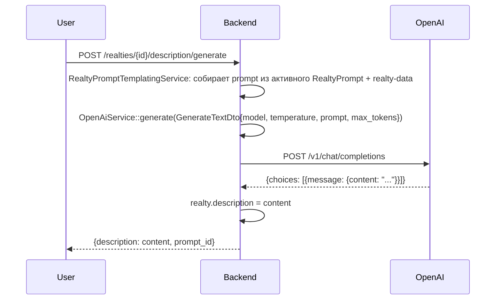

# Интеграция: OpenAI

> **Тип:** AI (LLM)
> **Направление:** outbound
> **Статус:** production
> **Ответственный:** TBD (автор AI-фичи — `igor.adam`?)

## Назначение

Две задачи:
1. **Генерация описаний объектов** для публикации (см. [realty-prompts.md](../02-modules/realty-prompts.md)) — на всех тарифах. **Реализована, в проде.**
2. **AI-юрист «Грут»** — чат-помощник по юридическим вопросам (после запуска — только Премиум+). **🚧 В разработке.** Backend-endpoint в `routes/api.php` ещё не существует (`grep ai-lawyer` пусто на origin/dev), `app/OpenAi/` сейчас обслуживает только генерацию описаний.

Когда фича Грута выйдет, она будет работать через тот же клиент `OpenAiService`.

## Поставщик

- **OpenAI** (https://openai.com, API https://platform.openai.com)
- **Клиент PHP:** `openai-php/client` версии `^0.19.0` (из `composer.json`).
- **Модели в использовании (подтверждено в админке 2026-04-23):**
  - **Генерация описания объекта:** `o4-mini-2025-04-16` (reasoning-модель) с параметром «уровень мышления» (`ReasoningEffort`) = **«Глубоко»** (высокий reasoning_effort). Настраивается в `admin.rspace.pro/console/prompts`.
  - **AI-юрист Грут:** ещё не реализован, промпта в админке нет. Когда фича выйдет, конкретная модель будет настраиваться отдельно (вероятно через тот же раздел `admin.rspace.pro/console/prompts`).

## Конфигурация

В `config/open_ai.php`:

```php
return [
    'fake'    => (bool) env('OPEN_AI_FAKE_MODE', false),
    'api_key' => env('OPEN_AI_API_KEY'),
];
```

Env-переменные (`.env.example`):
```
OPEN_AI_FAKE_MODE=true   ← в dev-окружении по умолчанию!
OPEN_AI_API_KEY=
```

**Ключевая особенность:** флаг `OPEN_AI_FAKE_MODE` переключает реализацию генератора с реальной на `FakeTextGenerator`, которая возвращает заготовленный текст без обращения к OpenAI API. Для локальной разработки и CI — `true`, на prod — `false`.

Переменных `OPEN_AI_ORG_ID`, `OPEN_AI_BASE_URL`, моделей под разные задачи — **в конфиге нет**. Модели выбираются в коде генератора (`AiTextGenerator`) или через промпт-шаблон. Прокси для OpenAI (блокировки в РФ) — через переменную `PROXY_URL` из `.env.example`.

## Код

| Компонент | Путь |
|---|---|
| Service Provider | `app/OpenAi/OpenAiServiceProvider.php` |
| Сервис | `app/OpenAi/Services/OpenAiService.php` + `DefaultOpenAiService.php` |
| Генератор | `app/OpenAi/Generators/TextGenerator.php` (абстракт) |
| Реализации генератора | `AiTextGenerator` (prod), `FakeTextGenerator` (tests/local) |
| DTO | `app/OpenAi/Dto/GenerateTextDto.php` |
| Exception | `app/OpenAi/Exceptions/OpenAiApiException.php` |
| Параметры | `app/OpenAi/Models/Temperature.php`, `Verbosity.php`, `ReasoningEffort.php` |
| Custom Rule | `app/OpenAi/Rules/TemperatureRule.php` — валидатор (0-2) |

## Параметры генерации

### Temperature
Контролирует случайность. Диапазон `0.0 - 2.0`:
- `0.0-0.3` — детерминированно (для технических описаний).
- `0.5-0.7` — сбалансированно (продающие описания).
- `0.8-1.2` — креативно.
- `>1.5` — часто мусор.

Дефолт RSpace TBD, ожидаемо `0.7`.

### Verbosity
Длина ответа (короткий / средний / длинный). Маппится на `max_tokens`.

### ReasoningEffort
Для **reasoning-моделей** (o1, o3). Сколько «думать» перед ответом: `low`/`medium`/`high`. Для GPT-4o и -mini **не применяется**.

## Сценарии

### 1. Генерация описания объекта



### 2. AI-юрист «Грут» — 🚧 в разработке

**Статус (2026-04-29):** в коде на `origin/dev` отсутствует. Подтверждено:
- `git show origin/dev:routes/api.php | grep -i 'ai-lawyer\|grut'` → пусто.
- `git ls-tree -r origin/dev | grep -i 'AiLaw\|Grut\|AiChat'` → пусто.
- `app/OpenAi/` обслуживает только генерацию описаний объектов.

Планируемый flow (от CPO Игоря Адама, 2026-04-29):

```
User → POST /services/ai-lawyer/chat {question, context?}        ← ENDPOINT TBD
Backend → гейтинг: проверка Premium/Ultima/Enterprise
       → OpenAiService::generate(модель TBD, system-prompt юрист-эксперт)
       → ответ в чат
       → история сохраняется (TBD: где — отдельная таблица/Spatie Media/etc.)
```

User-facing документация (`external/00-about.md`, `01-tariffs.md`, `07-legal.md`, `13-faq.md`) обновлена 2026-04-29: фича помечена «🚧 в разработке, после запуска включится автоматически на Премиум+» — чтобы не обещать недоступную фичу.

**Когда будем строить — добавить:**
1. Endpoint в `routes/api.php` (вероятно `/services/ai-lawyer/*`).
2. Сервис в `app/OpenAi/` или новый `app/AiLawyer/` (по конвенции domain folders).
3. Промпт в админке (`admin.rspace.pro/console/prompts`) — новый тип, не realty-description.
4. Хранилище истории чатов (новая таблица или JSON-колонка на User).
5. Гейтинг по `subscription.plan.level >= premium`.
6. Обновление user docs: убрать «в разработке», вернуть к презенс-форме.

## Обработка ошибок

`OpenAiApiException` — обёртка над ошибками OpenAI SDK:
- `401` — неверный API key
- `429` — rate limit (RPM или TPM)
- `500-503` — OpenAI downtime
- `context_length_exceeded` — промпт слишком длинный
- `content_policy_violation` — модерация OpenAI
- `timeout` — долгий ответ (>60 сек)

Fallback стратегия (TBD):
- Retry с backoff для 429/5xx (через Laravel Job?).
- Для описаний — синхронный вызов, при фейле — ошибка юзеру «Попробуйте позже».

## FakeTextGenerator

`app/OpenAi/Generators/FakeTextGenerator.php` — **для локальной разработки и тестов**. Возвращает заранее заготовленные строки без вызова OpenAI — экономит API-бюджет при разработке.

Переключение между Fake и Real — через Service Provider (dependency injection), настраивается env-переменной или явной привязкой.

## Лимиты и квоты

### OpenAI стороны
- **RPM** (requests per minute) — зависит от tier аккаунта, обычно 500-10000 на минуту.
- **TPM** (tokens per minute) — также по tier.
- **Контекст** — GPT-4o: 128K токенов, GPT-4o-mini: 128K.

### RSpace стороны
- Rate-limit на юзера: **TBD, нужно проверить в коде**. Вероятно отсутствует сейчас — можно заспамить.

### Стоимость
- GPT-4o-mini: ~$0.15 / 1M input tokens, $0.60 / 1M output tokens.
- GPT-4o: ~$2.50 / 1M input, $10.00 / 1M output.
- **Средняя генерация описания**: ~500 tokens input + 200 output = ~$0.15-0.20 на GPT-4o-mini.

## Как тестировать локально

1. Получить тестовый API key в OpenAI platform.
2. Использовать дешёвую модель (GPT-4o-mini) для локального тестирования.
3. Переключить на `FakeTextGenerator` через DI / конфиг — не тратит бюджет.

Для integration-тестов:
- Моки через `FakeTextGenerator`.
- Snapshot-тесты: сохранить ожидаемый output с реальным API, сравнивать.

## Безопасность

- **API key в `.env`** (не коммитим, не логируем).
- **PII в промптах**: паспортные данные клиента, ФИО собственника **не отправляются** (в промпт идут только обобщённые поля: количество комнат, площадь, район). Это важно для compliance.
- **Content policy**: OpenAI фильтрует откровенно нарушающий контент — наш UI должен мягко показывать ошибку, если модерация заблокировала.

## Known issues

- **Rate-limit per user** не реализован — TBD.
- **AI-юрист «Грут» — 🚧 в разработке.** Endpoint и хранение истории чатов в коде отсутствуют (подтверждено 2026-04-29 на origin/dev). После запуска проверить, что логика гейтинга по plan/level совпадает с user-facing документацией.
- **Стоимость не пробрасывается в биллинг** — юзер генерирует, RSpace платит. Для массовой генерации нужен внутренний лимит.
- **Модель выбирается в `RealtyPrompt`** — если поменяли в админке на GPT-4 вместо 4o-mini, стоимость скакнёт в 10x. Нужна защита.

## Связанные разделы

- [../02-modules/realty-prompts.md](../02-modules/realty-prompts.md) — основной потребитель.
- [../02-modules/services.md](../02-modules/services.md) — возможный потребитель (AI-юрист).
- `_sources/05-ai-descriptions.md` — ТЗ фичи.

## Ссылки GitLab

- [OpenAi/](https://git.rs-app.ru/rspase/project/backend/-/tree/dev/app/OpenAi)
- [OpenAiServiceProvider.php](https://git.rs-app.ru/rspase/project/backend/-/blob/dev/app/OpenAi/OpenAiServiceProvider.php)
