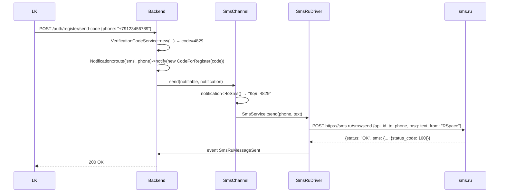

# Интеграция: SMS (sms.ru)

> **Тип:** SMS-уведомления
> **Направление:** outbound
> **Статус:** production

## Назначение

Отправка SMS для:
- **Кода подтверждения при регистрации** (`/auth/register/send-code`).
- **Кода восстановления пароля** (`/auth/reset-password/send-code`).
- **Уведомлений** (опционально, если Telegram не привязан) — о новых лидах, платежах, окончании подписки.

## Поставщик

- **sms.ru** (https://sms.ru) — российский массовый SMS-сервис.
- **Docs:** https://sms.ru/api

## Конфигурация

В `config/sms.php` (фактические имена):

```php
return [
    'default' => env('SMS_PROVIDER', 'logs'),

    'providers' => [
        'logs' => [
            'driver' => \App\Sms\Drivers\LogsSmsDriver::class,
            'level'  => 'info',
        ],
        'sms_ru' => [
            'driver'   => \App\Sms\Drivers\SmsRuDriver::class,
            'api_id'   => env('SMS_RU_API_ID'),
            'timeout'  => 30,
            'test'     => env('SMS_RU_TEST', false),
            'translit' => false,
        ],
    ],
];
```

Env-переменные (`.env.example`):
```
SMS_PROVIDER=logs     # logs | sms_ru
SMS_RU_API_ID=
SMS_RU_TEST=false     # sandbox-режим sms.ru без фактической отправки
```

- **По умолчанию `logs`** — в dev и CI SMS пишется в лог (уровень `info`), не отправляется.
- `SMS_RU_TEST=true` — sms.ru sandbox (отвечает success, но не шлёт реально).
- `translit=false` — кириллица не транслитерируется (SMS короче помещает латиницу, но кириллицу клиенты понимают без путаницы).
- Альфа-имя отправителя **в коде не задаётся** — настраивается на стороне sms.ru-ЛК.

## Код

| Компонент | Путь |
|---|---|
| Service Provider | `app/Sms/SmsServiceProvider.php` |
| Контракт драйвера | `app/Sms/Drivers/SmsDriver.php` |
| Реализация sms.ru | `app/Sms/Drivers/SmsRuDriver.php` |
| Log-реализация (dev) | `app/Sms/Drivers/LogsSmsDriver.php` |
| SDK-клиент | `app/Sms/Clients/SmsRuClient.php` |
| Сервис | `app/Sms/Services/SmsService.php` + `DefaultSmsService.php` |
| Laravel notification channel | `app/Sms/Channels/SmsChannel.php` |
| Event | `app/Sms/Events/SmsRuMessageSent.php` — выстреливает после успешной отправки |
| Exceptions | `SmsSendingException`, `SmsRuException`, `SmsBalanceException` |

## Driver-архитектура

`SmsDriver` — интерфейс с методом `send(phone, message): SmsResult`. Две реализации:
- **`SmsRuDriver`** — production, отправляет через sms.ru API.
- **`LogsSmsDriver`** — пишет в `logs()->info` вместо реальной отправки.

Переключение — через `SmsServiceProvider` + env `SMS_DRIVER`.

## Notifications channel

Стандартный Laravel Notification pattern:

```php
class CodeForRegister extends Notification
{
    public function via($notifiable) { return ['sms']; }

    public function toSms($notifiable): string {
        return "Код подтверждения RSpace: {$this->code}";
    }
}

// routing: Notification::route('sms', '+79123456789')
//           ->notify(new CodeForRegister('4829'));
```

Channel `sms` регистрируется в `SmsServiceProvider::boot()` через `Notification::extend('sms', ...)`.

## Сценарии

### 1. Отправка кода верификации регистрации



### 2. SMS-код восстановления пароля

Аналогично, но через `CodeForPasswordReset` notification и `action='password_reset'` в VerificationCodeService.

## Ошибки sms.ru

API sms.ru возвращает свои коды статуса:

| Код | Значение |
|---|---|
| 100 | Запрос обработан, SMS в очереди |
| 101 | В процессе передачи оператору |
| 102 | Передан оператору |
| 103 | Доставлен |
| 104 | Не доставлен (просрочено) |
| 105-110 | Ошибки оператора (неверный номер и т.д.) |
| 200-299 | Ошибки API (неверный api_id, недостаточно средств...) |

Маппинг на исключения:
- **Недостаточно средств** → `SmsBalanceException` — критично, алерт админу.
- **Неверный номер** → `SmsSendingException` — вернуть юзеру «Проверьте номер».
- **API error** → `SmsRuException`.

## Events и логирование

- `SmsRuMessageSent` — после успешной отправки. Можно подписать listener для сбора аналитики (сколько SMS отправлено, кому, сколько стоит).
- Логи с префиксом `[SMS]` — каждая отправка.

## Баланс

sms.ru работает на предоплате. Пополнение — в их кабинете.

**Мониторинг баланса**: вероятно, через `ExternalBalancesAdminController` (`/admin/balances`), где показываются внешние балансы (Avito, CIAN, sms.ru, OpenAI). Детально — Волна 7 админки.

При истощении баланса SMS перестают идти → юзер не может зарегистрироваться. **Критичный monitoring-поинт**.

## Лимиты

- **sms.ru**: сотни тысяч SMS в день для прод-аккаунтов. Rate-limit API ~10 RPS.
- **Throttle RSpace**: 1 SMS в 90 секунд на номер (`throttle:register_sms_code`, `throttle:reset_password_sms_code`) — защита от спама.

## Стоимость

SMS в РФ через sms.ru: **~2-3 ₽ / SMS** (зависит от оператора).

На объёме 100 регистраций/день + 200 восстановлений = 300 SMS × 2.5 ₽ = **~750 ₽/день = ~23K ₽/мес**.

## Безопасность

- API key в env, не логируем.
- **Альфа-имя «RSpace»** должно быть зарегистрировано у операторов — иначе SMS идут с buffer-номера (менее доверительно).
- Логирование: текст SMS с кодом **НЕ попадает в прод-логи** (чувствительные данные). В dev — `LogsSmsDriver` пишет полный текст.

## Как тестировать локально

1. В `.env`: `SMS_DRIVER=logs`.
2. SMS идут в `storage/logs/laravel.log` вместо реальной отправки.
3. Найти код: `grep 'SMS' storage/logs/laravel.log | tail -5`.

Для интеграционного теста с реальной sms.ru — переключить на `smsru` с тестовым `api_id`, sms.ru поддерживает sandbox-режим (TBD уточнить).

## Known issues

- **Мониторинг баланса не автоматизирован** — если sms.ru исчерпается, юзеры перестанут получать SMS. Нужен алерт.
- **Fallback на другой провайдер** отсутствует — если sms.ru упадёт, вся регистрация ломается.
- **Delivery reports** (доставлено / не доставлено) — sms.ru может их присылать webhook'ами, но endpoint в `routes/api.php` **не найден**. Есть только event `SmsRuMessageSent` на отправку.
- **Международные номера**: RSpace работает только в РФ, валидация E.164, но не-RU номера могут проходить валидацию и падать на отправке.

## Связанные разделы

- [../02-modules/identity.md](../02-modules/identity.md) — главный потребитель (регистрация, восстановление пароля).
- [../03-api-reference/auth.md](../03-api-reference/auth.md) — эндпоинты с throttle.

## Ссылки GitLab

- [Sms/](https://git.rs-app.ru/rspase/project/backend/-/tree/dev/app/Sms)
- [SmsServiceProvider.php](https://git.rs-app.ru/rspase/project/backend/-/blob/dev/app/Sms/SmsServiceProvider.php)
- [SmsRuDriver.php](https://git.rs-app.ru/rspase/project/backend/-/blob/dev/app/Sms/Drivers/SmsRuDriver.php)
