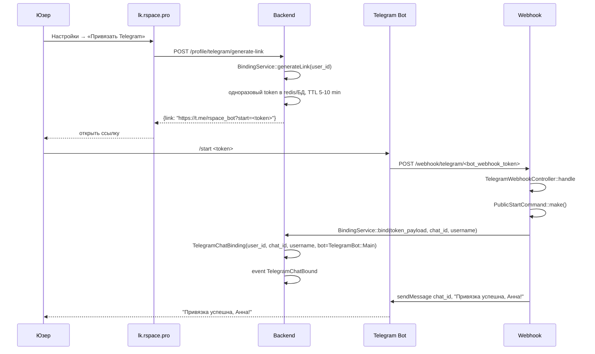
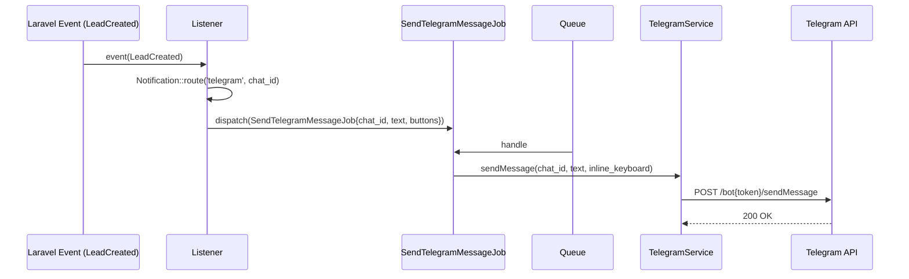

# Интеграция: Telegram Bot

> **Тип:** мессенджер (уведомления + привязка)
> **Направление:** bidirectional (outbound send + inbound webhook)
> **Статус:** production

## Назначение

Telegram-боты RSpace используются для:
1. **Push-уведомлений** агентам: новый лид, оплата подписки, успех публикации, события биллинга.
2. **Привязки аккаунта** — юзер нажимает `/start <token>` в боте, RSpace получает `chat_id` и username.
3. **Возможно несколько ботов** — enum `TelegramBot` в `app/Telegram/Enums/TelegramBot.php` подразумевает мульти-бот архитектуру (например, бот для агентов + бот для админов / админ-алертов).

## Поставщик

- **Telegram Bot API** (https://core.telegram.org/bots/api)
- **PHP SDK:** `irazasyed/telegram-bot-sdk` версии `^3.15` (из `composer.json`)
- **Канал Laravel Notifications:** `app/Telegram/Channels/TelegramChannel.php` — можно использовать `->toTelegram()` в notification классах

## Конфигурация

Два места: `config/telegram.php` (основной — инстансы ботов и SDK) и `config/reporting.php` (report-каналы).

### `config/telegram.php` — два бота

```php
'bots' => [
    'public' => [
        'token'       => env('TELEGRAM_PUBLIC_BOT_TOKEN'),
        'name'        => env('TELEGRAM_PUBLIC_BOT_NAME'),
        'webhook_url' => env('TELEGRAM_PUBLIC_BOT_WEBHOOK_URL'),
        'commands'    => [\App\Telegram\Commands\PublicStartCommand::class],
    ],
    'errors' => [
        'token'    => env('TELEGRAM_ERRORS_BOT_TOKEN'),
        'name'     => env('TELEGRAM_ERRORS_BOT_NAME'),
        'commands' => [],
    ],
],
'default' => 'public',
```

- **`public`** — публичный бот, принимает команду `/start` для привязки и шлёт push'и юзерам.
- **`errors`** — бот для алертов в dev-чат (падения, критические ошибки). Без команд, только отправка.

### `config/reporting.php` — 4 отчётных канала в Telegram

```php
'telegram' => [
    'enabled' => env('TELEGRAM_REPORT_ENABLED', false),
    'chats' => [
        'expiring_publishings' => env('TELEGRAM_REPORT_EXPIRING_PUBLISHINGS_CHAT_ID'),
        'publishing_errors'    => env('TELEGRAM_REPORT_PUBLISHING_ERRORS_CHAT_ID'),
        'new_users'            => env('TELEGRAM_REPORT_NEW_USERS_CHAT_ID'),
        'requests'             => env('TELEGRAM_REPORT_REQUESTS_CHAT_ID'),
    ],
],
```

В отдельные рабочие чаты команды RSpace улетают снапшоты:
- публикации, у которых скоро истекает срок;
- ошибки выкладки на Avito/CIAN;
- регистрации новых юзеров;
- заявки на услуги и скоринги.

### Env-переменные (`.env.example`)

```
TELEGRAM_PUBLIC_BOT_TOKEN=
TELEGRAM_PUBLIC_BOT_NAME=
TELEGRAM_PUBLIC_BOT_WEBHOOK_URL=
TELEGRAM_ERRORS_BOT_TOKEN=
TELEGRAM_ERRORS_BOT_NAME=

TELEGRAM_REPORT_ENABLED=false
TELEGRAM_REPORT_EXPIRING_PUBLISHINGS_CHAT_ID=
TELEGRAM_REPORT_PUBLISHING_ERRORS_CHAT_ID=
TELEGRAM_REPORT_NEW_USERS_CHAT_ID=
TELEGRAM_REPORT_REQUESTS_CHAT_ID=
```

**HTTP-клиент SDK**: `App\Telegram\Util\ProxyHttpClient` (из `config/telegram.php`: `http_client_handler = null`, но реальная замена делается в `TelegramServiceProvider::configureTelegramProxy`). Использует `PROXY_URL` из `.env`, нужен для обхода блокировок Telegram в РФ.

## Код

| Компонент | Путь |
|---|---|
| Service Provider | `app/Telegram/TelegramServiceProvider.php` |
| Webhook-controller | `app/Telegram/Http/Controllers/TelegramWebhookController.php` |
| Command: /start | `app/Telegram/Commands/PublicStartCommand.php` |
| Сервис привязки | `app/Telegram/Services/BindingService.php` + `DefaultBindingService.php` |
| Сервис отправки | `app/Telegram/Services/TelegramService.php` + `DefaultTelegramService.php` |
| Notifications channel | `app/Telegram/Channels/TelegramChannel.php` |
| Модель | `app/Telegram/Models/TelegramChatBinding.php` |
| Query | `app/Telegram/Models/TelegramChatBindingsQuery.php` |
| Event | `app/Telegram/Events/TelegramChatBound.php` |
| Exceptions | `BindingDeactivated`, `BindingNotFound`, `SendMessageException` |
| Enum | `app/Telegram/Enums/TelegramBot.php` — несколько ботов |
| Job | `app/Telegram/Jobs/SendTelegramMessageJob.php` — асинхронная отправка |
| HTTP-утилита | `app/Telegram/Util/ProxyHttpClient.php` — прокси, возможно для обхода блокировок |

## Сценарии

### 1. Привязка Telegram к юзеру



### 2. Отправка уведомления (лид)



Для простых уведомлений — используется `TelegramChannel` (Laravel Notification):

```php
class LeadReceivedNotification extends Notification
{
    public function via($notifiable) { return [TelegramChannel::class]; }

    public function toTelegram($notifiable): TelegramMessage {
        return TelegramMessage::make()
            ->to($notifiable->telegram->chat_id)
            ->text("🔔 Новая заявка от {$this->lead->phone}")
            ->buttons([...]);
    }
}
```

### 3. Отвязка

```
User → POST /profile/telegram/unbind
Backend → TelegramChatBinding.active = false (или delete)
       → Notification: TelegramUnbindedNotification (finalize-message в бот)
```

## Webhook

### `POST /webhook/telegram/{token}`

**Единый endpoint** для всех ботов; `{token}` идентифицирует, какому боту адресован webhook.

Controller `TelegramWebhookController::handle`:
1. Верификация токена.
2. Parse Telegram Update (message / callback_query / etc).
3. Диспатч в Commands (например `/start` → `PublicStartCommand`).
4. Если это не команда — стандартная обработка текста (FAQ-bot / echo — в зависимости от бота).

## ProxyHttpClient

`app/Telegram/Util/ProxyHttpClient.php` — кастомный HTTP клиент. Используется, вероятно, для обхода ограничений сети (если Telegram API недоступен напрямую с прод-серверов). Настройка — в Service Provider.

## Laravel Notifications: channel `telegram`

```php
public function via($notifiable): array {
    return ['telegram']; // или TelegramChannel::class
}

public function toTelegram($notifiable) {
    return TelegramMessage::make()->to(...)->text(...);
}
```

Routing в User-модели:
```php
public function routeNotificationForTelegram() {
    return $this->telegram?->chat_id;
}
```

## Обработка ошибок

| Ошибка | Поведение |
|---|---|
| `SendMessageException` | Лог + Job retry (стандарт Laravel queue) |
| Юзер заблокировал бота (`403 Forbidden: bot was blocked`) | `TelegramChatBinding.active = false`, уведомления не идут больше |
| `BindingNotFound` при `/start` с неизвестным токеном | В бот: «Токен недействителен» |
| `BindingDeactivated` | В бот: «Привязка уже деактивирована» |
| Timeout Telegram | Retry через queue |

## Лимиты

- **Telegram Bot API**: 30 сообщений/секунду в одного юзера, 20 в минуту в один чат-группу.
- Массовые рассылки должны идти с задержкой (обычно делается в job с `sleep(0.05)` или batched).

## Безопасность

- **Токен бота** — в `.env`, не логируем.
- **Webhook-токен** — отличается от токена бота, случайная строка (URL-path). Если утечёт — менять в коде/env и пере-регистрировать webhook в Telegram.
- **Верификация источника**: Telegram не подписывает запросы HMAC'ом (webhook-токен в URL — единственная защита). Если нужно — `X-Telegram-Bot-Api-Secret-Token` поддерживается Telegram с 2022 года (TBD — используется ли).

## Known issues

- **Мульти-бот архитектура**: `TelegramBot` enum подразумевает несколько ботов, но как они маппятся на окружение (main bot для агентов, admin bot для алертов) — TBD.
- **Блокировка Telegram в России**: на некоторых сетях с прод-серверов доступ к API может быть нестабильным. `ProxyHttpClient` — костыль.
- **Rate-limit на рассылки**: массовые уведомления всем юзерам могут попасть в лимит Telegram. Нужен throttler.
- **История сообщений** — не хранится (Telegram сам хранит, у RSpace только `chat_id`).
- **Hard-coded webhook URL token** — если секрет в URL утечёт, только rebuild кода его поменяет.

## Связанные разделы

- [../02-modules/identity.md](../02-modules/identity.md) — привязка через профиль.
- [../02-modules/leads.md](../02-modules/leads.md) — главный потребитель уведомлений.
- [../03-api-reference/webhooks.md](../03-api-reference/webhooks.md) — webhook endpoint.
- [../03-api-reference/profile.md](../03-api-reference/profile.md) — привязка в ЛК.

## Ссылки GitLab

- [Telegram/](https://git.rs-app.ru/rspase/project/backend/-/tree/dev/app/Telegram)
- [TelegramWebhookController.php](https://git.rs-app.ru/rspase/project/backend/-/blob/dev/app/Telegram/Http/Controllers/TelegramWebhookController.php)
- [BindingService.php](https://git.rs-app.ru/rspase/project/backend/-/blob/dev/app/Telegram/Services/BindingService.php)
