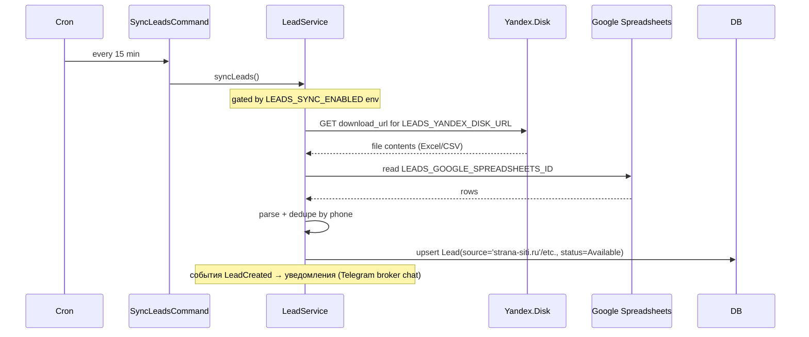

# Интеграция: Yandex.Disk + Google Spreadsheets (импорт лидов от застройщиков)

> **Тип:** импорт лидов от партнёров (застройщики новостроек)
> **Направление:** outbound (pull с публичных файлов)
> **Статус:** production (gated через `LEADS_SYNC_ENABLED`)
> **Не путать с Yandex.Metrika** — у Метрики вообще нет backend-кода, она только клиентская. Здесь Яндекс.Диск как файловый источник.

## Назначение

Лиды от застройщиков (промо-страницы ЖК — strana-siti.ru, soul-forma.ru, gertzena-city.ru и т.п.) собираются на стороне застройщика, периодически экспортируются в файл (Excel / CSV / Google Sheet) и затем импортируются в RSpace через `leads:sync` cron'ом. Это **единственный pull-источник лидов помимо Avito/CIAN API** — Jivo/Telegram приходят через webhooks.

## Поставщики данных

| Источник | Env | Формат | Кто публикует |
|---|---|---|---|
| **Yandex.Disk public URL** | `LEADS_YANDEX_DISK_URL` | Excel / CSV (через download_url) | менеджер программы «Купить новостройку» выкладывает файл на Диск, шлёт публичную ссылку |
| **Google Spreadsheets** | `LEADS_GOOGLE_SPREADSHEETS_ID` | Spreadsheet id | застройщик ведёт таблицу контактов, мы читаем по id |

Оба источника вычитываются одной и той же командой `leads:sync` (`App\Leads\Console\Commands\SyncLeadsCommand`).

## Конфигурация

`.env.example` (`origin/dev`):

```
LEADS_SYNC_ENABLED=false       # master toggle
LEADS_YANDEX_DISK_URL=         # full https://disk.yandex.ru/i/... URL
LEADS_GOOGLE_SPREADSHEETS_ID=  # Google Sheet ID (часть URL: docs.google.com/spreadsheets/d/<id>/edit)
```

В dev/local `LEADS_SYNC_ENABLED=false` — sync не запускается. На проде `true`.

## Код

| Компонент | Путь |
|---|---|
| Cron-команда | `app/Leads/Console/Commands/SyncLeadsCommand.php` (signature: `leads:sync`) |
| Scheduler | `app/Leads/Console/Scheduler.php` — `->everyFifteenMinutes()->runInBackground()` |
| Service для синка | `app/Leads/Services/SyncLeadsCommand.php` (`final readonly class`) — отдельная инкарнация, executor вызывается из `LeadService::syncLeads()` |
| Сервис лидов | `app/Leads/Services/LeadService.php` + `DefaultLeadService::syncLeads()` |
| Yandex.Disk клиент | `app/Api/Yandex/YandexDiskApiClient.php` (interface `downloadPublicResource(publicKey)`) |
| Yandex Disk DTO | `app/Api/Yandex/DownloadPublicResourceResponse.php` |
| Yandex Disk exception | `app/Exceptions/Api/Yandex/YandexApiException.php` |
| Service Provider | `app/Leads/LeadsServiceProvider.php` — регистрирует `SyncLeadsCommand` через `commands()` |

## Расписание

```php
// app/Leads/Console/Scheduler.php
$this->schedule
    ->command(SyncLeadsCommand::class)
    ->everyFifteenMinutes()
    ->runInBackground();
```

**Каждые 15 минут**, в фоне (не блокирует cron-loop). Как и Avito/CIAN sync-команды.

## Flow



**Дедупликация:** по телефону. Уже существующий `Lead` с тем же `phone` обновляется (timestamp), не создаётся дубль.

**Распределение:** новый лид сначала идёт со `status=Available` (общий пул). Админ через `POST /admin/leads/assign` или массово раздаёт лиды агентам участвующим в программе «Купить новостройку».

## Колонки в источнике

Точная структура (Excel-колонки или Google-Sheet-headers) зависит от конкретного застройщика. Минимум обязательно:
- **Телефон клиента** — единственное обязательное поле для создания `Lead`.
- **ФИО клиента** — опционально.
- **ЖК** — опционально, идёт в `Lead.residental_complex` (это устаревшее имя колонки, был typo в схеме — оставлено для совместимости).

Источник `Lead.source` устанавливается по доменному имени промо-страницы застройщика: `strana-siti.ru`, `soul-forma.ru`, `gertzena-city.ru`, ...

## Ручной триггер

В админке или через CLI:

```bash
# Полный sync вручную
php artisan leads:sync

# Через API (auth:admin)
POST /admin/leads/sync
```

`POST /admin/leads/sync` дёргает тот же `LeadService::syncLeads()`. Use case: админ видит, что лидов нет 2 часа — проверяет руками.

## Обработка ошибок

| Ошибка | Поведение |
|---|---|
| `YandexApiException` (Disk недоступен / кривая ссылка) | Лог ошибки, sync завершается без падения cron'а. Следующая попытка — через 15 минут |
| Google Sheets API rate-limit | Та же логика — лог, retry на следующем cron'е |
| Кривая структура файла (нет phone-колонки) | Skip строку, лог warning, продолжить с следующей строкой |
| Дубль по телефону | Update timestamp, не создаём новый Lead |

## Безопасность

- **Yandex.Disk URL — публичный** (`disk.yandex.ru/i/...`). Защита через секретность ссылки (длинный uuid). Если ссылка утечёт — менять `LEADS_YANDEX_DISK_URL` в env и пере-деплой.
- **Google Spreadsheets** — для публичного чтения нужен или public-доступ к таблице, или service-account JWT (сейчас, вероятно, public read — уточнить).
- **PII в источнике**: телефоны, ФИО, иногда сумма ипотеки. Файл хранится у застройщика — RSpace выступает только как импортёр.

## Известные проблемы

- **`Lead.residental_complex` typo** — в схеме БД колонка названа `residental_complex` (опечатка, должно быть `residential_complex`). Не правят, чтобы не ломать import-парсеры.
- **Master switch `LEADS_SYNC_ENABLED`** — если случайно `false` на проде, лиды не пойдут. Мониторинг — есть алерты в ops-чат при «0 новых лидов за день» (через Reporting-модуль).
- **Структура файла зависит от застройщика** — каждый партнёр шлёт свой формат. Если структура поменялась, парсер падает на той строке. Tech debt: схематизировать формат, валидировать на загрузке.
- **Нет admin-UI для управления источниками** — список источников и их URL'ы захардкожены в env. Если добавляется новый застройщик, нужен deploy.

## Связанные разделы

- [../02-modules/leads.md](../02-modules/leads.md) — модуль Leads (модель, статусы, assign).
- [../03-api-reference/leads.md](../03-api-reference/leads.md) — публичный + admin API.
- [../03-api-reference/admin/services-scorings.md](../03-api-reference/admin/services-scorings.md) — раздел Leads.
- [yandex-metrika.md](./yandex-metrika.md) — **другое** Яндекс-API; не путать.

## Ссылки GitLab

- [SyncLeadsCommand.php](https://git.rs-app.ru/rspase/project/backend/-/blob/dev/app/Leads/Console/Commands/SyncLeadsCommand.php)
- [Yandex/](https://git.rs-app.ru/rspase/project/backend/-/tree/dev/app/Api/Yandex)
- [LeadsServiceProvider.php](https://git.rs-app.ru/rspase/project/backend/-/blob/dev/app/Leads/LeadsServiceProvider.php)
