# 06. Админка (admin.rspace.pro)

> **Аудитория:** команда поддержки RSpace (биллинг, КС, ипотечный брокер), супер-админ, разработчики.
> **Домен:** [admin.rspace.pro](https://admin.rspace.pro)
> **Последнее обновление:** 2026-04-23

Админка — это **внутренний инструмент команды RSpace** для работы с пользователями, подписками, биллингом, услугами, объектами и интеграциями. Отдельный UI поверх общего backend-API.

## Архитектура

```
┌──────────────────────────────────────────────────────┐
│   admin.rspace.pro                                   │
│   Frontend: репозиторий ВНЕ GitLab rspase/project/*  │
│   Источник кода — TBD (уточнить у команды)           │
└───────────────────────┬──────────────────────────────┘
                        │
                        │  Bearer токен (Sanctum, guard=admin)
                        │
┌───────────────────────▼──────────────────────────────┐
│   api.rspace.pro  (тот же backend что и lk.rspace.pro)│
│   Префикс /admin/*, middleware auth:admin            │
│   179 эндпоинтов admin + 93 user + 34 без guard     │
│   = 306 в routes/api.php (строки 90-439 — admin)     │
└──────────────────────────────────────────────────────┘
```

**Ключевое:**
- Backend — **общий** с кабинетом (`project/backend`, ветка `dev`).
- Админ-эндпоинты под префиксом `/admin/*` с `middleware('auth:admin')`.
- Отдельный guard Sanctum для админов: `auth:admin` (кабинет использует `auth:user`).
- Отдельные модели: `Admin` в `app/Models/Admin/Admin.php`, своя таблица `admins`.

## Роли

Из кода и QA-отчёта видно **двухуровневую иерархию**:

1. **Супер-администратор** (супервайзер) — полный доступ.
2. **Администратор** (менеджер) — с назначенными пользователями (`assigned_to_id` у юзеров → `admins.id`). Видит своих, не видит чужих.

Endpoint `GET /admin/admins/supervisors` показывает список супер-админов. `POST /admin/admins/{id}/assigned-users/reassign-to/{new_admin_id}` перекидывает всех юзеров с одного менеджера на другого.

Тестовый супер-админ для ознакомления — **Орлова И. М.** (Изольда Максимовна). На 2026-04-23 — **единственный админ на проде** (`/console/administrators` содержит одну запись). Роль: Супер администратор, подразделение «Отдел продаж», зарегистрирована 16.06.2025.

## Группы функций (по структуре routes/api.php)

Админка закрывает следующие задачи — **по каждой** есть отдельный раздел в API reference. Цифра в колонке «n» — количество эндпоинтов в группе по `routes/api.php@dev` на 2026-04-23.

| # | Секция | URL-префикс | n | Что делает | API Reference |
|---|---|---|---:|---|---|
| 1 | **Auth & Admins** | `/admin/auth`, `/admin/admins` | 18 | Логин, смена пароля, управление админами, распределение менеджеров | [auth-and-admins.md](./03-api-reference/admin/auth-and-admins.md) |
| 2 | **Users** | `/admin/users` | 24 | Просмотр пользователей, поиск, CSV-экспорт, назначение подписки, баланс, файлы, комментарии | [users.md](./03-api-reference/admin/users.md) |
| 3 | **Plans & Subscriptions** | `/admin/plans`, `/admin/users/{id}/subscription` | 8 | CRUD тарифов, `PlanLevelSettings` (матрица скидок), ручная активация триала / подписки | [plans-and-billing.md](./03-api-reference/admin/plans-and-billing.md) |
| 4 | **Billing** | `/admin/billing/*` | 21 | Балансы, компенсационный баланс, выводы (полный workflow), счета, CloudPayments, промокоды | [plans-and-billing.md](./03-api-reference/admin/plans-and-billing.md) |
| 5 | **Realties** | `/admin/realties` | 27 | Полное редактирование объектов от имени юзера | [realties-publishings.md](./03-api-reference/admin/realties-publishings.md) |
| 6 | **Realty Prompts** | `/admin/realties/prompts` | 10 | AI-промпты для генерации описаний: CRUD, активация, переменные | [realties-publishings.md](./03-api-reference/admin/realties-publishings.md) |
| 7 | **Publishings & Promotions** | `/admin/publishings` | 23 | Публикации, заказы промо (Avito + CIAN), заявки на промо с `POST .../complete`, звонки (CSV-экспорт) | [realties-publishings.md](./03-api-reference/admin/realties-publishings.md) |
| 8 | **Feeds** | `/admin/feeds/{type}` | 2 | Ручная генерация feed для Avito/CIAN/DomClick | [realties-publishings.md](./03-api-reference/admin/realties-publishings.md) |
| 9 | **Services** | `/admin/services`, `/admin/services/requests` | 33 | CRUD услуг, обработка заявок (start/complete/cancel/restore), комментарии и файлы, widget items | [services-scorings.md](./03-api-reference/admin/services-scorings.md) |
| 10 | **Scorings** | `/admin/scorings` | 9 | CRUD скорингов, обработка заявок: cancel/finish с PDF | [services-scorings.md](./03-api-reference/admin/services-scorings.md) |
| 11 | **Leads** | `/admin/leads` | 3 | Просмотр всех лидов, bulk-assign на админов, ручной sync | [services-scorings.md](./03-api-reference/admin/services-scorings.md) |
| 12 | **External Balances** | `/admin/balances` | 1 | Мониторинг внешних балансов: Avito, CIAN, sms.ru, OpenAI, ... | [services-scorings.md](./03-api-reference/admin/services-scorings.md) |
|   | **Итого** | | **179** | | |

Полный машинно-прочитанный список роутов — в `rspace-docs/_verification/routes-dev-2026-04-23.json`.

## UI-walkthrough

Скриншоты всех ключевых экранов админки сняты 2026-04-23 через playwright. Лежат в `../assets/screenshots/admin/`.

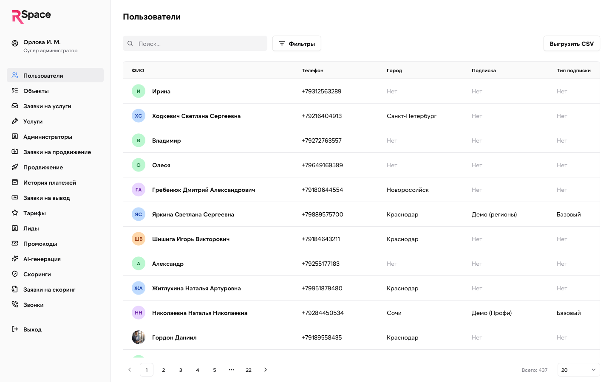

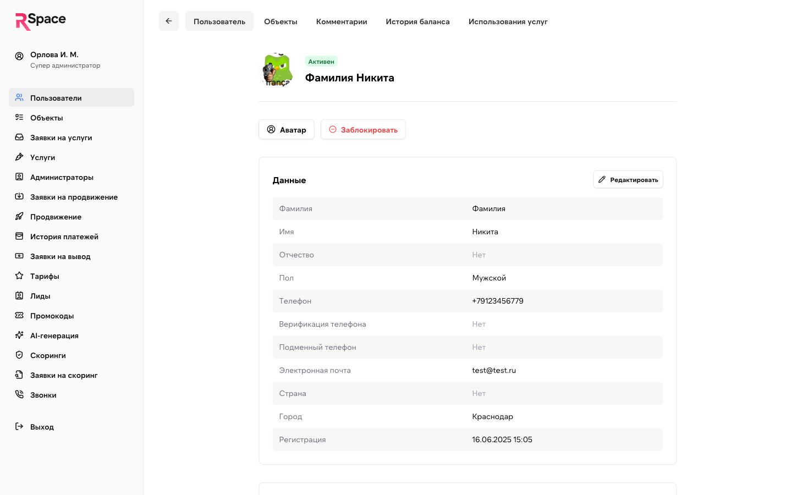

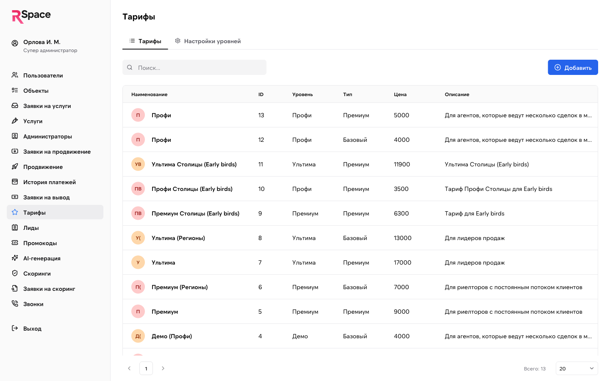

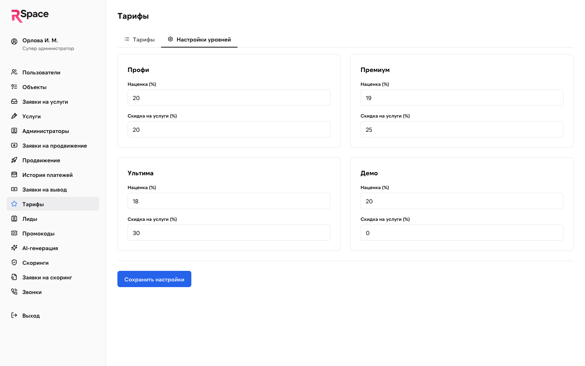

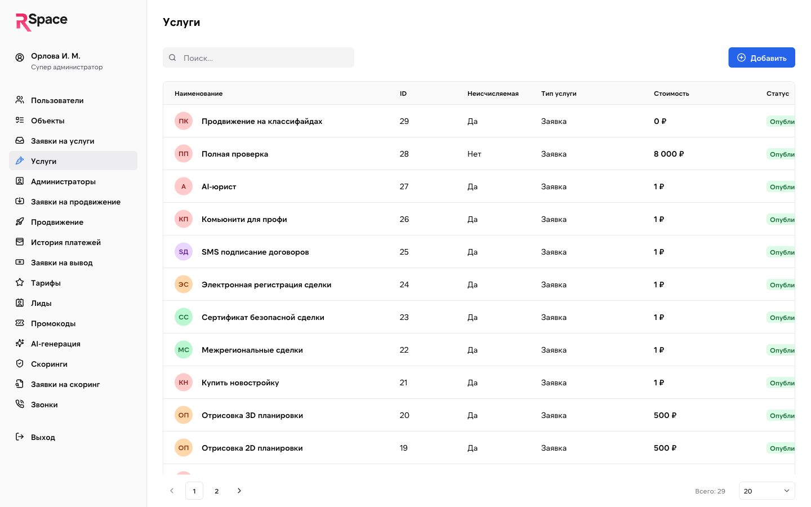

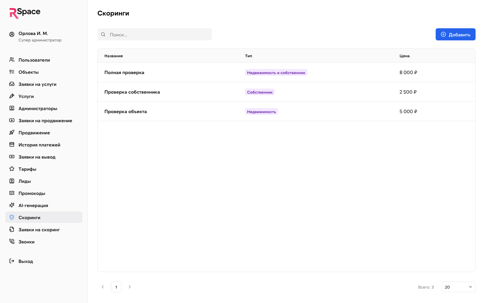

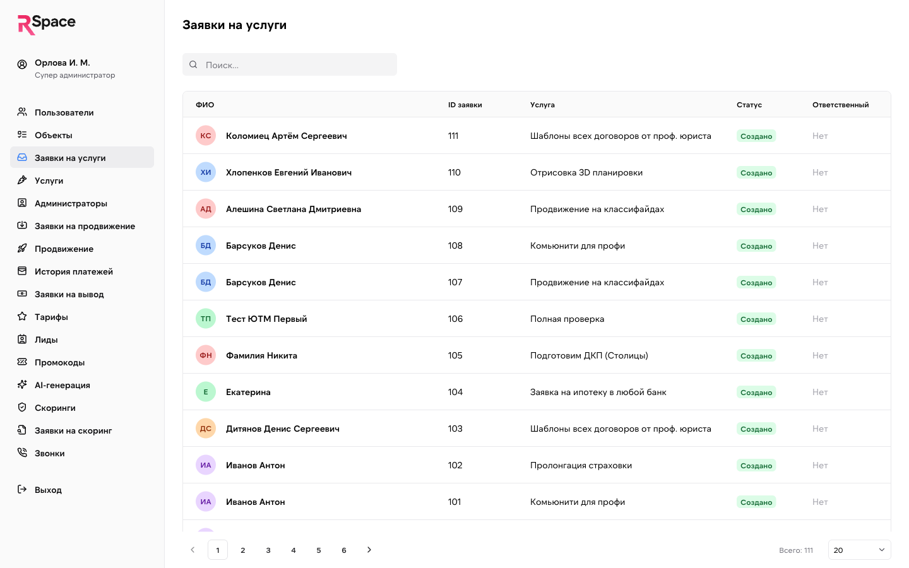

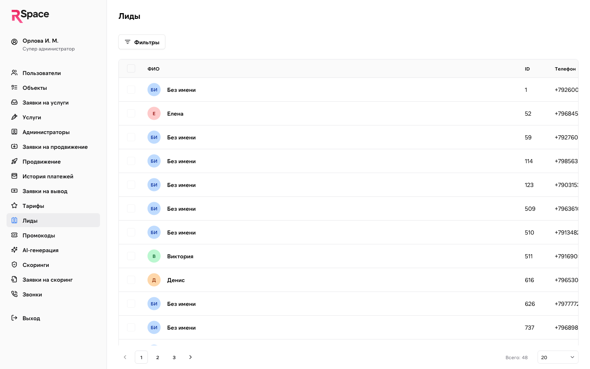

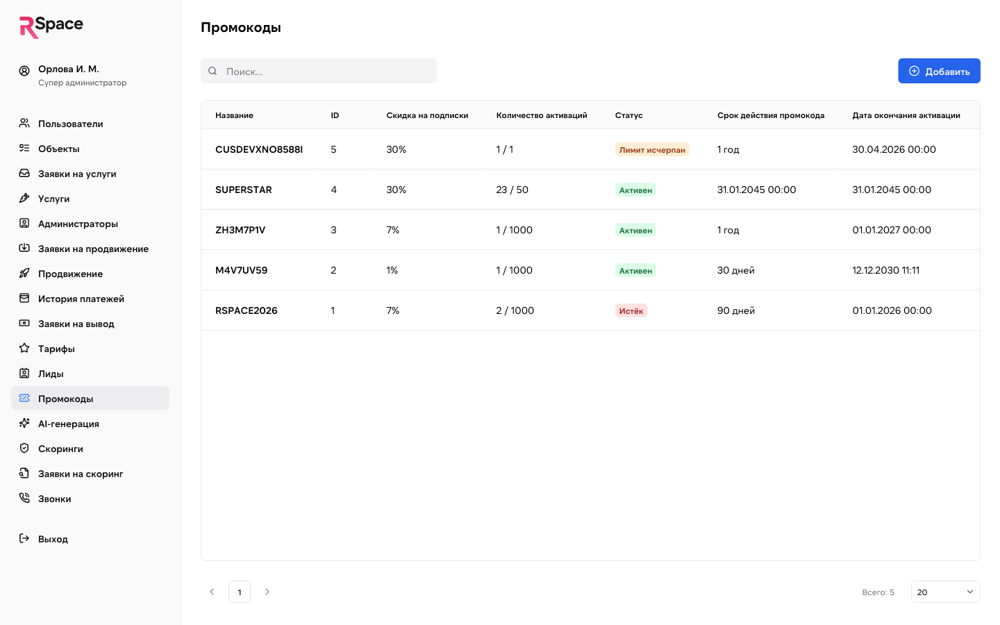

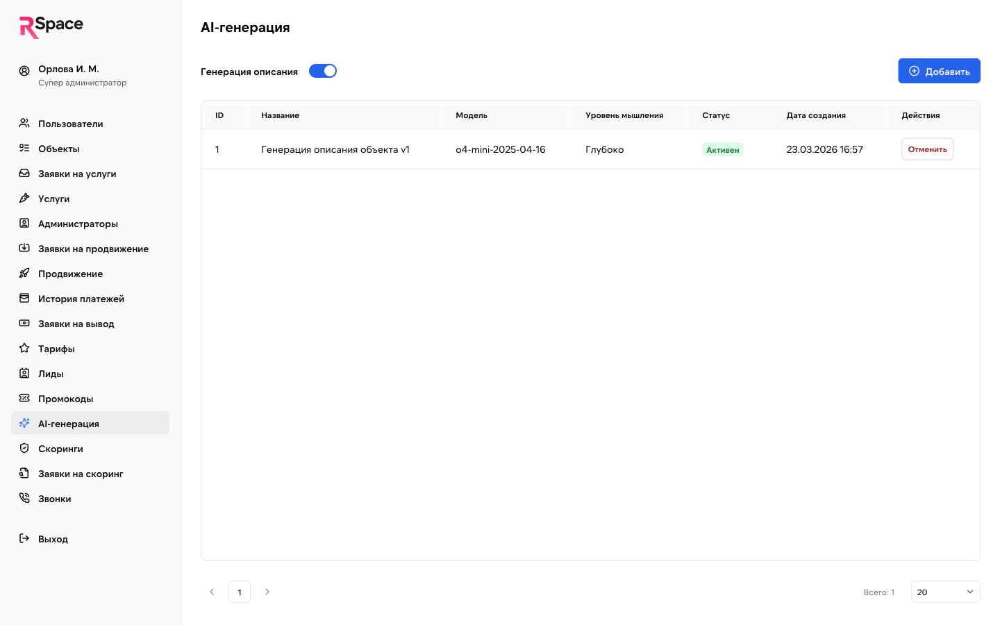

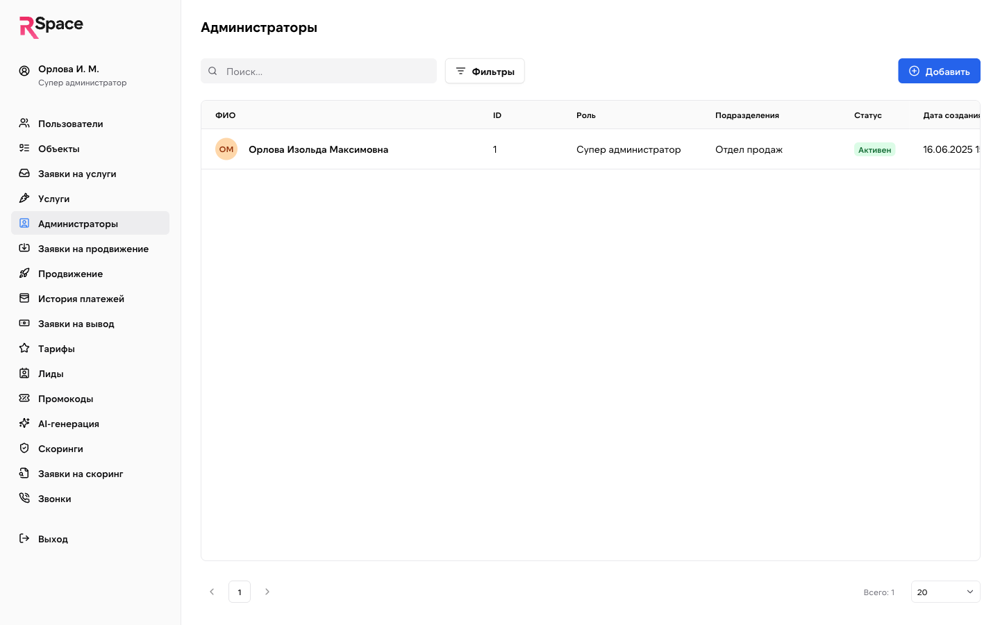

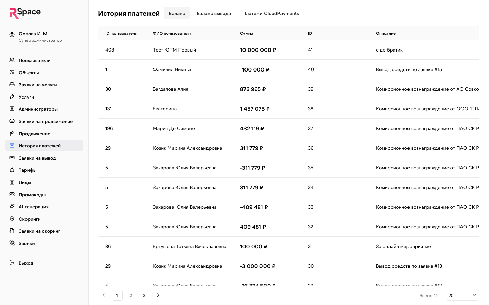

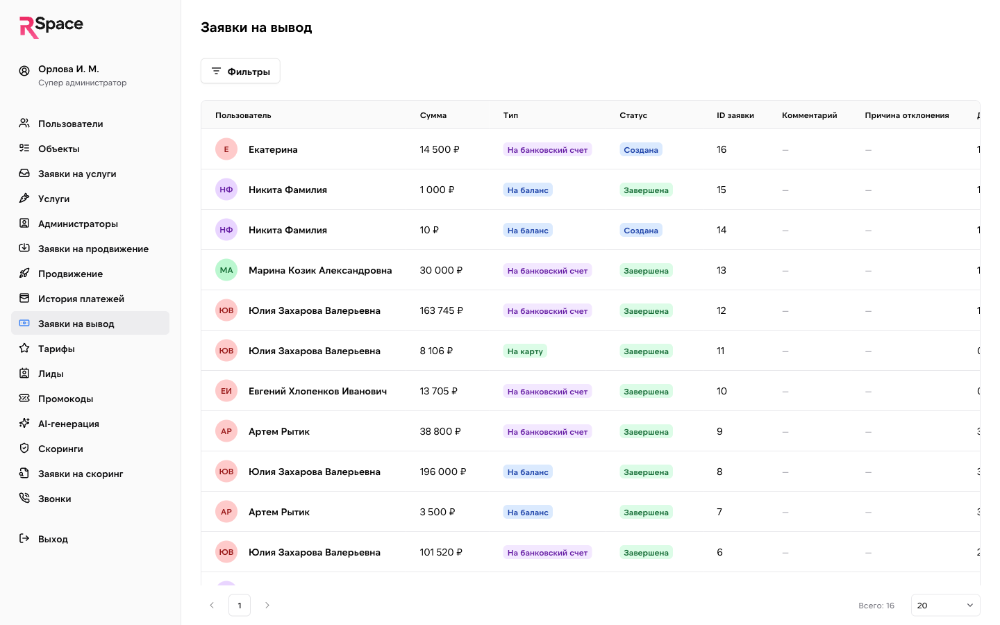

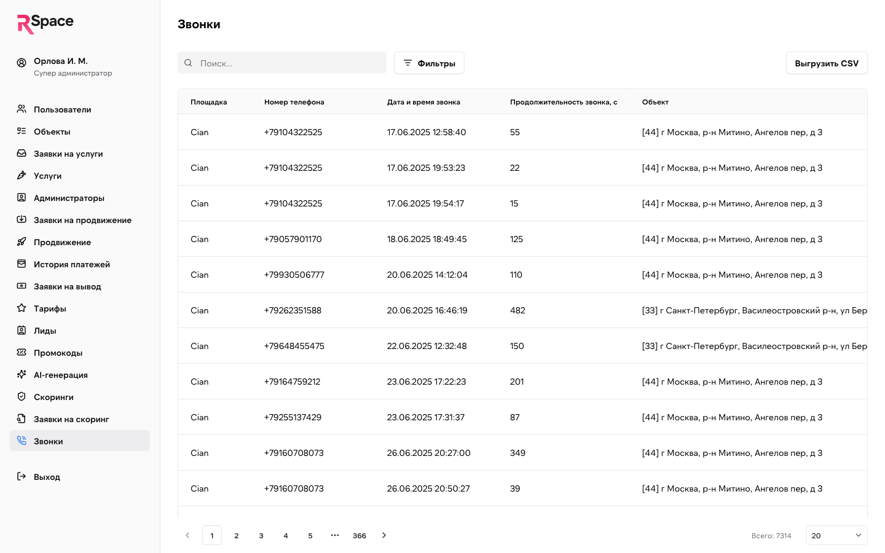

### Фактические экраны (сверено 2026-04-23 через `admin.rspace.pro`)

| Экран | URL UI | Главные факты |
|---|---|---|
| Логин | `/login` | (не проверял — зашёл по уже установленной сессии супер-админа) |
| Корень | `/` → `/console/users` | Автоматический редирект на список пользователей |
| Пользователи — список | `/console/users` | Поиск, «Фильтры», «Выгрузить CSV». Колонки: ФИО, Телефон, Город, Подписка, Тип подписки, Статус подписки, Дата регистрации, Дата следующего платежа, Карта, Баланс, Баланс вывода, Кол-во активных объектов, Статус пользователя, Пригласил, Активный промокод, Дата применения промокода |
| Пользователь — детали | `/console/users/{id}` | 5 вкладок: **Пользователь / Объекты / Комментарии / История баланса / Использования услуг**. Действия: Аватар, Заблокировать, Редактировать данные, Изменить баланс, Пополнить баланс вывода, Назначить/Сменить подписку, Назначить куратора, Загрузить файлы |
| Объекты | `/console/listings` | 7 страниц (≥1500 объектов). Колонки: Наименование, ID объекта, Адрес, Тип, Пользователь, Статус, Цена, **Циан**, **Авито**, Дата создания. Фильтры |
| Продвижение | `/console/promotions` | 2 вкладки Авито / Циан. Формат продвижения: `x10_7`, `x5_1` и т.п. — множитель просмотров × дни |
| Заявки на продвижение | `/console/promotion-orders` | 2 вкладки Авито / Циан. В момент проверки — пусто |
| Заявки на услуги | `/console/service-orders` | **111 заявок, все в статусе «Создано» и без «Ответственного»**. Колонки: ФИО, ID заявки, Услуга, Статус, Ответственный, Дата создания |
| Услуги | `/console/services` | 29 услуг (см. `_verification/admin-walkthrough-2026-04-23.md`). Колонки: Наименование, ID, Неисчисляемая, Тип услуги, Стоимость, Статус |
| Скоринги | `/console/scorings` | **3 записи** (Полная проверка 8 000 ₽, Проверка собственника 2 500 ₽, Проверка объекта 5 000 ₽). ⚠️ Отдельная от `services` таблица |
| Заявки на скоринг | `/console/scoring-requests` | В момент проверки — пусто |
| Звонки | `/console/publishing-calls` | **7 312 записей**. Колонки: Площадка, Номер телефона, Дата/время, Продолжительность (с), Объект, Пользователь. Фильтры + «Выгрузить CSV» |
| Тарифы | `/console/plans` | 2 вкладки: **Тарифы** (13 записей в БД) / **Настройки уровней** (наценка + скидка на услуги по 4 уровням Профи/Премиум/Ультима/Демо) |
| Лиды | `/console/leads` | **48 лидов**, все с источником = сайт застройщика (`strana-siti.ru`, `soul-forma.ru`, `gertzena-city.ru`). Колонки: ФИО, ID, Телефон, ЖК, Источник, Статус, Привязан к, Дата привязки |
| Промокоды | `/console/promo-codes` | 5 кодов. Колонки: Название, ID, Скидка на подписки, Количество активаций, Статус, Срок, Дата окончания, Дата создания, Действия |
| AI-генерация | `/console/prompts` | 1 активный промпт «Генерация описания объекта v1», модель `o4-mini-2025-04-16`, уровень мышления «Глубоко» |
| История платежей | `/console/balance-transactions` | 3 вкладки: **Баланс / Баланс вывода / Платежи CloudPayments**. 204 транзакции на вкладке Баланс. Колонки: ID транзакции, Дата, Тип операции, Назначение, Сумма, Статус, ID/ФИО пользователя, Карта (•••• last4), Ошибка |
| Заявки на вывод | `/console/withdrawal-orders` | 16 заявок. Типы: «На банковский счет» / «На баланс». Действие: **«В работу»** для Созданных |
| Администраторы | `/console/administrators` (⚠️ **не `/console/admins`**) | **Только 1 запись** — Орлова И. М., Супер администратор, подразделение «Отдел продаж». Колонки: ФИО, ID, Роль, Подразделения, Статус, Дата создания |

### Чего НЕ нашёл в админке

Разделы, которые были описаны в доке и предполагались, но отсутствуют в UI:

- **Внешние балансы** (`/console/monitoring` или `/console/balances`) — раздела нет. Остатки на Avito / CIAN / sms.ru / OpenAI в UI недоступны. Данные, вероятно, пишутся в таблицу `external_balances` (миграция 13.04.2026), но читаются только через API, не UI.
- **Счета** (`/console/invoices`) — отдельного раздела нет. История платежей отражает фактические транзакции, invoice-ов как отдельной сущности в UI нет.
- **Дашборд** (`/console`) — отдельной страницы нет, корень редиректит на `/console/users`.

### 🔴 На проде — только один админ

В `/console/administrators` на 2026-04-23 **одна запись**: Орлова И. М., Супер администратор, подразделение «Отдел продаж». Обычных (не-супер) админов нет.

Это значит «роли» из `_sources/00-product-passport.md` (Юля — ипотечный брокер, Света — биллинг, Маша — поддержка) работают **под одним аккаунтом Орловой**, либо не участвуют в админке RSpace и координируются через отдельные каналы (Telegram, email).

В `external/17-contacts.md` «роли команды» описаны как **концептуальные должности**, не как реальные аккаунты. Это соответствует прод-реальности.

### Почему URL админов — `/console/administrators`

В нашей доке и API-reference использовался URL `/admin/admins` (для backend API) и `/console/admins` (для фронта). Backend API действительно под `/admin/admins/*` (подтверждено в `routes/api.php`), но **фронт использует `/console/administrators`** (полное слово). Это маленькое, но важное расхождение — документация должна указывать именно фронт-URL.

## Типичные задачи команды

Исходя из ролей (из паспорта):

### Света (биллинг)
- Проверить, почему у юзера не прошёл платёж.
- Обработать запрос на вывод комиссии (complete / reject).
- Создать промокод, отследить активации.
- Начислить бонусный баланс пользователю вручную (`balance/increment`).

### Юля (ипотечный брокер)
- Посмотреть заявки на ипотеку (на данный момент — через `/admin/leads` и `/admin/service-requests`, т.к. отдельного «Ипотечный брокер» модуля в коде не видно).
- Перевести лида в AmoCRM (не через админку — через webhook flow).
- Отметить сопровождение сделки как завершённое.

### Маша (продажи, поддержка)
- Найти юзера, посмотреть его профиль (телефон, UTM).
- Добавить комментарий («разговор 23 апреля: хочет на Премиум»).
- Приложить файл к карточке юзера.
- Помочь с обработкой заявок на услуги.

### Супер-админ / Игорь (CPO)
- CRUD тарифов и Plan Level Settings.
- Создание AI-промптов.
- Мониторинг внешних балансов.
- Управление админами (создание, назначение, деактивация).

## Безопасность

- **Auth:** Sanctum, guard `admin`, токен в `Authorization: Bearer ...`.
- **Login rate limit:** 5 попыток / минуту (`throttle:5,1`).
- **Change-password rate limit:** 5 / минуту.
- **Logout:** `/admin/auth/logout` (текущий токен) или `/admin/auth/logout/all` (все токены).
- **Check session:** `/admin/auth/check` (без middleware — для проверки валидности токена).
- **Права:** административные роли (super vs regular) определяются через поля в модели `Admin` (TBD точно какие — `is_supervisor` или полиморфная).

## Known issues (из QA-отчёта 2026-04-20)

- **BUG-007:** колонка «Статус» обрезана в таблице Объекты.
- **BUG-008:** фильтр «Тип подписки» не содержит всех вариантов (только Базовый / Премиум, но уровней больше).
- **BUG-009:** несогласованный формат городов.
- **BUG-010:** опечатка «Новоросссийск» в справочнике городов.
- **BUG-011:** несогласованный формат баланса («0 ₽» vs «0,00 ₽»).
- **BUG-012:** путаница в названиях тарифов — два «Профи» (базовый 4К, премиум 5К), терминология «Уровень: Профи, Тип: Премиум» перегружена.

## Frontend-код админки

**Не находится в GitLab группе `rspase`** — проверено 2026-04-23 через GitLab API: в группе доступны только `rspase/project/backend`, `rspase/project/frontend`, `rspase/landing/next`. Ни одного репо с паттерном имени `admin`/`console` не найдено.

Laravel admin-пакеты (Nova / Filament / Orchid) **не используются** — в `composer.json` их нет (только `laravel/framework`, `sanctum`, `tinker`, `clockwork`, `scribe`). Значит админка — отдельный SPA на собственном фронте.

**TBD:** получить ссылку на репо (подозрение — отдельный github / самохостный GitLab).

## Ссылки

- [../02-modules/](./02-modules/) — доменные модули, admin-эндпоинты которых описаны здесь.
- [../03-api-reference/admin/](./03-api-reference/admin/) — полное API reference админки.
- [routes/api.php на GitLab](https://git.rs-app.ru/rspase/project/backend/-/blob/dev/routes/api.php) — источник правды (строки 90-439 — admin-группа).
- [_sources/03-qa-report.md](../_sources/03-qa-report.md) — QA-отчёт от 2026-04-20 со всеми найденными багами.
